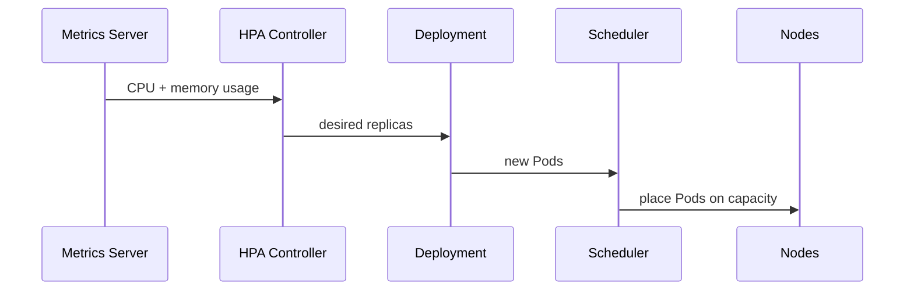
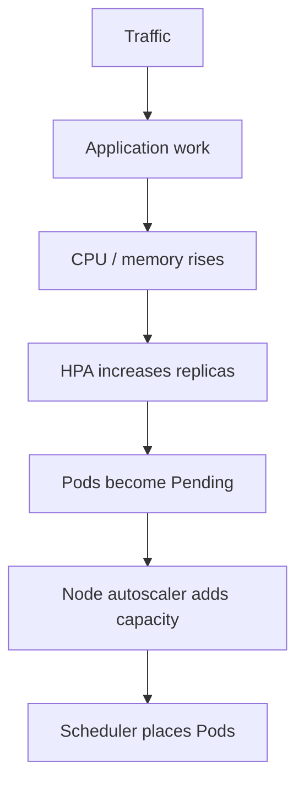
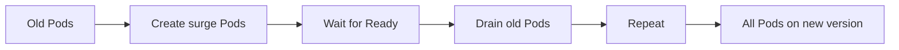
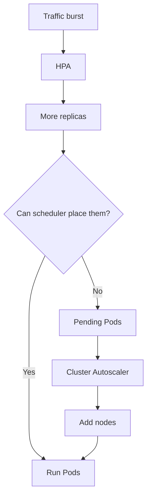
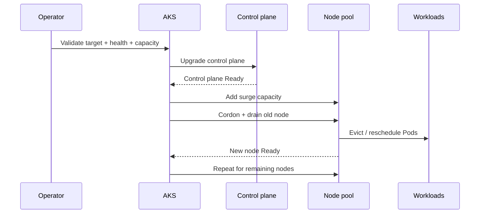
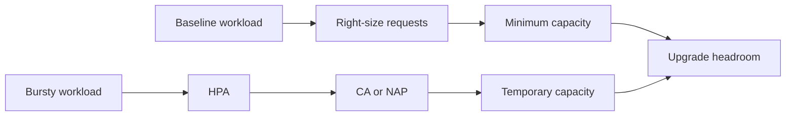
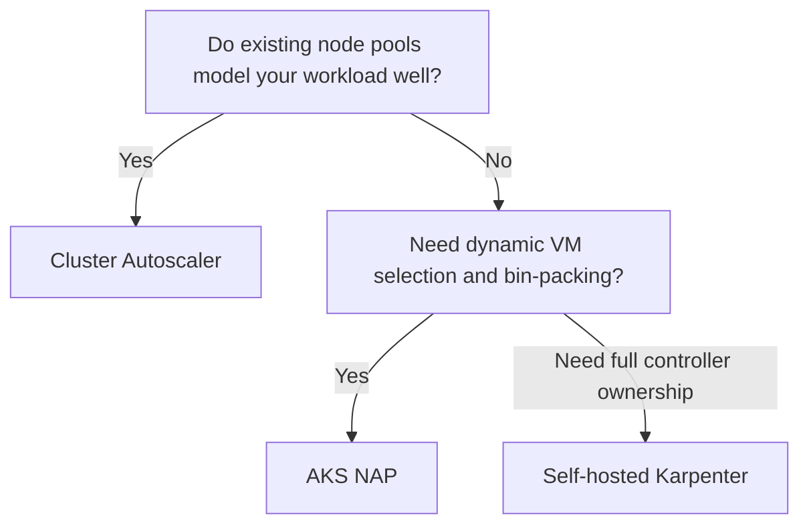

# 01 — Resource Requests, Limits and QoS

## What is it?

- **Request** is the amount Kubernetes uses for scheduling and resource-utilization calculations.
- **Limit** is the container's upper resource boundary. CPU limits can throttle; memory limits can lead to OOM termination when exceeded.
- Kubernetes assigns each Pod a QoS class: `Guaranteed`, `Burstable`, or `BestEffort`.

## Why does it matter?

- Requests determine whether a Pod fits on a node.
- HPA resource utilization targets are calculated relative to Pod resource requests.
- During resource pressure, Kubernetes generally considers `BestEffort` Pods first, then `Burstable`, then `Guaranteed`.
- Missing or unrealistic requests create poor scheduling, autoscaling and capacity-planning signals.

## What should I remember?

**A request is a scheduling contract; a limit is a runtime ceiling.**

## QoS matrix

| Class | CPU | Memory | Typical use |
|---|---|---|---|
| Guaranteed | request = limit | request = limit | latency-sensitive or tightly controlled workloads |
| Burstable | at least one request/limit, but not Guaranteed | same | most production applications |
| BestEffort | none | none | avoid for important workloads |

## Mini demo

The source template `manifests/templates/qos-demo.yaml.tmpl` creates three Pods with deliberately different resource settings.

### Student objective

Identify the QoS class for each Pod and relate it to the resource specification.

```bash
wget https://
unzip

```

```bash
# Set your unique learner identifier.
export STUDENT="student01"
```

```bash
# Set the namespace used by the current learner.
export LAB_NAMESPACE="scalable-${STUDENT}"
```

```bash
# Render the complete namespaced YAML files for this learner.
bash scripts/render-manifests.sh
```

### Apply the demo

```bash
kubectl apply -f "rendered/${STUDENT}/namespace.yaml"
```

```bash
# Apply the three QoS demonstration Pods into the learner's namespace.
kubectl apply -f "rendered/${STUDENT}/qos-demo.yaml"
```

### Expected result

Three Pods become `Running`, and their QoS classes are different.

```bash
# Show each Pod's Kubernetes QoS class.
kubectl get pods -n "$LAB_NAMESPACE" -o custom-columns=NAME:.metadata.name,QOS:.status.qosClass,STATUS:.status.phase
```

Example shape of the output:

```text
NAME             QOS          STATUS
qos-guaranteed   Guaranteed   Running
qos-burstable    Burstable    Running
qos-besteffort   BestEffort   Running
```

A CPU/memory request that is set too low makes utilization percentages look artificially high, while an oversized request can block scheduling and waste capacity. Requests must be treated as part of workload design, not as placeholders.

## Production note

For real workloads, derive requests from measured usage. A common operational workflow is: observe p50/p95/p99 usage, set an initial request, run load tests, then iterate with HPA behavior and node-capacity data.

## Common failure

If a Pod remains `Pending`, inspect its scheduling event before changing limits.

```bash
# Show the scheduling and admission events for the learner's namespace.
kubectl get events -n "$LAB_NAMESPACE" --sort-by=.lastTimestamp
```
---

# 02 — Horizontal Pod Autoscaler

## What is it?

- HPA adjusts the replica count of a scalable workload such as a Deployment.
- With built-in resource metrics, HPA can target CPU and memory using `autoscaling/v2`.
- For utilization targets, Kubernetes compares current resource usage with the resource **request**.

## Why does it matter?

- HPA handles application-level demand without requiring manual replica changes.
- CPU-only autoscaling misses memory-driven workloads.
- HPA depends on usable metrics and realistic requests.
- HPA and node autoscaling solve different problems: HPA changes **Pods**; node autoscaling changes **node capacity**.

## What should I remember?

**HPA decides how many Pods you need; the scheduler and node autoscaler decide where those Pods can run.**

## Architecture



# Lab 1 — HPA driven by CPU and memory

### Instructor preparation

Confirm the Metrics API works before learners begin.

```bash
# Confirm the cluster exposes resource metrics used by HPA and kubectl top.
kubectl top nodes
```

### Student objective

Deploy a synthetic CPU + memory workload and observe HPA scaling from one replica toward a controlled maximum.

### 1. Define student variables

```bash
# Set a unique learner ID; use the value assigned by the instructor.
export STUDENT="student01"
```

```bash
# Build the learner-only namespace name from the unique student ID.
export LAB_NAMESPACE="scalable-${STUDENT}"
```

### 2. Apply the HPA workload

```bash
# Deploy the synthetic CPU/memory workload and its HPA into the learner namespace.
kubectl apply -f "rendered/${STUDENT}/hpa-demo.yaml"
```

### 3. Verify the Pods are running

```bash
# Verify the synthetic workload is healthy before checking autoscaling.
kubectl get pods -n "$LAB_NAMESPACE" -l app=hpa-demo -o wide
```

### 4. Check resource metrics

```bash
# Observe CPU and memory consumption from the Metrics API.
kubectl top pods -n "$LAB_NAMESPACE"
```

### 5. Check HPA status

```bash
# Show the HPA's current and target CPU/memory utilization and replica count.
kubectl get hpa -n "$LAB_NAMESPACE"
```

### 6. Inspect HPA decisions

```bash
# Read the HPA controller's conditions and recent scaling events.
kubectl describe hpa hpa-demo -n "$LAB_NAMESPACE"
```

### 7. Watch replicas change

```bash
# Continuously watch HPA replicas while the synthetic workload is active.
kubectl get hpa -n "$LAB_NAMESPACE" --watch
```

### Expected result

- CPU and memory metrics are populated.
- HPA increases replicas while the synthetic workload stays above target.
- The Deployment never exceeds its `maxReplicas` of 4.
- Once extra Pods are healthy, the workload is distributed across more Pods.

### Common failures

**HPA shows `<unknown>` targets.** Usually the Metrics API is unavailable or Pods do not have CPU/memory requests.

```bash
# Confirm that the Metrics API can return resource data for the workload.
kubectl top pods -n "$LAB_NAMESPACE" -l app=hpa-demo
```

**Pods restart with `OOMKilled`.** The synthetic memory allocation has crossed the intentionally bounded limit. This is a teaching signal, not a production tuning recommendation.

```bash
# Confirm whether the workload has experienced OOM-related restarts. Gives no matches if not found.
kubectl get pods -n "$LAB_NAMESPACE" -l app=hpa-demo -o custom-columns=NAME:.metadata.name,RESTARTS:.status.containerStatuses[0].restartCount,WAITING:.status.containerStatuses[0].state.waiting.reason

```

### Teaching point

There are two scaling loops in production:



A healthy HPA with insufficient node capacity is still a failed application-scaling design.

### Cleanup

```bash
# Remove only this learner's namespace and every namespaced object inside it.
kubectl delete namespace "$LAB_NAMESPACE"
```

## Production notes

- Use stabilization windows and scaling policies deliberately for noisy workloads.
- Avoid setting requests just to make HPA percentages look convenient.
- Consider business or application metrics with custom/external metrics when CPU and memory are weak proxies for demand.

---

# 03 — Rolling Updates, `maxSurge`, `maxUnavailable` and PDB

## What is it?

- A Deployment with `RollingUpdate` replaces old Pods gradually.
- `maxSurge` controls extra Pods that can be created above the desired replica count.
- `maxUnavailable` controls how many desired Pods may be unavailable during the rollout.
- A PodDisruptionBudget (PDB) limits **voluntary disruptions**, such as node drains during maintenance and upgrades.

## Why does it matter?

- Deployments protect availability during application changes.
- PDBs protect availability during infrastructure operations.
- Setting both too aggressively can stall an upgrade; setting neither can allow avoidable downtime.
- More surge capacity costs money and may need subscription quota/IP capacity.

## What should I remember?

**Deployment rollout settings protect application changes; PDBs protect voluntary disruption. They complement each other.**

## Rollout picture



# Mini exercise — safe rollout

### Student setup

```bash
# Set your unique learner identifier.
export STUDENT="student01"
```

```bash
# Set the namespace used by the current learner.
export LAB_NAMESPACE="scalable-${STUDENT}"
```

```bash
kubectl apply -f "rendered/${STUDENT}/namespace.yaml"
```

```bash
# Apply the rendered rollout and PDB manifest.
kubectl apply -f "rendered/${STUDENT}/rollout-pdb-demo.yaml"
```

### Student objective

See a controlled rolling update with three replicas, one extra Pod at a time, and a PDB that permits one voluntary disruption.

### Apply the workload

### Observe the initial state

```bash
# Confirm the application starts with three ready replicas.
kubectl get deployment rollout-demo -n "$LAB_NAMESPACE"
```

### Inspect the PDB

```bash
# Show the disruption budget and how many voluntary disruptions are currently allowed.
kubectl get pdb -n "$LAB_NAMESPACE"
```

### Trigger an application rollout

```bash
# Change the container image to force a rolling update of the Deployment.
kubectl set image deployment/rollout-demo nginx=nginx:1.28-alpine -n "$LAB_NAMESPACE"
```

### Watch the rollout

```bash
# Watch old Pods leave and new Pods become Ready during the rollout.
kubectl rollout status deployment/rollout-demo -n "$LAB_NAMESPACE"
```

### Inspect rollout history

```bash
# Show which Deployment revisions have been recorded.
kubectl rollout history deployment/rollout-demo -n "$LAB_NAMESPACE"
```

### Cleanup

```bash
# Remove only this learner's namespace and every namespaced object inside it.
kubectl delete namespace "$LAB_NAMESPACE"
```

### Expected result

- The Deployment keeps the desired replica count available during the update.
- At most one additional Pod is created because `maxSurge: 1`.
- `maxUnavailable: 0` means the Deployment does not voluntarily reduce the available replica count during the rollout.
- The PDB reports the current number of allowed disruptions for voluntary eviction.

### Common failure

A rollout can appear stuck when the new image cannot start, a probe never becomes ready, or scheduling capacity is insufficient.

```bash
# Identify the exact Pod and scheduling/container event causing the rollout to stall.
kubectl get events -n "$LAB_NAMESPACE" --sort-by=.lastTimestamp
```

### Teaching point

A common production failure is combining a strict PDB with too few replicas. During a node drain, the operator may need an eviction that the PDB will not permit. The solution is not to bypass the PDB blindly; design replica count, disruption budget, surge capacity and maintenance behavior together.

## Production note

AKS rolling node upgrades also rely on cordon/drain behavior and surge capacity. AKS documentation currently recommends a `33%` max surge starting point for production node pools, then adjusting for quota, capacity and disruption tolerance.

---

# 04 — AKS Cluster Autoscaler

## What is it?

- AKS Cluster Autoscaler (CA) watches for Pods that cannot be scheduled because of resource constraints and scales eligible node pools up.
- It also scales down underutilized nodes when workloads can be safely rescheduled.
- Bounds are configured per node pool with a minimum and maximum count.

## Why does it matter?

- HPA can create demand faster than existing nodes can host.
- CA turns Pending Pods into additional node capacity.
- The most useful CA signal is often **Pending Pods caused by insufficient allocatable capacity**, not raw node CPU percentage.
- Bounds are an operational safety control: too low can block workloads; too high can cause cost or quota problems.

## What should I remember?

**CA reacts to scheduling pressure, not to application traffic directly.**

## HPA + CA relationship



# Lab 2 — Trigger node scale-out

### Important shared-cluster rule

**This lab uses a dedicated tainted workshop node pool prepared by the instructor.** Learners do not create or delete nodes.

The autoscaler bound-setting operation is **INSTRUCTOR ONLY** on a shared cluster. Learners observe and validate the bounds and trigger the scale-out from their namespaces.

### Student objective

Create a namespace-scoped workload whose resource requests exceed the currently available workshop-node capacity, then watch AKS add nodes.

### 1. Define student variables

```bash
# Set a unique learner identifier.
export STUDENT="student01"
```

```bash
# Create the learner's isolated namespace name.
export LAB_NAMESPACE="scalable-${STUDENT}"
```

### 2. Create the namespace

```bash
# Create or reconcile the learner's isolated namespace.
kubectl apply -f "rendered/${STUDENT}/namespace.yaml"
```

### 3. Apply the capacity-pressure workload

```bash
# Create two Pods with deliberate resource requests that make scheduling pressure visible on the workshop node pool.
kubectl apply -f "rendered/${STUDENT}/capacity-demo.yaml"
```

The manifest targets the instructor-created workshop node pool by the shared `workshop=aks-scaling` label and tolerates its matching taint.

### 4. Observe Pods and Pending state

```bash
# Show each capacity Pod and whether it is Running or Pending.
kubectl get pods -n "$LAB_NAMESPACE" -l app=capacity-demo -o wide
```

### 5. Inspect scheduling events

```bash
# Confirm whether insufficient node resources are keeping a Pod Pending.
kubectl get events -n "$LAB_NAMESPACE" --sort-by=.lastTimestamp
```

### 6. Observe the workshop node pool

> **STUDENT SAFE — read-only Azure operation.**

```bash
# Read the current node count and autoscaler settings without modifying the cluster.
az aks nodepool show --resource-group "$AKS_RESOURCE_GROUP" --cluster-name "$AKS_CLUSTER" --name "$LAB_NODEPOOL" --query "{count:count,min:minCount,max:maxCount,autoscaler:enableAutoScaling,state:provisioningState}" --output table
```

### 7. Watch nodes join the cluster

```bash
# Watch cluster nodes so the scale-out becomes visible as new nodes register.
kubectl get nodes -o wide --watch
```

Stop the watch with `Ctrl+C` after the additional node(s) appear.

### 8. Re-check the workload

```bash
# Verify that the previously Pending Pods become schedulable after capacity is added.
kubectl get pods -n "$LAB_NAMESPACE" -l app=capacity-demo -o wide
```

### Expected result

- At least one capacity Pod initially becomes `Pending`.
- The node autoscaler sees unschedulable demand and scales the workshop node pool up.
- New nodes register with the cluster.
- The Pending Pod(s) are scheduled.
- The node pool remains bounded by the configured `minCount` and `maxCount`.

### 9. Remove the pressure workload

```bash
# Delete only the learner's capacity demonstration Deployment.
kubectl delete deployment capacity-demo -n "$LAB_NAMESPACE"
```

### 10. Observe scale-down

The exact scale-down timing is cluster-profile dependent; do not wait indefinitely during the workshop. Explain that production environments often use deliberate scale-down delays to avoid oscillation during bursts.

> Note: CA profile settings are cluster-wide and should be tuned by platform owners rather than independently by developers.

### Common failures

**Pods stay Pending forever.**

```bash
# Show scheduler events; look for taint, node selector or resource-fit messages.
kubectl describe pod -n "$LAB_NAMESPACE" -l app=capacity-demo
```

**No nodes are added.**

```bash
# Verify the node pool's autoscaler is enabled and has room below max count.
az aks nodepool show --resource-group "$AKS_RESOURCE_GROUP" --cluster-name "$AKS_CLUSTER" --name "$LAB_NODEPOOL" --query "{count:count,min:minCount,max:maxCount,autoscaler:enableAutoScaling,state:provisioningState}" --output table
```

**Scale-up is slow.** Azure VM allocation and node bootstrap are not instantaneous. The correct teaching point is that autoscaling is a control loop with provisioning latency, not a synchronous API call.

### Teaching point

Resource requests are the bridge between application scaling and infrastructure scaling. Unrealistic requests distort both scheduling and the amount of infrastructure the autoscaler thinks is required.

## Production notes

- Keep min/max bounds aligned with budget and workload SLOs.
- Do not manually resize VMSS instances behind AKS's control plane.
- Keep a buffer for upgrades and burst when the application cannot tolerate waiting for new node provisioning.
- CA works best when node pools have predictable scheduling properties; NAP is better when VM-shape selection itself needs to be dynamic.

---

# 05 — AKS Upgrade Strategy and Controlled Upgrade Lab

## What is it?

- AKS separates the managed control plane from workload node pools.
- A full `az aks upgrade` upgrades the control plane first and then node pools sequentially.
- Node-pool rolling upgrades use surge capacity, then cordon/drain old nodes and replace them.

## Why does it matter?

- Kubernetes version changes can affect APIs, admission, images, networking and workloads.
- Upgrade capacity is part of application availability planning.
- PDBs, replicas, quotas, subnet IPs and max surge interact with upgrade success.
- A safe upgrade is a change-management process, not merely a CLI command.

## What should I remember?

**Preflight first, control-plane compatibility second, node-pool capacity and workload disruption third.**

## Upgrade sequence



# Lab 3 — Controlled AKS upgrade

## Shared-cluster safety

The actual Kubernetes version change is **INSTRUCTOR ONLY** because it affects the shared cluster's control plane and potentially every node pool.

Learners still perform the safety gates and all Kubernetes-side validation. This is the correct production operating model for a shared environment.


> **STUDENT SAFE — read-only Azure query**

```bash
# Display the upgrade targets AKS currently offers for this cluster.
az aks get-upgrades --resource-group "$AKS_RESOURCE_GROUP" --name "$AKS_CLUSTER" --output table
```

### 1. Record the current cluster state

```bash
# Capture the current control-plane version and provisioning state before the change.
az aks show --resource-group "$AKS_RESOURCE_GROUP" --name "$AKS_CLUSTER" --query "{kubernetesVersion:kubernetesVersion,currentKubernetesVersion:currentKubernetesVersion,state:provisioningState}" --output table
```

### 2. Check node-pool versions

```bash
# Confirm whether node pools are aligned with the control plane before the upgrade.
az aks nodepool list --resource-group "$AKS_RESOURCE_GROUP" --cluster-name "$AKS_CLUSTER" --query "[].{name:name,mode:mode,version:orchestratorVersion,count:count,state:provisioningState}" --output table
```

### 3. Check workload health inside your namespace

```bash
# Confirm the learner's workload is healthy before infrastructure maintenance.
kubectl get pods -n "$LAB_NAMESPACE" -o wide
```

### 4. Check PodDisruptionBudgets

```bash
# Review the namespace PDBs that protect workloads from voluntary eviction.
kubectl get pdb -n "$LAB_NAMESPACE"
```

### 5. Check recent cluster events

```bash
# Look for existing Warning events before starting a maintenance operation.
kubectl get events -A --field-selector type=Warning --sort-by=.lastTimestamp
```

> **Teaching checkpoint:** do not start an upgrade just because a new version exists. The cluster should first be healthy, the target should be supported, and workload disruption should be understood.

## Instructor-only control-plane change

Set the target version from a version that the instructor has just verified with `az aks get-upgrades`.

```bash
# Set the exact target Kubernetes version chosen by the instructor from the AKS upgrade list.
export TARGET_KUBERNETES_VERSION="<verified-target-version>"
```

> **INSTRUCTOR ONLY**

The following command changes the shared AKS control plane. Coordinate the class before running it.

```bash
# Upgrade only the managed control plane so the class can observe the first stage of the upgrade.
az aks upgrade --resource-group "$AKS_RESOURCE_GROUP" --name "$AKS_CLUSTER" --kubernetes-version "$TARGET_KUBERNETES_VERSION" --control-plane-only --yes
```

### 6. Validate the control plane

```bash
# Confirm the requested and current control-plane versions after the operation completes.
az aks show --resource-group "$AKS_RESOURCE_GROUP" --name "$AKS_CLUSTER" --query "{requested:kubernetesVersion,current:currentKubernetesVersion,state:provisioningState}" --output table
```

### 7. Validate Kubernetes API reachability

```bash
# Confirm the API server is answering normal discovery requests after the control-plane change.
kubectl version --output=yaml
```

### 8. Observe nodes

```bash
# Re-check node versions and Ready status before any node-pool upgrade.
kubectl get nodes -o wide
```

## Instructor-only node-pool upgrade

Before changing a node pool, review its max surge setting. AKS currently recommends `33%` as a production starting point for node-pool upgrades, while the exact value should account for quota, subnet IP capacity and workload disruption tolerance.

> **INSTRUCTOR ONLY**

```bash
# Inspect the lab node pool's upgrade settings before the controlled node rotation.
az aks nodepool show --resource-group "$AKS_RESOURCE_GROUP" --cluster-name "$AKS_CLUSTER" --name "$LAB_NODEPOOL" --query "{name:name,version:orchestratorVersion,maxSurge:upgradeSettings.maxSurge,count:count,state:provisioningState}" --output table
```

If the workshop node pool is used for the demonstration, the instructor can set a small surge value appropriate to its size.

```bash
# Configure one extra surge node on the small workshop node pool for a visible, controlled rotation.
az aks nodepool update --resource-group "$AKS_RESOURCE_GROUP" --cluster-name "$AKS_CLUSTER" --name "$LAB_NODEPOOL" --max-surge 1 --output none
```

Then upgrade that node pool to the verified control-plane version.

```bash
# Upgrade only the dedicated workshop node pool after the control plane is ready.
az aks nodepool upgrade --resource-group "$AKS_RESOURCE_GROUP" --cluster-name "$AKS_CLUSTER" --name "$LAB_NODEPOOL" --kubernetes-version "$TARGET_KUBERNETES_VERSION" --no-wait
```

### 9. Watch upgrade events

> **STUDENT SAFE — read-only Kubernetes observation**

```bash
# Watch for node surge, drain and upgrade events while the instructor performs the node-pool rotation.
kubectl get events -A --field-selector reason=Drain,reason=Surge,reason=Upgrade --watch
```

Stop the watch with `Ctrl+C` once the rotation is clear.

### 10. Validate the upgraded node pool

```bash
# Confirm the lab node pool reaches the target version and a healthy provisioning state.
az aks nodepool show --resource-group "$AKS_RESOURCE_GROUP" --cluster-name "$AKS_CLUSTER" --name "$LAB_NODEPOOL" --query "{version:orchestratorVersion,state:provisioningState,count:count}" --output table
```

### 11. Validate application health after maintenance

```bash
# Confirm learner Pods are still healthy after the node maintenance activity.
kubectl get pods -n "$LAB_NAMESPACE" -o wide
```

### Expected result

- The class identifies a real AKS upgrade target rather than assuming one.
- The control plane reaches the target version.
- The dedicated workshop node pool rotates using surge capacity.
- Old nodes are cordoned/drained and new nodes become Ready.
- Namespace workloads remain healthy or recover automatically within their designed availability budget.

### Common failures

**Upgrade target is not offered.** Re-check `az aks get-upgrades`; AKS validates supported upgrade paths.

**Surge node cannot be provisioned.** Check subscription VM quota, regional capacity and subnet IP availability.

**Drain is blocked.** Inspect PDBs, replica counts and workloads that resist eviction.

```bash
# Show Pods that are not currently Ready so the class can correlate them with eviction or scheduling behavior.
kubectl get pods -A -o wide --field-selector=status.phase!=Running
```

### Teaching point

A safe upgrade combines:

**version compatibility + workload health + PDBs + replica capacity + surge capacity + quota/IP headroom + observability.**

## Production upgrade checklist

Before a real change window:

- Review AKS release notes and Kubernetes API deprecations.
- Test manifests and admission policies against the target version.
- Confirm backup/restore and data-layer behavior where relevant.
- Validate VM quota and subnet IP headroom for surge nodes.
- Review PDBs for critical workloads.
- Plan a low-traffic maintenance window.
- Upgrade non-production first.
- Monitor application SLOs and events throughout the change.

---

# 06 — Cost Optimization and Capacity Planning

## What is it?

Cost optimization is not “make the cluster as small as possible.” It is matching capacity and purchasing models to workload behavior.

For AKS, the main levers in this workshop are:

- right-sized requests and VM shapes;
- autoscaling for bursty demand;
- Spot capacity for interruptible workloads;
- reservations/commitments for steady-state compute;
- stopping idle development node pools when appropriate.

## Why does it matter?

- Oversized Pods cause wasted capacity and can force unnecessary node scale-out.
- Undersized Pods cause contention, throttling and unreliable autoscaling signals.
- Spot can reduce compute cost but is interruption-prone.
- Stopping a user node pool can eliminate compute charges while a development environment is idle.
- Upgrade surge capacity is temporary cost and quota demand that must be included in capacity planning.

## What should I remember?

**Optimize the whole utilization curve, not just the VM price.**

## Steady-state vs burst capacity



## Capacity-planning worksheet

Use this mental model during design reviews:

| Question | Example signal |
|---|---|
| Baseline replicas | p95 replica count during normal business hours |
| Burst replicas | max sustainable replicas during load test |
| Request per Pod | measured p95 CPU/memory + safety margin |
| Node allocatable | schedulable CPU/memory after system overhead |
| Scale-up latency | VM allocation + node bootstrap + daemonsets |
| Upgrade surge | extra nodes required by max surge |
| Quota/IP headroom | current usage + burst + upgrade surge |
| Cost floor | minimum user-pool capacity |

## Right-sizing

A simple approximation is:

`required node capacity ≈ pod requests + system reserve + upgrade/burst headroom`

Do not use VM advertised CPU/memory as if it were fully allocatable to applications.

## Spot node pools

### What is it?

- Azure Spot VMs use spare Azure capacity and can be evicted when Azure needs the capacity.
- AKS supports Spot as a secondary node pool, not the default system pool.
- Use it for interruptible workloads such as batch jobs and some development/test scenarios.

### Why does it matter?

Spot can materially reduce compute cost, but availability is probabilistic and the workload must tolerate interruption.

### Instructor demo

> **INSTRUCTOR ONLY — infrastructure mutation**
>
> Use only in a non-production training cluster.

```bash
# Create an autoscaled Spot pool for interruptible workloads; the exact VM SKU should be selected for regional availability and quota.
az aks nodepool add --resource-group "$AKS_RESOURCE_GROUP" --cluster-name "$AKS_CLUSTER" --name "spotlab" --node-vm-size "Standard_D2s_v3" --priority Spot --eviction-policy Delete --spot-max-price -1 --node-count 0 --mode User --enable-cluster-autoscaler --min-count 0 --max-count 3 --output none
```

**Teaching point:** the cost optimization is only meaningful when the application can tolerate eviction and the workload is isolated from critical services.

## Reservations / commitments

For predictable, always-on compute, compare on-demand spend with Azure reservation/commitment options. Treat reservation coverage as a portfolio decision: reserve the stable baseline and leave bursty capacity flexible.

## Stop/start development node pools

AKS supports stopping **user** node pools to reduce compute cost when a development workload is idle. System node pools cannot be stopped, and node-pool stop/start is not available for clusters using NAP.

> **INSTRUCTOR ONLY — only when the pool is known to be disposable/non-critical**

```bash
# Stop an idle user node pool to release its running VM compute.
az aks nodepool stop --resource-group "$AKS_RESOURCE_GROUP" --cluster-name "$AKS_CLUSTER" --nodepool-name "<dev-nodepool>"
```

```bash
# Start the previously stopped user node pool before resuming development workloads.
az aks nodepool start --resource-group "$AKS_RESOURCE_GROUP" --cluster-name "$AKS_CLUSTER" --nodepool-name "<dev-nodepool>"
```

## Production-security distinction

**Production practice:** select VM SKUs, reservations, Spot mix, autoscaler bounds and upgrade headroom from real demand, availability-zone requirements, fault tolerance, quota and SLO data.

---
# 07 — AKS Node Auto-Provisioning vs Self-Hosted Karpenter

## What is it?

- **AKS Node Auto-Provisioning (NAP)** is the managed Karpenter-based node provisioning path in AKS.
- NAP evaluates pending Pod requirements and can provision different VM configurations rather than being limited to one VM size per pre-created pool.
- **Self-hosted Karpenter** is deployed and operated by the customer instead of being managed as the AKS capability.

## Why does it matter?

- Cluster Autoscaler is strong when existing node pools already represent your capacity model.
- NAP is useful when VM shape selection and bin-packing should be driven dynamically from pending Pod requirements.
- Self-hosted Karpenter gives more direct controller ownership but adds lifecycle, compatibility and support responsibilities.
- For AKS production platforms, the managed path usually reduces operational overhead.

## What should I remember?

**The choice is primarily about who owns node-provisioning complexity and how dynamic the VM-shape decision needs to be.**

## Comparison

| Dimension | Cluster Autoscaler | AKS NAP | Self-hosted Karpenter |
|---|---|---|---|
| Node selection | Existing node pools | Dynamic, requirement-driven | Dynamic, requirement-driven |
| VM shapes | Usually fixed per pool | Mixed SKUs from policy/constraints | Mixed SKUs from policy/constraints |
| Operations | Azure-managed CA + pool design | AKS-managed Karpenter capability | You operate controller and integration |
| Bin-packing | Good within pool model | Designed for more dynamic packing | Designed for dynamic packing |
| Support model | AKS | AKS-managed capability | Primarily project/community support |
| Best fit | Predictable pool topology | Production platforms needing flexible provisioning | Teams that explicitly accept controller ownership |

## Decision frame



## Teaching point

NAP is not simply “a faster Cluster Autoscaler.” It changes the provisioning model: scheduling constraints from pending Pods can influence which VM shape is created.

## Production note

AKS documentation currently describes NAP as a managed implementation based on Karpenter and the AKS Karpenter provider. Microsoft and the provider project recommend NAP over self-hosted Karpenter for most users; self-hosting is appropriate only when a team intentionally accepts the additional operational ownership.

No self-hosted Karpenter installation is included in this 3-hour workshop because it would add infrastructure, IAM and lifecycle complexity without improving the stated learning objectives.

## Optional instructor demo: inspect NAP presence

> **STUDENT SAFE — read-only**

```bash
# Check whether the current cluster exposes AKS NAP resources; the result depends on how the training cluster was created.
kubectl api-resources | grep -E 'nodepools|aksnodeclasses'
```
