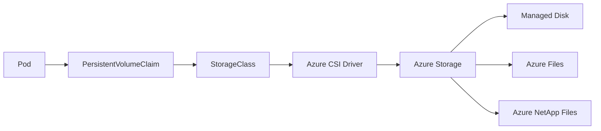
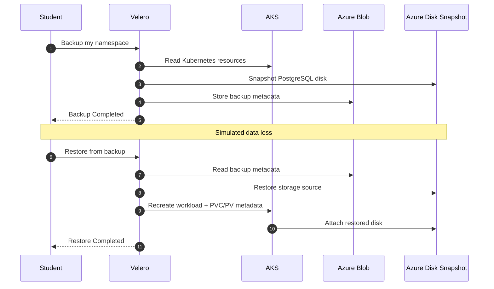

# AKS Storage and Stateful Workloads

## Workshop goal

Give developers and DevOps engineers a practical understanding of persistent storage, StatefulSets, and backup/recovery on AKS 

This version is designed for:

- **One shared AKS cluster** used by all students.
- **Azure Cloud Shell** for every participant.
- **Azure Portal → AKS → Connect → Run command in Cloud Shell** to establish the `kubectl` context.
- A **trainer-prepared Velero installation** shared by all students.
- A unique namespace per student so workloads, PVCs, and backups do not collide.

> **Scope:** PostgreSQL is used as a teaching workload, not as a recommendation that production PostgreSQL should generally be self-managed on AKS. Production database HA, PITR, encryption, secrets management, and DR require additional controls.

---

# delivery plan

| Module | Delivery focus |
|---|---|
| Module 1 | Storage fundamentals + Azure choices |
| Module 2 | StatefulSets + backup architecture |
| Shared-cluster setup | Cloud Shell + namespace + validation |
| Module 3 | PostgreSQL + Velero backup/restore |
| Module 4 | Four troubleshooting scenarios |
| Wrap-up | Q&A, recap, production takeaways |

---

# Module 1 — Kubernetes Storage Fundamentals & Azure Options

## Learning objectives

Participants can explain how a PVC becomes an Azure-backed persistent volume and choose between Azure Disk, Azure Files, Azure NetApp Files, and Blob Storage for common workload patterns.

## 1.1 Storage mental model

- **PVC** = what the workload requests.
- **PV** = the persistent volume Kubernetes binds to that request.
- **StorageClass** = how dynamic provisioning should happen.
- **CSI driver** = the integration that turns the Kubernetes request into Azure storage operations.
- **Pod lifecycle and storage lifecycle are separate.**

> **Key distinction:** A persistent volume can survive Pod deletion, but persistence is not the same as recoverability.

### Core flow



## 1.2 Access modes

| Mode | Typical Azure backend | Typical use |
|---|---|---|
| **RWO** | Azure Managed Disk | One active writer / database volume |
| **RWX** | Azure Files / ANF | Shared filesystem across Pods/nodes |
| **ROX** | Backend-dependent | Shared read-only data |

RWO is a node/attachment constraint; it is not simply “one Pod may ever use this volume.”

## 1.3 `WaitForFirstConsumer`

- Defers volume provisioning until the scheduler has a consuming Pod.
- Helps storage provisioning respect topology such as availability zones.
- Particularly important for zonal storage.

## 1.4 Azure storage choices

| Requirement | Typical first choice | Reason |
|---|---|---|
| Low-latency database block storage | **Azure Managed Disk** | Block semantics + RWO |
| Shared filesystem | **Azure Files** | RWX / shared mount |
| High-performance shared file workloads | **Azure NetApp Files** | Enterprise shared filesystem performance |
| Backups / artifacts | **Azure Blob Storage** | Object storage |

### Selection dimensions

Teach only these six during the workshop:

1. Access pattern.
2. Concurrent writers.
3. Latency / IOPS / throughput.
4. Dataset growth.
5. Failure domain and topology.
6. Backup and recovery requirements.

## 1.5 Short live demo

List the StorageClasses available on the shared cluster.

```bash
# Show the StorageClasses available to all students and identify the trainer-approved class for this lab.
kubectl get storageclass -o wide
```

Show node zones only when the shared cluster is zonal and the topic is relevant.

```bash
# Display node topology so students can see why zonal storage can affect scheduling.
kubectl get nodes -L topology.kubernetes.io/zone
```

### 2-minute knowledge check

Questions:

- What does a PVC request?
- What creates the Azure disk?
- Why is Azure Disk commonly RWO?
- Why is Azure Blob not a drop-in replacement for PostgreSQL block storage?

---

# Module 2 — StatefulSets, Backups & Architectural Patterns

## 2.1 StatefulSet essentials

Use a StatefulSet when replicas need stable identity and/or stable storage.

- Stable ordinal identity: `postgres-0`, `postgres-1`, ...
- `volumeClaimTemplates` can create one PVC per replica.
- A headless Service provides stable DNS identity.
- Pod deletion does not automatically mean persistent data deletion.

> A StatefulSet provides a controller model for stateful applications. It does **not** become the database replication system.

### Identity and storage

```text
StatefulSet postgres
        |
        +---- postgres-0 ---- pgdata-postgres-0 ---- Azure Disk
        |
        +---- postgres-1 ---- pgdata-postgres-1 ---- Azure Disk
```

## 2.2 Backup: three different things

### Database-native backup

- `pg_dump`
- Physical backups
- WAL archiving
- Point-in-time recovery

### Storage snapshot

- Fast infrastructure recovery.
- Useful for persistent volume restoration.
- May be crash-consistent rather than database-consistent.
- Does not automatically provide PostgreSQL PITR.

### Kubernetes resource backup

Velero can preserve Kubernetes objects such as:

- StatefulSets
- Services
- Secrets
- ConfigMaps
- PVC/PV metadata

The Kubernetes objects and the actual bytes in the persistent volume are related but different recovery concerns.

## 2.3 Velero architecture for this workshop

The **trainer configures this once** for the shared cluster. Students only consume the prepared service.



## 2.4 Kubernetes or managed PostgreSQL?

| Factor | PostgreSQL on AKS | Azure Database for PostgreSQL |
|---|---|---|
| Kubernetes-local control | High | Low |
| Database operations | Team-owned | More managed |
| Storage operations | Team-owned | Managed |
| HA/backup lifecycle | Team/operator | Managed-service capabilities |
| Operational burden | Higher | Lower |

The key decision question is:

> **Are we trying to run an application platform, or are we intentionally running a database platform?**

### 5-minute discussion

For a SaaS application with stateless APIs, PostgreSQL, Redis, and object uploads, which components truly need to run inside Kubernetes.

---

# Module 3 — Hands-On Lab: Stateful Deployment, Backup & Recovery

## Lab objective

Each student will:

1. Create a unique namespace.
2. Deploy PostgreSQL with an Azure Disk-backed StatefulSet.
3. Write a known test record.
4. Create a namespace-scoped Velero backup.
5. Delete the test table to simulate logical loss.
6. Delete only their namespace.
7. Restore the namespace and persistent data.
8. Verify the original record is back.

## 3.1 Trainer prerequisites

The trainer (Aayush) will prepare these:

- Shared AKS cluster with enough node and volume capacity for the class.
- A trainer-approved Azure Disk StorageClass, for example `managed-csi-premium`.
- Velero already installed in the `velero` namespace.
- Azure Blob BackupStorageLocation configured and `Available`.
- Azure Disk SnapshotLocation configured and usable.
- Velero Azure permissions and Workload Identity configured once at cluster level.


---

## 3.2 Connect Cloud Shell to AKS

In Azure Portal open:

**AKS → Connect → Run command in Cloud Shell**


Confirm cluster access.

```bash
# Verify that the shared AKS cluster is reachable before creating any student resources.
kubectl get nodes
```

Install Velero.

```
export VERSION="v1.18.2"
wget https://github.com/velero-io/velero/releases/download/v1.18.2/velero-v1.18.2-linux-amd64.tar.gz
tar -xvf velero-${VERSION}-linux-amd64.tar.gz
mkdir -p ~/.local/bin
mv velero-${VERSION}-linux-amd64/velero ~/.local/bin/
echo 'export PATH="$HOME/.local/bin:$PATH"' >> ~/.bashrc
source ~/.bashrc
velero version --client-only
```

## 3.3 Set student variables

Each student receives a short unique identifier.

```bash
# Set the unique identifier assigned to you.
export STUDENT="<studnet>"
```

Create a unique namespace name.

```bash
# Keep every student's resources isolated inside a unique namespace on the shared cluster.
export LAB_NS="storage-${STUDENT}"
```

Set the trainer-approved StorageClass.

```bash
# Use the StorageClass selected by the instructor; change only if the instructor provided a different class name.
export STORAGE_CLASS="managed-csi-premium"
```

Confirm that the StorageClass exists.

```bash
# Verify that the trainer-approved Azure Disk CSI StorageClass is present before deploying PostgreSQL.
kubectl get storageclass "$STORAGE_CLASS"
```

Create the namespace.

```bash
# Create an isolated namespace so each student's StatefulSet and PVCs stay separate.
kubectl create namespace "$LAB_NS"
```

Create a unique Velero backup name.

```bash
# Generate a unique backup name so multiple students can use the shared Velero installation safely.
export BACKUP_NAME="${STUDENT}-postgres-$(date +%Y%m%d-%H%M%S)"
```

Confirm Velero is available.

```bash
# Verify that the shared Velero backup repository is available before starting the application lab.
velero backup-location get
```

---

## 3.4 Deploy PostgreSQL

Use one manifest to reduce typing and eliminate manual YAML editing during the class.

```bash
# Deploy a small training PostgreSQL StatefulSet with one Azure Disk-backed PVC, a headless Service, and a training-only Secret.
kubectl apply -f - <<YAML
apiVersion: v1
kind: Secret
metadata:
  name: postgres-secret
  namespace: ${LAB_NS}
type: Opaque
stringData:
  POSTGRES_PASSWORD: postgres
---
apiVersion: v1
kind: Service
metadata:
  name: postgres
  namespace: ${LAB_NS}
spec:
  clusterIP: None
  selector:
    app: postgres
  ports:
    - name: postgres
      port: 5432
      targetPort: 5432
---
apiVersion: apps/v1
kind: StatefulSet
metadata:
  name: postgres
  namespace: ${LAB_NS}
spec:
  serviceName: postgres
  replicas: 1
  selector:
    matchLabels:
      app: postgres
  template:
    metadata:
      labels:
        app: postgres
    spec:
      containers:
        - name: postgres
          image: postgres:16-alpine
          ports:
            - containerPort: 5432
          env:
            - name: POSTGRES_PASSWORD
              valueFrom:
                secretKeyRef:
                  name: postgres-secret
                  key: POSTGRES_PASSWORD
            - name: POSTGRES_DB
              value: appdb
          resources:
            requests:
              cpu: 100m
              memory: 256Mi
            limits:
              cpu: 500m
              memory: 512Mi
          readinessProbe:
            exec:
              command: ["sh", "-c", "pg_isready -U postgres -d appdb"]
            initialDelaySeconds: 5
            periodSeconds: 5
          volumeMounts:
            - name: pgdata
              mountPath: /var/lib/postgresql/data
  volumeClaimTemplates:
    - metadata:
        name: pgdata
      spec:
        accessModes: ["ReadWriteOnce"]
        storageClassName: ${STORAGE_CLASS}
        resources:
          requests:
            storage: 8Gi
YAML
```

Watch the workload and PVC.

```bash
# Watch the StatefulSet, Pod, and PVC until PostgreSQL becomes Ready and the Azure Disk is provisioned and attached.
kubectl -n "$LAB_NS" get statefulset,pod,pvc -w
```

> Stop the watch with `Ctrl+C` once `postgres-0` is `Running`/`Ready` and the PVC is `Bound`.

Show the PVC to make the storage relationship explicit.

```bash
# Show the student's PostgreSQL PVC and the PV bound to it.
kubectl -n "$LAB_NS" get pvc pgdata-postgres-0 -o wide
```

---

## 3.5 Create known test data

Verify PostgreSQL is ready.

```bash
# Confirm PostgreSQL is accepting connections before creating the recovery test data.
kubectl -n "$LAB_NS" exec postgres-0 -- pg_isready -U postgres -d appdb
```

Create one deterministic row.

```bash
# Create a tiny test table and insert one known row that will be used as the restore acceptance test.
kubectl -n "$LAB_NS" exec postgres-0 -- psql -U postgres -d appdb -c "CREATE TABLE orders (id integer PRIMARY KEY, customer text NOT NULL, amount numeric(10,2) NOT NULL); INSERT INTO orders VALUES (1, 'training-user', 125.50);"
```

Verify the row.

```bash
# Prove the known-good record exists before the backup is taken.
kubectl -n "$LAB_NS" exec postgres-0 -- psql -U postgres -d appdb -c "SELECT * FROM orders;"
```

---

## 3.6 Create the Velero backup

Create a namespace-scoped backup.

```bash
# Back up only this student's namespace and request persistent-volume snapshots for the PostgreSQL Azure Disk.
velero backup create "$BACKUP_NAME" --include-namespaces "$LAB_NS" --snapshot-volumes --wait
```

Verify completion.

```bash
# Confirm that the backup completed successfully before simulating data loss.
velero backup get "$BACKUP_NAME"
```

Inspect the important backup details.

```bash
# Show included resources, volume snapshot information, and any warnings reported by Velero.
velero backup describe "$BACKUP_NAME" --details
```

> **Teaching point:** The backup contains Kubernetes resource information in the backup repository and uses Azure Managed Disk snapshots for the persistent volume. A snapshot is not equivalent to PostgreSQL point-in-time recovery.

---

## 3.7 Simulate logical data loss

Delete the database table.

```bash
# Deliberately drop the training table to simulate an operator or application mistake.
kubectl -n "$LAB_NS" exec postgres-0 -- psql -U postgres -d appdb -c "DROP TABLE orders;"
```

Confirm the table is gone.

```bash
# Prove that the test data is no longer present before the restore begins.
kubectl -n "$LAB_NS" exec postgres-0 -- psql -U postgres -d appdb -c "SELECT to_regclass('public.orders');"
```

---

## 3.8 Simulate workload loss and restore

Delete **only your namespace**.

```bash
# Remove this student's workload and current Kubernetes storage objects while leaving every other student's namespace untouched.
kubectl delete namespace "$LAB_NS"
```

Wait for namespace deletion to complete.

```bash
# Wait until the namespace is gone so Velero can recreate it without object-name conflicts.
kubectl get namespace "$LAB_NS" -w
```

Restore from the known-good backup.

```bash
# Recreate the namespace, StatefulSet, PVC/PV metadata, and persistent data from the Velero recovery point.
velero restore create --from-backup "$BACKUP_NAME" --wait
```

Check the restored workload.

```bash
# Confirm that the StatefulSet, PostgreSQL Pod, and PVC have been recreated after the restore.
kubectl -n "$LAB_NS" get statefulset,pod,pvc
```

Verify the recovered data.

```bash
# Query the restored database and confirm that the original order row has returned.
kubectl -n "$LAB_NS" exec postgres-0 -- psql -U postgres -d appdb -c "SELECT * FROM orders;"
```

Run the final acceptance test.

```bash
# Return a compact value that can be checked quickly by the instructor as proof of successful recovery.
kubectl -n "$LAB_NS" exec postgres-0 -- psql -U postgres -d appdb -tAc "SELECT id || ':' || customer || ':' || amount FROM orders WHERE id = 1;"
```

Expected result:

```text
1:training-user:125.50
```

---

## 3.9 Safe Pod-failure demonstration

This is the preferred shared-cluster substitute for a real node failure.

Delete the PostgreSQL Pod.

```bash
# Delete only the student's PostgreSQL Pod so the StatefulSet recreates it against the same persistent volume.
kubectl -n "$LAB_NS" delete pod postgres-0
```

Watch the replacement.

```bash
# Observe the recreated Pod move through scheduling, volume attachment, mounting, and PostgreSQL readiness.
kubectl -n "$LAB_NS" get pod postgres-0 -o wide -w
```

Verify the data again.

```bash
# Confirm that Pod replacement did not remove the persistent database data.
kubectl -n "$LAB_NS" exec postgres-0 -- psql -U postgres -d appdb -c "SELECT * FROM orders;"
```

> **Do not cordon or drain nodes in a learner exercise on a shared cluster.** A node operation can disrupt every participant.

---

## 3.10 Lab cleanup

Delete the student's namespace when the instructor is ready to clean the cluster.

```bash
# Remove all Kubernetes resources created by this student inside the shared-cluster training namespace.
kubectl delete namespace "$LAB_NS"
```

Optionally delete the training backup after the restore has been verified.

```bash
# Delete only this student's Velero backup and its associated snapshot artifacts after the instructor confirms recovery.
velero backup delete "$BACKUP_NAME" --confirm
```

---

# Module 4 — Troubleshooting & Failure Recovery Lab

## Troubleshooting mindset

Debug the dependency chain from the workload downward:

```text
Pod
 ↓
PVC
 ↓
PV
 ↓
StorageClass / CSI
 ↓
Azure resource
 ↓
Node topology / attachment
```

### Shared-cluster rule

Diagnose first. Avoid cluster-wide mutation as a “quick fix.”

---

## Scenario 1 — PVC stuck in `Pending`

### Symptoms

- PVC remains `Pending`.
- PostgreSQL Pod is unschedulable or waiting for storage.
- Common causes: wrong StorageClass, topology, capacity/quota, or CSI provisioning error.

### Step 1 — Inspect the claim

```bash
# Show the student's PVC and confirm whether the storage request is still Pending.
kubectl -n "$LAB_NS" get pvc -o wide
```

### Step 2 — Read the events

```bash
# Read PVC events because the provisioner or scheduler usually reports the first useful error here.
kubectl -n "$LAB_NS" describe pvc pgdata-postgres-0
```

### Step 3 — Verify the StorageClass

```bash
# Confirm that the requested class exists and inspect its provisioner and binding mode.
kubectl get storageclass "$STORAGE_CLASS" -o wide
```

### Step 4 — Check the Pod scheduler message

```bash
# Inspect the Pod for scheduling, topology, capacity, or node-constraint errors related to the pending volume.
kubectl -n "$LAB_NS" describe pod postgres-0
```

### Resolution pattern

Fix only the actual cause:

- Wrong class → correct the workload configuration before recreating the PVC.
- Topology issue → check node zones and `WaitForFirstConsumer` behavior.
- Azure quota/API error → instructor handles Azure-side remediation.
- CSI controller failure → instructor investigates cluster-level CSI health.

> **Do not delete a healthy PV/PVC just because the Pod is Pending.**

---

## Scenario 2 — Pod stuck in `ContainerCreating` because of Azure Disk attachment

### Symptoms

Typical events include:

- `FailedAttachVolume`
- `FailedMount`
- `Multi-Attach error`
- Attach timeout
- Volume limit reached

### Step 1 — Read the Pod events

```bash
# Identify the exact attach or mount failure before changing any storage objects.
kubectl -n "$LAB_NS" describe pod postgres-0
```

### Step 2 — Inspect VolumeAttachment objects

```bash
# Check whether Kubernetes believes the disk is attached to another node or is waiting for detach.
kubectl get volumeattachment -o wide
```

### Step 3 — Correlate the Pod and node

```bash
# Show where PostgreSQL is scheduled and whether the node is Ready before escalating to node/CSI troubleshooting.
kubectl -n "$LAB_NS" get pod postgres-0 -o wide
```

### Resolution pattern

- If the old node is genuinely still using the disk, wait for a clean detach or investigate that node.
- If Kubernetes reports a stale attachment but Azure has already detached the disk, the instructor can repair the stale attachment.
- If the node has reached its volume attachment limit, rescheduling or increasing node capacity may be required.

> **Student safety rule:** Do not manually delete `VolumeAttachment` objects on a shared cluster. Confirm the Azure state and involve the instructor.

---

## Scenario 3 — StatefulSet identity or PVC mapping is wrong

### Symptoms

A workload has been recreated or renamed and appears to have:

- The wrong StatefulSet name.
- A newly generated PVC.
- A PV still bound to an older claim.
- A Pod using a different storage object than expected.

### Step 1 — Inspect the StatefulSet

```bash
# Check the StatefulSet name, service name, replica count, and volumeClaimTemplates used by the workload.
kubectl -n "$LAB_NS" get statefulset postgres -o yaml
```

### Step 2 — Inspect PVC and PV mapping

```bash
# Show which PVC and PV are currently associated with the PostgreSQL data path.
kubectl -n "$LAB_NS" get pvc pgdata-postgres-0 -o wide
```

### Step 3 — Inspect the PV claim reference

```bash
# Confirm that the PV points to the expected namespace and PVC rather than an orphaned or different claim.
kubectl get pv "$(kubectl -n "$LAB_NS" get pvc pgdata-postgres-0 -o jsonpath='{.spec.volumeName}')" -o jsonpath='{.metadata.name}{" -> "}{.spec.claimRef.namespace}/{.spec.claimRef.name}{"\n"}'
```

### Safe recovery pattern

For the workshop, prefer the known-good Velero backup instead of manual PV ownership surgery.

```bash
# List backups for the student's namespace so a known-good recovery point can be selected before manual storage manipulation.
velero backup get
```

> Manual PV/PVC `claimRef` surgery is intentionally removed from the student lab. It is powerful, but it is too risky and too time-consuming for a shared four-hour workshop.

---

## Scenario 4 — Slow I/O on Azure Files

This scenario is intentionally **diagnosis-first**. Do not have every student create custom StorageClasses or run a large benchmark against the shared cluster.

### Typical symptoms

- Directory traversal is slow.
- Application latency is high despite apparently low throughput.
- Shared-file workloads perform poorly compared with local disk.
- A Premium Azure Files share does not achieve expected throughput from one client.

### Step 1 — Inspect the StorageClass

```bash
# Inspect the Azure Files class to identify the provisioner, protocol, SKU, and mount options.
kubectl get storageclass <AZURE-FILES-CLASS> -o yaml
```

### Step 2 — Inspect the live mount

```bash
# Determine whether the workload is using SMB/CIFS or NFS and inspect the actual kernel mount options.
kubectl -n <NAMESPACE> exec <POD-NAME> -- sh -c 'mount | grep -E "cifs|nfs" || true'
```

### Step 3 — Check capacity

```bash
# Confirm that the mounted Azure Files share is not nearly full before investigating performance tuning.
kubectl -n <NAMESPACE> exec <POD-NAME> -- df -h <MOUNT-PATH>
```

### Discuss the likely tuning areas

- SMB caching behavior.
- SMB Multichannel where supported.
- Azure Files tier and provisioned performance.
- NFS `nconnect` for supported workloads.
- Linux network/client limitations.
- Application access pattern: many tiny files vs sequential large I/O.

---

# Final recap

## Five things participants should remember

1. **PVCs express storage intent; CSI turns that intent into Azure storage.**
2. **Azure Disk and Azure Files solve different access patterns.**
3. **StatefulSets provide stable identity and storage relationships; they do not provide database HA by themselves.**
4. **A successful backup is not the same as a tested recovery.**
5. **In a shared cluster, namespace isolation is a safety mechanism, not just an organizational convenience.**

## Final acceptance checklist

A student has completed the workshop when they can show:

- A Bound PostgreSQL PVC using the trainer-approved Azure Disk CSI StorageClass.
- `postgres-0` with persistent data.
- A successful Velero backup.
- A deliberately deleted table.
- A successful Velero restore.
- The original row returned after recovery.
- An explanation of why the same architecture would need additional controls for production PostgreSQL.
