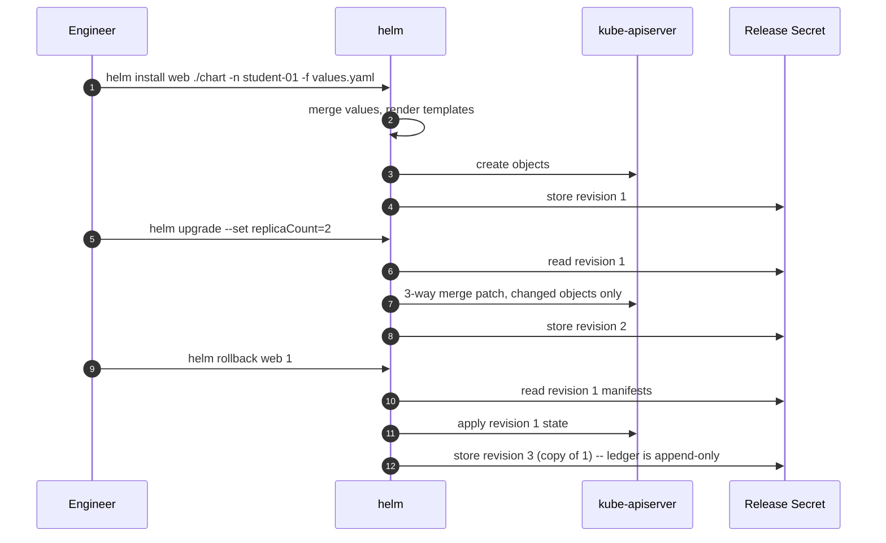

## Lab 9.6 — Helm (40 min)

### Objectives
- Explain chart, release and values, and the precedence order between them.
- Install, upgrade, roll back and uninstall a release in your namespace.
- Render with `helm template` before installing, and use the checksum-annotation idiom so a config change rolls the Pods automatically.

### Concept

Helm is a template engine plus a release ledger. A **chart** is templated manifests + `values.yaml`. A **release** is one installation of a chart into one namespace under a name. **Values precedence**, lowest to highest: chart defaults → `-f values.yaml` (later files win) → `--set`. Each revision's rendered manifests are stored in a Secret named `sh.helm.release.v1.<release>.v<n>` — that ledger is what makes rollback possible.

What Helm is **not**: a deployment controller. `helm upgrade` applies and waits; if someone edits the objects afterwards, Helm has no idea until the next upgrade. That gap is the argument for ArgoCD or Flux.



### Setup

```bash
cd ~/k8s-labs/09-foundations
kubectl config use-context aks-training
kubectl config set-context --current --namespace="$NAMESPACE"
helm version
```

### CLI walkthrough

```bash
helm repo add ingress-nginx https://kubernetes.github.io/ingress-nginx
helm repo update
helm search repo ingress-nginx --versions | head -5
helm show values ingress-nginx/ingress-nginx | head -30
```

> **Chart sourcing, for the enterprise audience.** Public chart repositories change ownership, licensing and image locations — Bitnami's public catalog was restructured during 2025 and broke a large number of pinned references overnight. Mirror the charts and images you depend on into your own ACR, and pin chart versions and image digests. Never let a production rollout depend on an anonymous pull from a repository you do not control.

**Render before you install — always:**

```bash
helm template demo ingress-nginx/ingress-nginx -n "$NAMESPACE" > preview.yaml
grep -E "^kind:" preview.yaml | sort | uniq -c
```

`ClusterRole`, `ValidatingWebhookConfiguration`, `IngressClass` — all cluster-scoped, all things you cannot create as a namespace-scoped student. **`helm template` told you the install would fail before you tried it.** (The instructor has already installed this chart cluster-wide for Section 10.)

**Scaffold your own chart — how every real chart in your organisation starts:**

```bash

helm create monolith-chart
rm -f monolith-chart/templates/hpa.yaml monolith-chart/templates/ingress.yaml

cat <<'EOF' > monolith-chart/values.yaml
replicaCount: 2

image:
  repository: mcr.microsoft.com/azuredocs/aks-helloworld
  pullPolicy: IfNotPresent
  tag: "v1"

imagePullSecrets: []
nameOverride: ""
fullnameOverride: "monolith-helm"

serviceAccount:
  create: true
  automount: false
  annotations: {}
  name: ""

config:
  appEnv: "dev"
  logLevel: "info"
  title: "Monolith deployed by Helm"

podAnnotations: {}
podLabels: {}

podSecurityContext:
  seccompProfile:
    type: RuntimeDefault

securityContext:
  allowPrivilegeEscalation: false
  capabilities:
    drop:
      - ALL

service:
  type: ClusterIP
  port: 80

resources:
  requests:
    cpu: 100m
    memory: 128Mi
  limits:
    cpu: 500m
    memory: 512Mi

livenessProbe:
  httpGet:
    path: /
    port: http
  initialDelaySeconds: 15
  periodSeconds: 20

readinessProbe:
  httpGet:
    path: /
    port: http
  initialDelaySeconds: 5
  periodSeconds: 10

autoscaling:
  enabled: false

volumes: []
volumeMounts: []
nodeSelector: {}
tolerations: []
affinity: {}
EOF

cat <<'EOF' > monolith-chart/templates/configmap.yaml
apiVersion: v1
kind: ConfigMap
metadata:
  name: {{ include "monolith-chart.fullname" . }}-config
  labels:
    {{- include "monolith-chart.labels" . | nindent 4 }}
data:
  APP_ENV: {{ .Values.config.appEnv | quote }}
  LOG_LEVEL: {{ .Values.config.logLevel | quote }}
  TITLE: {{ .Values.config.title | quote }}
EOF
```

Wire the ConfigMap into the Deployment, with the checksum annotation — this is *the* Helm idiom:

```bash
python3 - <<'PYEOF'
import pathlib
p = pathlib.Path("monolith-chart/templates/deployment.yaml")
s = p.read_text()

anno = ('      annotations:\n'
        '        checksum/config: {{ include (print $.Template.BasePath "/configmap.yaml") . | sha256sum }}\n')

if "checksum/config" not in s:
    if "      annotations:\n        {{- toYaml . | nindent 8 }}" in s:
        s = s.replace("      annotations:\n",
                      anno.replace("      annotations:\n", "      annotations:\n"), 1)
        s = s.replace('      annotations:\n        {{- toYaml . | nindent 8 }}',
                      anno + '        {{- toYaml . | nindent 8 }}', 1)
    else:
        s = s.replace("    spec:\n", anno + "    spec:\n", 1)

s = s.replace(
    "          resources:\n            {{- toYaml .Values.resources | nindent 12 }}",
    '          envFrom:\n            - configMapRef:\n                name: {{ include "monolith-chart.fullname" . }}-config\n'
    "          resources:\n            {{- toYaml .Values.resources | nindent 12 }}",
    1,
)
p.write_text(s)
PYEOF

grep -n -B1 -A2 "checksum/config" monolith-chart/templates/deployment.yaml
grep -n -A2 "envFrom" monolith-chart/templates/deployment.yaml
```

```bash
helm lint ./monolith-chart
helm template monolith-helm ./monolith-chart -n "$NAMESPACE" | grep -E "^kind:|checksum/config"

helm install monolith-helm ./monolith-chart -n "$NAMESPACE" --wait --timeout 5m
helm list -n "$NAMESPACE"
helm status monolith-helm -n "$NAMESPACE" | head -8
kubectl get secret -n "$NAMESPACE" -l "owner=helm"     # the release ledger, visible
```

**Upgrade with a values file, then with `--set`:**

```bash
cat <<'EOF' > values-dev.yaml
replicaCount: 3
config:
  appEnv: "dev"
  logLevel: "debug"
resources:
  requests:
    cpu: 50m
    memory: 64Mi
  limits:
    cpu: 200m
    memory: 192Mi
EOF

helm upgrade monolith-helm ./monolith-chart -n "$NAMESPACE" -f values-dev.yaml --wait --timeout 5m
helm upgrade monolith-helm ./monolith-chart -n "$NAMESPACE" -f values-dev.yaml --set replicaCount=1 --wait
kubectl get deploy -n "$NAMESPACE" -l "app.kubernetes.io/instance=monolith-helm" \
  -o custom-columns='NAME:.metadata.name,REPLICAS:.spec.replicas'
helm history monolith-helm -n "$NAMESPACE"
```

`--set replicaCount=1` beat the file's `3`. Command line always wins.

**The checksum idiom, proved:**

```bash
kubectl get pods -n "$NAMESPACE" -l "app.kubernetes.io/instance=monolith-helm" \
  -o custom-columns='NAME:.metadata.name,AGE:.metadata.creationTimestamp'
helm upgrade monolith-helm ./monolith-chart -n "$NAMESPACE" -f values-dev.yaml --set config.logLevel=warn --wait
kubectl get pods -n "$NAMESPACE" -l "app.kubernetes.io/instance=monolith-helm" \
  -o custom-columns='NAME:.metadata.name,AGE:.metadata.creationTimestamp'
```

New Pod names. A ConfigMap-only change produced a rolling restart automatically — no `rollout restart` needed. That is the whole reason charts beat a folder of static YAML.

**Rollback and test:**

```bash
helm history monolith-helm -n "$NAMESPACE"
helm rollback monolith-helm 2 -n "$NAMESPACE" --wait --timeout 5m
helm history monolith-helm -n "$NAMESPACE"      # rollback is a NEW revision -- append-only ledger
helm test monolith-helm -n "$NAMESPACE" --logs  # the generated test-connection Pod; most teams delete it, a mistake
```


Red/green field-level output before anything happens. In a change-controlled enterprise that output *is* your change record.

**Package to ACR — the enterprise pattern (charts as OCI artifacts beside your images):**

```bash
helm package ./monolith-chart --destination ./dist
# az acr login --name "$ACR_NAME"
# helm push ./dist/monolith-chart-0.1.0.tgz "oci://${ACR_LOGIN_SERVER}/helm"
# helm install monolith-helm "oci://${ACR_LOGIN_SERVER}/helm/monolith-chart" --version 0.1.0 -n "$NAMESPACE"
```

### WebUI equivalent

Helm has no first-class Portal UI. **Workloads → Deployments →** open a release object → **YAML** → find `app.kubernetes.io/managed-by: Helm`. That label is the only clue in the UI. **Configuration → Secrets** shows `sh.helm.release.v1.monolith-helm.v1..v5` — one per revision.

**Drift demo:** scale `monolith-helm` to 5 in the Portal, then `helm upgrade monolith-helm ./monolith-chart -n "$NAMESPACE" -f values-dev.yaml --wait`. It snaps back. Editing a Helm-managed object through the Portal is a drift event that the next upgrade silently reverts.

### Verify & troubleshoot

```bash
helm list -n "$NAMESPACE"                                    # STATUS deployed
helm history monolith-helm -n "$NAMESPACE"                   # >= 4 revisions
kubectl get all -n "$NAMESPACE" -l "app.kubernetes.io/managed-by=Helm"
```

**Scenario — a failed upgrade, and `--atomic`.**

```bash
helm upgrade monolith-helm ./monolith-chart -n "$NAMESPACE" \
  -f values-dev.yaml --set image.tag=not-a-real-tag --wait --timeout 90s
helm list -n "$NAMESPACE"                                    # STATUS: failed
kubectl describe pod -n "$NAMESPACE" -l "app.kubernetes.io/instance=monolith-helm" | sed -n '/Events:/,$p' | tail -10
helm rollback monolith-helm -n "$NAMESPACE" --wait --timeout 5m

# Better: let Helm roll itself back.
helm upgrade monolith-helm ./monolith-chart -n "$NAMESPACE" \
  -f values-dev.yaml --set image.tag=still-not-real --atomic --timeout 90s || echo "auto-rolled-back"
helm list -n "$NAMESPACE"                                    # STATUS: deployed
```

`--wait --timeout` is what turns a silent half-broken rollout into a failed command your pipeline can detect. Always use it in CI; prefer `--atomic`.

| Symptom                                        | Cause                                      | Fix                                        |
| ---------------------------------------------- | ------------------------------------------ | ------------------------------------------ |
| `cannot re-use a name that is still in use`    | Release exists                             | `helm upgrade`, or uninstall first         |
| Stuck in `pending-upgrade`                     | Interrupted upgrade (Ctrl-C, CI timeout)   | `helm rollback <rel> <last-good>`          |
| `field is immutable`                           | Changed a Deployment `selector`            | Uninstall and reinstall                    |
| Objects exist, `helm list` empty               | Wrong namespace, or created with `kubectl` | `helm list -A`; check `managed-by`         |
| `INSTALLATION FAILED: ... is forbidden`        | Chart creates cluster-scoped objects       | `helm template` first; instructor installs |
| Rollback reverts config but Pods don't restart | No checksum annotation                     | Add it as above                            |
| Values seem ignored                            | Precedence, or a typo in a nested key      | `helm get values <rel> -n <ns> --all`      |

### Cleanup

```bash
helm uninstall monolith-helm -n "$NAMESPACE"
helm list -n "$NAMESPACE" --all
kubectl get all -n "$NAMESPACE" -l "app.kubernetes.io/managed-by=Helm"
rm -rf ./dist preview.yaml
kubectl get all -n "$NAMESPACE"                  # the hand-written monolith from 9.4 remains -- keep it
```

`helm uninstall` deletes the history Secrets too, so rollback is no longer possible. Use `--keep-history` when you want the release marked `uninstalled` but still rollback-able.
