# Kubernetes & AKS — Sections 9 to 12

**Total delivery time: 12 hours.** S9 Foundations (6h) · S10 Networking & Gateway API (2h) · S11 Storage & Stateful (2h) · S12 Secure Operations (2h).

---

## 0. How this was fitted into 12 hours

The syllabus contains more material than 12 hours of live delivery can absorb. Four decisions make it fit. State them to the class on slide one so nobody thinks something was forgotten.

| Decision | Effect |
|---|---|
| **Pre-work is mandatory, not optional** | Toolchain install and the local `k3d` cluster happen before day one. Saves ~50 min of live time. |
| **Cluster-scoped components are pre-installed by the instructor** | Ingress controller, cert-manager, Velero, Secrets Store CSI driver. Students consume them in their own namespace. Saves ~60 min and matches how a real platform team operates anyway. |
| **Each concept is taught once, in the section that owns it** | NetworkPolicy lives in S12, not S9. Service types live in S10, not S9. Probes live in S9, not repeated in S11. |
| **Terraform `apply` runs in the background** | Kick off the 8–10 min apply, then teach the sizing/node-pool theory while it provisions. |

### Time budget

| Section | Lab | Minutes |
|---|---|---|
| **9** | 9.1 Architecture, modernization strategy & sizing (no terminal) | 45 |
| | 9.2 Cluster access, `kubectl` workflow & contexts | 40 |
| | 9.3 Namespaces & dev/test isolation | 30 |
| | 9.4 Core objects + the monolith on AKS | 90 |
| | 9.5 Provision AKS with Terraform | 75 |
| | 9.6 Helm | 40 |
| | Breaks & buffer | 40 |
| | **Section 9 total** | **360** |
| **10** | 10.1 Networking models & Service types | 20 |
| | 10.2 Gateway API + DNS + TLS | 60 |
| | 10.3 Troubleshooting lab | 30 |
| | Buffer | 10 |
| | **Section 10 total** | **120** |
| **11** | 11.1 Storage primitives & Azure options | 20 |
| | 11.2 StatefulSet on Azure Disks | 45 |
| | 11.3 Backup & restore with Velero | 35 |
| | 11.4 Troubleshooting lab | 20 |
| | **Section 11 total** | **120** |
| **12** | 12.1 AKS RBAC & least privilege | 25 |
| | 12.2 Workload Identity + Key Vault CSI | 45 |
| | 12.3 Pod Security Standards | 20 |
| | 12.4 Default-deny network policy | 25 |
| | Wrap-up | 5 |
| | **Section 12 total** | **120** |

Every lab below follows the same shape: **Objectives → Concept → Diagram → Setup → CLI → WebUI → Verify & troubleshoot → Cleanup.**

### Conventions

| Placeholder | Example |
|---|---|
| `$STUDENT` / `$NAMESPACE` | `student-01` |
| `$NS_DEV` / `$NS_TEST` | `student-01-dev` / `student-01-test` |
| `$RG` / `$AKS_NAME` | `rg-k8s-training` / `aks-training-shared` |
| `$ACR_NAME` / `$LOCATION` | `acrtrainingshared` / `centralindia` |
| `$BASE_DOMAIN` | `training.example.com` |

**Every `kubectl` command carries `-n $NAMESPACE`.** On a shared cluster an un-namespaced command is how you land in someone else's lab.

---

## 0.1 Pre-work (students complete before day one — 30 min, unattended)

```bash
# Azure CLI, kubectl, kubelogin, Helm, k9s
curl -sL https://aka.ms/InstallAzureCLIDeb | sudo bash
sudo az aks install-cli
curl -fsSL https://raw.githubusercontent.com/helm/helm/main/scripts/get-helm-3 | bash
K9S_VERSION="$(curl -s https://api.github.com/repos/derailed/k9s/releases/latest | grep -oP '"tag_name": "\K[^"]+')"
curl -sL "https://github.com/derailed/k9s/releases/download/${K9S_VERSION}/k9s_Linux_amd64.tar.gz" -o /tmp/k9s.tar.gz
tar -xzf /tmp/k9s.tar.gz -C /tmp k9s && sudo mv /tmp/k9s /usr/local/bin/k9s

az version && kubectl version --client && kubelogin --version && helm version && k9s version
```

```bash
# Terraform
wget -O- https://apt.releases.hashicorp.com/gpg | sudo gpg --dearmor -o /usr/share/keyrings/hashicorp-archive-keyring.gpg
echo "deb [signed-by=/usr/share/keyrings/hashicorp-archive-keyring.gpg] https://apt.releases.hashicorp.com $(lsb_release -cs) main" | sudo tee /etc/apt/sources.list.d/hashicorp.list
sudo apt-get update && sudo apt-get install -y terraform
terraform version
```

```bash
# Local k3d cluster on WSL2 (Docker Desktop -> Settings -> Resources -> WSL Integration -> enable Ubuntu)
curl -s https://raw.githubusercontent.com/k3d-io/k3d/main/install.sh | bash

cat <<'EOF' > ~/k3d-lab.yaml
apiVersion: k3d.io/v1alpha5
kind: Simple
metadata:
  name: lab
servers: 1
agents: 2
image: rancher/k3s:v1.31.5-k3s1
ports:
  - port: 8080:80
    nodeFilters:
      - loadbalancer
options:
  k3d:
    wait: true
    timeout: "120s"
  kubeconfig:
    updateDefaultKubeconfig: true
    switchCurrentContext: true
EOF

k3d cluster create --config ~/k3d-lab.yaml
kubectl config use-context k3d-lab
kubectl get nodes            # 3 nodes Ready = pre-work complete
k3d cluster stop lab         # stop it; restart with 'k3d cluster start lab' when needed
```

**What k3d is for:** manifest authoring, `kubectl` muscle memory, breaking things privately. **What it cannot teach:** Azure Load Balancer behaviour, CNI IP planning, Entra ID auth, node autoscaling, AKS upgrades, Workload Identity. Everything in that second list is why the shared AKS cluster exists.

Work directory for all four sections:

```bash
mkdir -p ~/k8s-labs/{09-foundations,10-networking,11-storage,12-security}
```

---

## 0.2 Instructor prep (once, before day one)

```bash
export RG="rg-k8s-training" AKS_NAME="aks-training-shared" STUDENT_COUNT=20
az aks get-credentials -g "$RG" -n "$AKS_NAME" --admin --overwrite-existing

# Namespaces + per-student RBAC
kubectl apply -f - <<'EOF'
apiVersion: rbac.authorization.k8s.io/v1
kind: ClusterRole
metadata:
  name: training-cluster-reader
rules:
  - apiGroups: [""]
    resources: ["nodes", "namespaces", "persistentvolumes", "events"]
    verbs: ["get", "list", "watch"]
  - apiGroups: ["storage.k8s.io"]
    resources: ["storageclasses"]
    verbs: ["get", "list", "watch"]
  - apiGroups: ["metrics.k8s.io"]
    resources: ["nodes", "pods"]
    verbs: ["get", "list"]
  - apiGroups: ["gateway.networking.k8s.io"]
    resources: ["gatewayclasses"]
    verbs: ["get", "list", "watch"]
EOF

for i in $(seq -w 1 $STUDENT_COUNT); do
  STUDENT="student-${i}"
  GROUP_ID="$(az ad group show --group "aks-training-${STUDENT}" --query id -o tsv)"
  for SUFFIX in "" "-dev" "-test"; do
    NS="${STUDENT}${SUFFIX}"
    kubectl create namespace "$NS" --dry-run=client -o yaml | kubectl apply -f -
    kubectl label namespace "$NS" "training.owner=${STUDENT}" --overwrite
    kubectl create rolebinding "${STUDENT}-edit" --clusterrole=edit --group="$GROUP_ID" -n "$NS" \
      --dry-run=client -o yaml | kubectl apply -f -
  done
  kubectl create clusterrolebinding "${STUDENT}-cluster-reader" \
    --clusterrole=training-cluster-reader --group="$GROUP_ID" \
    --dry-run=client -o yaml | kubectl apply -f -
done
```

Cluster-scoped components to install before the relevant section (each is a `helm install` plus a check):

| Component | Needed by | Install |
|---|---|---|
| NGINX Gateway Fabric (or ingress-nginx) | S10 | `helm install ngf oci://ghcr.io/nginx/charts/nginx-gateway-fabric -n nginx-gateway --create-namespace` |
| cert-manager | S10 | `helm install cert-manager jetstack/cert-manager -n cert-manager --create-namespace --set crds.enabled=true` |
| external-dns → Azure DNS | S10 | Chart + a managed identity with `DNS Zone Contributor` on `$BASE_DOMAIN` |
| Velero + Azure plugin | S11 | `velero install --provider azure --bucket velero --secret-file ./credentials-velero ...` |
| Secrets Store CSI + Azure provider | S12 | `az aks enable-addons -g $RG -n $AKS_NAME -a azure-keyvault-secrets-provider` |
| Network policy engine | S12 | Must be on the cluster at creation: `--network-policy calico` |
| Workload Identity + OIDC | S12 | `az aks update -g $RG -n $AKS_NAME --enable-oidc-issuer --enable-workload-identity` |

Per-student managed identity for S12 (create up front — the `az` commands are shown to students but not run by them):

```bash
export OIDC_URL="$(az aks show -g "$RG" -n "$AKS_NAME" --query oidcIssuerProfile.issuerUrl -o tsv)"
for i in $(seq -w 1 $STUDENT_COUNT); do
  STUDENT="student-${i}"
  az identity create -g "$RG" -n "id-${STUDENT}" -l "$LOCATION"
  CLIENT_ID="$(az identity show -g "$RG" -n "id-${STUDENT}" --query clientId -o tsv)"
  az identity federated-credential create \
    --name "fc-${STUDENT}" --identity-name "id-${STUDENT}" -g "$RG" \
    --issuer "$OIDC_URL" \
    --subject "system:serviceaccount:${STUDENT}:sa-monolith" \
    --audience api://AzureADTokenExchange
  echo "${STUDENT} client-id: ${CLIENT_ID}"
done
```

Distribute each student's `client-id` and the Key Vault name on their lab card.

---
---

# SECTION 9 — Kubernetes and AKS Foundations (6h)

**Deliverable:** an AKS cluster provisioned by Terraform, running the previously containerized monolith as a Deployment + Service, with dev/test namespace isolation and a Helm-installed component.

---

## Lab 9.1 — Architecture, modernization strategy & sizing (45 min, no terminal)

### Objectives
- Describe the control plane / data plane split and say which half Microsoft operates on AKS.
- Map five VM-era concepts onto Kubernetes objects and explain declarative reconciliation.
- Apply a scoring rubric to decide whether a workload belongs on AKS — and name five that do not.
- Size a cluster and design its node pools from workload requests.

### Concept

Kubernetes is a control system, not a place to run containers. You submit *desired state*; controllers close the gap between it and observed state, continuously. In VM operations a change was an imperative event that could silently drift afterwards. Here a change is a persistent intent that keeps being true.

| Traditional | Kubernetes | What changed |
|---|---|---|
| Virtual machine | **Pod** | Disposable, seconds to create, no persistent identity |
| Golden image | **Container image** | Immutable, versioned, built in CI |
| LB VIP + pool members | **Service** | Membership computed from labels, not edited by hand |
| `systemctl enable app` | **Deployment** `replicas: 3` | The controller restarts it, not you |
| `/etc/myapp/app.conf` | **ConfigMap** | Versioned, namespaced, injected at runtime |
| `.env` with the DB password | **Secret** (→ Key Vault) | Controlled by RBAC, not file permissions |
| dev/test/prod VLANs | **Namespaces** + policy | Logical isolation inside one cluster |
| Change window + runbook | `kubectl apply` of Git-tracked YAML | Reviewable, auditable, revertable |

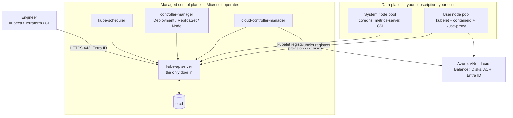

**AKS specifics to state now, so later labs make sense**

- **Managed control plane** — no SSH to the API server, no `etcd` backup on you. You choose the tier: Free (no SLA), Standard (99.95% with zones), Premium (long-term version support).
- **Node pools** — one *system* pool for add-ons, one or more *user* pools for workloads. The split stops a runaway app from starving CoreDNS. Enforced with the `CriticalAddonsOnly` taint (Lab 9.5).
- **Upgrades are two-phase** — control plane first, then node pools (cordon → drain → surge-replace). One replica plus a `PodDisruptionBudget` with `minAvailable: 1` will block a drain forever. Covered in 9.4 and revisited in the S11 cleanup.
- **If the control plane is down for ten minutes**, running Pods keep serving. You lose the ability to *change*, *reschedule* and *scale*. Know this distinction before your next SLA conversation.

### Modernization decision framework

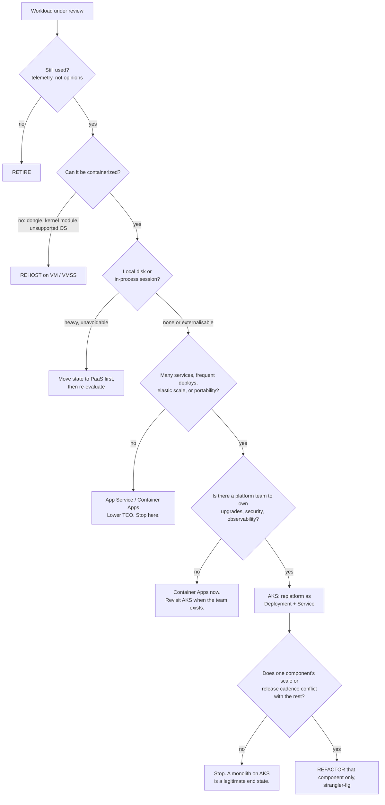

| Strategy | Changes | Effort | Right when |
|---|---|---|---|
| Retire | It goes away | Very low | Nobody can name a user |
| Rehost | Hosting only | Low | Datacentre exit deadline, no capacity |
| Replatform | Packaging + externalised config | Medium | Deployment pain is the bottleneck |
| Refactor | Architecture | High | One component's cadence genuinely conflicts |
| Replace | Buy instead of build | Medium | A commodity you happened to build |

**Sequencing rule that saves projects: containerize before you decompose.** Teams that attempt platform adoption and microservice decomposition at once usually deliver neither.

**When NOT to use Kubernetes** — say all six out loud:

1. A single app deployed monthly by one team. The platform costs more than it returns.
2. Anything that can't be containerized — dongles, kernel modules, MAC-bound licence servers.
3. Stateful engines you can buy as a service. You *can* run PostgreSQL or Kafka with operators; you then own storage performance, backup verification and failover testing.
4. Latency-critical or specialised-hardware workloads (real-time kernels, SR-IOV).
5. Windows apps with heavy GUI/COM+/MSMQ dependencies.
6. **When there is no platform team.** This is the one that actually kills projects.

**Scoring rubric** (0–100; ≤30 → don't use Kubernetes, 31–60 → Container Apps or AKS-with-a-team, ≥61 → AKS fits):

| Dimension | 0 | mid | max |
|---|---|---|---|
| Deploy frequency (0–20) | Quarterly | Monthly (10) | Weekly+ (20) |
| Deployable services (0–20) | 1 | 2–5 (10) | 6+ (20) |
| Scaling variability (0–15) | Flat | Predictable peaks (7) | Spiky (15) |
| Statelessness (0–15) | Local disk + session | Session externalised (7) | Stateless (15) |
| Team capability (0–15) | No container experience | Some CI/CD maturity (7) | Platform team exists (15) |
| Portability need (0–15) | Azure-only | Prefer portable (7) | Multi-cloud/on-prem (15) |

**Exercise (10 min):** each participant scores three of their own applications and reports the lowest scorer plus what the organisation would actually gain by moving it.

### Sizing & node pool design

AKS reserves resources on every node before your Pods see any. Memory: 25% of the first 4 GB, 20% of 4–8, 10% of 8–16, 6% of 16–128, 2% above. CPU: 6% of core 1, 1% of core 2, 0.5% each for cores 3–4, 0.25% thereafter. A `Standard_D2s_v5` (2 vCPU / 8 GB) yields roughly 1.9 vCPU and ~5.4 GB allocatable — nearly a third of the memory gone before you deploy anything. Every cost estimate built on raw capacity is wrong.

```
1. Sum workload CPU/memory REQUESTS (not usage, not limits):   24 vCPU / 96 GB
2. Headroom for burst, rolling updates, node failure (x1.3):   31.2 vCPU / 124.8 GB
3. Divide by ALLOCATABLE per node (D4s_v5 ≈ 3.86 vCPU / 12.8 GB):
     cpu 31.2/3.86 = 8.1 -> 9    memory 124.8/12.8 = 9.75 -> 10    take 10
4. Add N+1 and round to a multiple of the zone count:          12 across 3 zones
5. Autoscaler: min 6, max 18
```

| Pool role | Size | Notes |
|---|---|---|
| System | `D2s_v5`/`D4s_v5`, 2–3 nodes | Never 1 node. Spread across zones. Tainted. |
| General apps | `D4s_v5`/`D8s_v5` | 4–8 vCPU is the value sweet spot |
| Memory-heavy (JVM) | `E4s_v5`/`E8s_v5` | 8 GB per vCPU |
| Batch / CI | `D8s_v5` Spot | Taint `kubernetes.azure.com/scalesetpriority=spot:NoSchedule` |

IP planning, which you cannot change later: **kubenet** 110 pods/node, non-routable Pod IPs. **Classic Azure CNI** — every Pod takes a VNet IP, so the subnet needs `(nodes + surge) × (max_pods + 1)`; 100 nodes × 110 pods = 11,211 addresses, a /18. **Azure CNI Overlay** — nodes get VNet IPs, Pods get overlay IPs from a private CIDR, so a /24 supports a large cluster. Node subnets cannot be resized after cluster creation. Default to Overlay.

Rules for every pool: taint special-purpose pools and require an explicit toleration; label by *intent* (`workload=batch`) not implementation (`vm=D8sv5`); keep the system pool boring and multi-zone; one pool per scaling profile.

---

## Lab 9.2 — Cluster access, `kubectl` workflow & contexts (40 min)

### Objectives
- Authenticate to the shared AKS cluster with Entra ID + `kubelogin` and explain why `az aks get-credentials` alone is not enough.
- Manage contexts and pin a default namespace.
- Read the cluster's physical topology and your own permissions.

### Concept

`kubectl` reads `~/.kube/config`, which holds three independent lists: **clusters** (URL + CA), **users** (how to authenticate), **contexts** (cluster + user + default namespace). On an Entra-integrated cluster the user entry holds no token — it holds an *exec plugin* stanza that runs `kubelogin` to fetch a fresh OIDC token. `az aks get-credentials` writes the removed legacy provider; `kubelogin convert-kubeconfig` rewrites it to the supported exec format.

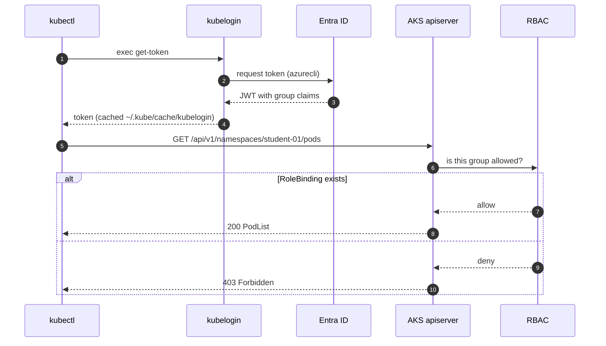

### Setup

```bash
cd ~/k8s-labs/09-foundations
export STUDENT="student-01"          # CHANGE to your assigned ID
export NAMESPACE="$STUDENT"
export NS_DEV="${STUDENT}-dev"
export NS_TEST="${STUDENT}-test"
export RG="rg-k8s-training"
export AKS_NAME="aks-training-shared"
export ACR_NAME="acrtrainingshared"
export LOCATION="centralindia"

cat <<EOF >> ~/.bashrc
export STUDENT="$STUDENT" NAMESPACE="$NAMESPACE" NS_DEV="$NS_DEV" NS_TEST="$NS_TEST"
export RG="$RG" AKS_NAME="$AKS_NAME" ACR_NAME="$ACR_NAME" LOCATION="$LOCATION"
EOF
```

### CLI walkthrough

```bash
az login --use-device-code
az account show -o table
# If multiple subscriptions: az account set --subscription "<ID-or-NAME>"
```

```bash
az aks get-credentials -g "$RG" -n "$AKS_NAME" --overwrite-existing
kubelogin convert-kubeconfig -l azurecli
kubectl cluster-info
```

`--overwrite-existing` prevents `aks-training-shared-1`, `-2` accumulating. **Never use `--admin`** on the shared cluster — it bypasses Entra ID and hands you cluster-admin.

Login modes: `-l azurecli` (workstation, our default), `-l devicecode` (headless), `-l workloadidentity` (Pods and federated CI), `-l spn` (legacy CI).

```bash
# Contexts: pin the namespace and give the context a name you can type.
kubectl config get-contexts
kubectl config rename-context "$AKS_NAME" "aks-training"
kubectl config use-context "aks-training"
kubectl config set-context --current --namespace="$NAMESPACE"
kubectl config view --minify -o jsonpath='{..namespace}{"\n"}'
```

```bash
# Physical topology
kubectl get nodes -o wide
kubectl get nodes -L agentpool -L kubernetes.azure.com/mode \
  -L topology.kubernetes.io/zone -L node.kubernetes.io/instance-type
kubectl describe node "$(kubectl get nodes -o jsonpath='{.items[0].metadata.name}')" \
  | grep -A 12 -E "Taints:|Allocatable:|Allocated resources"
kubectl top nodes
```

In the `describe` output point out three things: **Allocatable < Capacity** (the reservation from 9.1), **Taints** on system-pool nodes, and **Allocated resources** being the sum of *requests* — the only number the scheduler reads.

```bash
# Your three self-service reference tools
kubectl api-resources | head -20
kubectl api-resources --namespaced=false | head -10     # why a ClusterRole can't live in your namespace
kubectl explain deployment.spec.strategy
kubectl auth can-i create deployments -n "$NAMESPACE"   # yes
kubectl auth can-i create deployments -n kube-system    # no
kubectl auth can-i --list -n "$NAMESPACE" | head -15
```

Teach `kubectl explain` before any web search — it reflects the API version this cluster actually runs.

Optional terminal UI: `k9s -n "$NAMESPACE"` → `:pod`, `:deploy`, `:svc` to switch resource, `d` describe, `l` logs, `s` shell, `?` help.

### WebUI equivalent

| CLI | Azure Portal |
|---|---|
| `az aks show` | **Kubernetes services → cluster → Overview** |
| `kubectl get nodes -o wide` | **→ Node pools → pool → Nodes** |
| `kubectl get nodes -L agentpool` | **→ Node pools** (Mode column: System / User) |
| `kubectl top nodes` | **→ Monitoring → Insights → Nodes** |
| `kubectl get pods -A` | **→ Kubernetes resources → Workloads** (namespace filter) |
| `kubectl auth can-i --list` | **→ Access control (IAM) → Check access** |

1. Portal → **Kubernetes services → `aks-training-shared` → Node pools**. Exactly one pool is Mode `System`.
2. **Kubernetes resources → Workloads**, set **Namespace** to yours. Empty for now.
3. **Monitoring → Insights → Cluster** for node CPU/memory over the last 6 hours.

The Portal's Kubernetes resources blade is a real API client authenticating as *you*. "You do not have access" there is the same `403` the CLI returns, not a Portal bug.

### Verify & troubleshoot

```bash
kubectl config current-context                                  # aks-training
kubectl config view --minify -o jsonpath='{..namespace}{"\n"}'  # student-01
kubectl get nodes                                               # all Ready
kubectl auth can-i create deployments -n "$NAMESPACE"           # yes
kubectl get pods -n "$NAMESPACE"                                # "No resources found" = PASS
```

**Scenario — deliberate 403.** Run `kubectl get pods -n kube-system`, then `kubectl auth can-i list pods -n kube-system`. **`Forbidden` means authentication succeeded and authorization failed; `Unauthorized` means the token itself was rejected.** Two very different tickets.

| Symptom | Cause | Fix |
|---|---|---|
| `Unable to connect ... i/o timeout` | Authorized-IP range, you're off-VPN | Connect to VPN or get your egress IP added |
| `You must be logged in (Unauthorized)` | Cached token expired / wrong tenant | `kubelogin remove-tokens`; `az login --tenant <id>` |
| `exec: "kubelogin": not found` | Not installed | `sudo az aks install-cli` |
| `connection to localhost:8080 refused` | No kubeconfig | Re-run `az aks get-credentials` |
| Commands hit the wrong cluster | Current context is k3d | `kubectl config use-context aks-training` |
| `Forbidden` in your own namespace | RoleBinding missing / group claim absent | `kubectl auth can-i --list -n $NAMESPACE`; instructor checks the binding |

### Cleanup

Nothing was created on the cluster — this lab produced local configuration only. **Keep the context**; every later lab depends on it.

---

## Lab 9.3 — Namespaces & dev/test isolation (30 min)

### Objectives
- Explain precisely what a namespace does and does not isolate.
- Enforce capacity with `ResourceQuota` and set container defaults with `LimitRange`.
- Show that DNS is namespace-aware and that namespaces are *not* a network boundary.

### Concept

A namespace is a **name scope plus a policy attachment point**. It gives you: name uniqueness, an RBAC attachment point, a quota attachment point, a DNS domain (`<svc>.<ns>.svc.cluster.local`), and a cheap blast radius (`delete namespace` removes everything inside).

It does **not** give you network isolation (every Pod can reach every Pod cluster-wide until a NetworkPolicy says otherwise — **Lab 12.4**), node isolation, or kernel isolation.

The enterprise answer to "namespaces or clusters for dev/test/prod": dev and test as namespaces in one cluster is normal and cost-effective; **production in its own cluster is the default posture**, because upgrades, CRDs and admission controllers are cluster-wide and hit every namespace at once.

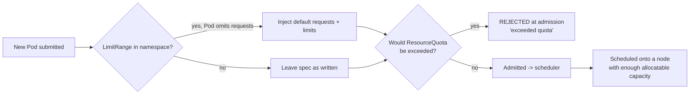

### Setup

```bash
cd ~/k8s-labs/09-foundations
kubectl config use-context aks-training
kubectl config set-context --current --namespace="$NAMESPACE"
kubectl get ns "$NAMESPACE" "$NS_DEV" "$NS_TEST"
```

### CLI walkthrough

```bash
kubectl label namespace "$NS_DEV"  environment=dev  owner="$STUDENT" cost-center=training --overwrite
kubectl label namespace "$NS_TEST" environment=test owner="$STUDENT" cost-center=training --overwrite
kubectl get namespaces -L environment,owner,cost-center
kubectl get namespaces -l "owner=$STUDENT"
```

```bash
cat <<EOF > 01-governance.yaml
apiVersion: v1
kind: ResourceQuota
metadata:
  name: dev-quota
  namespace: $NS_DEV
spec:
  hard:
    requests.cpu: "2"
    requests.memory: "4Gi"
    limits.cpu: "4"
    limits.memory: "8Gi"
    pods: "10"
    services: "5"
    services.loadbalancers: "0"
    persistentvolumeclaims: "4"
    count/deployments.apps: "5"
---
apiVersion: v1
kind: LimitRange
metadata:
  name: dev-limits
  namespace: $NS_DEV
spec:
  limits:
    - type: Container
      default:
        cpu: "300m"
        memory: "256Mi"
      defaultRequest:
        cpu: "100m"
        memory: "128Mi"
      min:
        cpu: "10m"
        memory: "32Mi"
      max:
        cpu: "1"
        memory: "1Gi"
    - type: Pod
      max:
        cpu: "2"
        memory: "2Gi"
    - type: PersistentVolumeClaim
      min:
        storage: "1Gi"
      max:
        storage: "10Gi"
EOF

kubectl apply -f 01-governance.yaml
kubectl describe resourcequota dev-quota -n "$NS_DEV"
kubectl describe limitrange dev-limits -n "$NS_DEV"
```

`services.loadbalancers: "0"` is a real cost control — every `type: LoadBalancer` Service provisions a public IP.

**Critical rule:** once a quota sets `requests.cpu` or `requests.memory`, **every** container in that namespace must specify requests and limits or be rejected at admission. The `LimitRange` is what keeps existing manifests working.

```bash
cat <<'EOF' > 02-web.yaml
apiVersion: apps/v1
kind: Deployment
metadata:
  name: web
  labels:
    app: web
spec:
  replicas: 2
  selector:
    matchLabels:
      app: web
  template:
    metadata:
      labels:
        app: web
    spec:
      containers:
        - name: web
          image: mcr.microsoft.com/azuredocs/aks-helloworld:v1
          ports:
            - name: http
              containerPort: 80
          resources:
            requests:
              cpu: "50m"
              memory: "64Mi"
            limits:
              cpu: "200m"
              memory: "192Mi"
---
apiVersion: v1
kind: Service
metadata:
  name: web
  labels:
    app: web
spec:
  type: ClusterIP
  selector:
    app: web
  ports:
    - name: http
      port: 80
      targetPort: http
EOF

kubectl apply -f 02-web.yaml -n "$NS_DEV"
kubectl apply -f 02-web.yaml -n "$NS_TEST"
kubectl rollout status deployment/web -n "$NS_DEV"  --timeout=180s
kubectl rollout status deployment/web -n "$NS_TEST" --timeout=180s
kubectl describe resourcequota dev-quota -n "$NS_DEV" | grep -E "pods|requests"
```

Two Deployments named `web`, two Services named `web`, zero conflicts. That is the name-scope property.

```bash
# DNS is namespace-aware
kubectl run netshoot --image=nicolaka/netshoot:latest --restart=Never -n "$NS_DEV" --command -- sleep 3600
kubectl wait --for=condition=Ready pod/netshoot -n "$NS_DEV" --timeout=120s

kubectl exec -it netshoot -n "$NS_DEV" -- cat /etc/resolv.conf
kubectl exec -it netshoot -n "$NS_DEV" -- nslookup web
kubectl exec -it netshoot -n "$NS_DEV" -- nslookup "web.${NS_TEST}.svc.cluster.local"
kubectl exec -it netshoot -n "$NS_DEV" -- curl -s -o /dev/null -w "dev  -> %{http_code}\n" http://web
kubectl exec -it netshoot -n "$NS_DEV" -- curl -s -o /dev/null -w "test -> %{http_code}\n" "http://web.${NS_TEST}.svc.cluster.local"
```

The `search` line in `/etc/resolv.conf` is the whole magic behind short names. **Both curls return 200** — a Pod in dev just reached a Service in test with nothing stopping it. That is the setup for Lab 12.4.

### WebUI equivalent

| CLI | Portal |
|---|---|
| `kubectl get ns` | **Kubernetes resources → Namespaces** |
| `kubectl label namespace` | Namespace → **YAML** → edit `metadata.labels` → Review + save |
| `kubectl apply -f 01-governance.yaml` | **Kubernetes resources → + Create → Add with YAML** |
| `kubectl get deploy -n $NS_DEV` | **Workloads → Deployments**, Namespace filter |

Switch the **Namespace** dropdown between `student-01-dev` and `student-01-test`: same Deployment name, different object. The filter is doing exactly what `-n` does. Then edit the `web` Deployment's `spec.replicas` in the **YAML** tab, save, and confirm from the terminal — the Portal and CLI are two clients of one API.

### Verify & troubleshoot

```bash
kubectl get ns -l "owner=$STUDENT"
kubectl get resourcequota,limitrange -n "$NS_DEV"
kubectl get deploy web -n "$NS_DEV"  -o jsonpath='{.status.readyReplicas}{"\n"}'   # 2
kubectl get deploy web -n "$NS_TEST" -o jsonpath='{.status.readyReplicas}{"\n"}'   # 2
```

**Scenario 1 — exceed the quota (asynchronous failure).**

```bash
kubectl scale deployment/web --replicas=12 -n "$NS_DEV"
kubectl get deploy web -n "$NS_DEV"                 # 2/12
kubectl get pods -n "$NS_DEV" -l app=web            # only 2 -- the rest never existed
RS="$(kubectl get rs -n "$NS_DEV" -l app=web -o jsonpath='{.items[0].metadata.name}')"
kubectl describe rs "$RS" -n "$NS_DEV" | sed -n '/Events:/,$p'
kubectl scale deployment/web --replicas=2 -n "$NS_DEV"
```

Expected: `pods "web-xxxxx" is forbidden: exceeded quota: dev-quota, requested: pods=1, used: pods=10, limited: pods=10`.

**This is the most important debugging lesson in the section.** `kubectl get pods` shows nothing because the Pods do not exist. Walk the ownership chain — Deployment → ReplicaSet → Pod → Events — and read the error on whichever object failed to create the next one down.

**Scenario 2 — violate the LimitRange (synchronous failure).**

```bash
kubectl run too-big --image=nginx:1.27-alpine -n "$NS_DEV" --restart=Never \
  --overrides='{"spec":{"containers":[{"name":"hog","image":"nginx:1.27-alpine","resources":{"requests":{"cpu":"100m","memory":"128Mi"},"limits":{"cpu":"3","memory":"4Gi"}}}]}}'
```

Expected: `Error from server (Forbidden): ... maximum cpu usage per Container is 1, but limit is 3`. This failed at **admission**, before anything was stored — it appears in your terminal. Scenario 1's object *was* stored and failed asynchronously, visible only in `describe` and events. Engineers who read only stdout miss half of Kubernetes.

| Symptom | Cause | Fix |
|---|---|---|
| `must specify limits.cpu` on a manifest that worked yesterday | Quota added without a LimitRange | Add a LimitRange or set requests/limits |
| Deployment says `0/3`, no Pods exist | Quota/admission blocked creation | `kubectl describe rs` → `FailedCreate` |
| Namespace stuck `Terminating` | Finalizer, or an unreachable APIService | `kubectl get apiservices \| grep -v True` |
| Short-name DNS fails cross-namespace | Expected behaviour | Use the FQDN |

### Cleanup

```bash
kubectl delete pod netshoot -n "$NS_DEV" --ignore-not-found
kubectl delete -f 02-web.yaml -n "$NS_TEST" --ignore-not-found
kubectl delete -f 02-web.yaml -n "$NS_DEV"  --ignore-not-found
kubectl delete -f 01-governance.yaml --ignore-not-found      # governance goes LAST
kubectl get all -n "$NS_DEV"; kubectl get all -n "$NS_TEST"
```

Leave the namespaces — later labs use them, and you cannot recreate them on the shared cluster.

---

## Lab 9.4 — Core objects and the monolith on AKS (90 min)

### Objectives
- Show that a bare Pod is not self-healing, that a ReplicaSet adds *count*, and that a Deployment adds *change management*.
- Perform a rolling update and a rollback; explain the label-selector → endpoints → `kube-proxy` chain.
- Deploy the containerized monolith with externalised config, probes and a `PodDisruptionBudget`.
- Diagnose `ImagePullBackOff`, `CrashLoopBackOff` and an empty-endpoint Service.

### Concept

Three layers, each adding exactly one capability. **Pod** — the atom; one or more containers sharing a network namespace and volumes; mortal, nothing brings it back. **ReplicaSet** — adds count; it creates or deletes Pods until observed equals `spec.replicas`; it knows nothing about versions. **Deployment** — adds change management; it manages one ReplicaSet per Pod-template revision and shifts replicas between them.

**Service** solves a different problem: Pod IPs change constantly, so a stable VIP and DNS name have their backends computed continuously from a **label selector**. A selector that matches nothing fails *silently* — the Service exists, DNS resolves, every connection is refused.

Configuration: **one image, many environments, injected at runtime.** `envFrom` values are frozen at container start and need a Pod restart; mounted files refresh within ~60 s but only matter if the app watches them. Neither restarts your Pods — that's what the checksum-annotation pattern (Lab 9.6) or `kubectl rollout restart` is for.

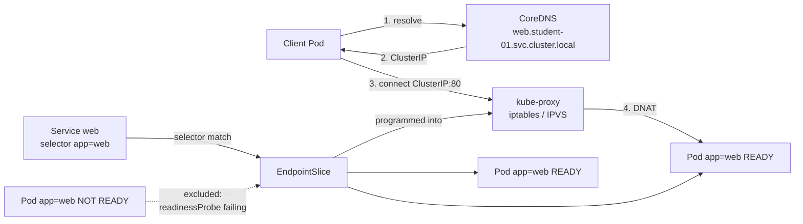

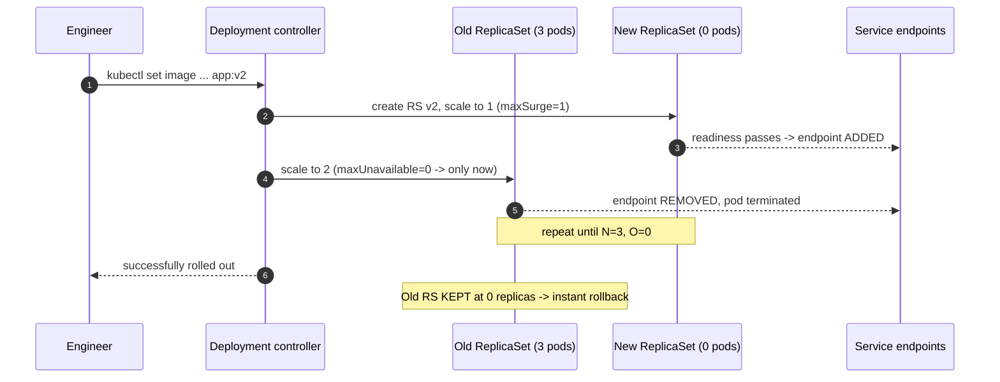

### Setup

```bash
cd ~/k8s-labs/09-foundations
kubectl config set-context --current --namespace="$NAMESPACE"

export ACR_LOGIN_SERVER="$(az acr show --name "$ACR_NAME" --query loginServer -o tsv 2>/dev/null || echo "${ACR_NAME}.azurecr.io")"
export APP_IMAGE="${ACR_LOGIN_SERVER}/${STUDENT}/monolith:1.0.0"
az acr repository show-tags --name "$ACR_NAME" --repository "${STUDENT}/monolith" -o table 2>/dev/null \
  || { export APP_IMAGE="mcr.microsoft.com/azuredocs/aks-helloworld:v1"; echo "fallback image: $APP_IMAGE"; }
echo "APP_IMAGE=$APP_IMAGE"
```

### Part A — Pod, ReplicaSet, Deployment (30 min)

```bash
# A bare Pod, killed, is gone. That is the whole lesson.
kubectl run standalone --image=mcr.microsoft.com/azuredocs/aks-helloworld:v1 \
  -n "$NAMESPACE" --restart=Never \
  --overrides='{"spec":{"containers":[{"name":"web","image":"mcr.microsoft.com/azuredocs/aks-helloworld:v1","resources":{"requests":{"cpu":"50m","memory":"64Mi"},"limits":{"cpu":"200m","memory":"192Mi"}}}]}}'
kubectl wait --for=condition=Ready pod/standalone -n "$NAMESPACE" --timeout=180s
kubectl delete pod standalone -n "$NAMESPACE"
sleep 5
kubectl get pods -n "$NAMESPACE"        # nothing. A bare Pod is a VM you forgot to put in a scale set.
```

```bash
cat <<'EOF' > 03-replicaset.yaml
apiVersion: apps/v1
kind: ReplicaSet
metadata:
  name: web-rs
  labels:
    app: web
    managed-by: replicaset
spec:
  replicas: 3
  selector:
    matchLabels:
      app: web
      managed-by: replicaset
  template:
    metadata:
      labels:
        app: web
        managed-by: replicaset
    spec:
      containers:
        - name: web
          image: mcr.microsoft.com/azuredocs/aks-helloworld:v1
          ports:
            - name: http
              containerPort: 80
          resources:
            requests:
              cpu: "50m"
              memory: "64Mi"
            limits:
              cpu: "200m"
              memory: "192Mi"
EOF

kubectl apply -f 03-replicaset.yaml -n "$NAMESPACE"
kubectl rollout status deployment/web-rs -n "$NAMESPACE" 2>/dev/null || kubectl get rs,pods -n "$NAMESPACE"

# Self-healing: delete one, get three back.
VICTIM="$(kubectl get pods -n "$NAMESPACE" -l managed-by=replicaset -o jsonpath='{.items[0].metadata.name}')"
kubectl delete pod "$VICTIM" -n "$NAMESPACE"
sleep 15
kubectl get pods -n "$NAMESPACE" -l managed-by=replicaset

# The selector -- not the owner reference -- is what it watches.
ADOPTEE="$(kubectl get pods -n "$NAMESPACE" -l managed-by=replicaset -o jsonpath='{.items[0].metadata.name}')"
kubectl label pod "$ADOPTEE" -n "$NAMESPACE" managed-by=orphan --overwrite
kubectl get pods -n "$NAMESPACE" --show-labels          # FOUR pods now
kubectl delete pod "$ADOPTEE" -n "$NAMESPACE"
```

Relabelling to orphan a Pod is exactly how you quarantine a misbehaving Pod for a live post-mortem: the controller replaces it immediately while your broken copy keeps running for inspection.

```bash
# The limitation that motivates Deployments:
kubectl set image rs/web-rs web=mcr.microsoft.com/azuredocs/aks-helloworld:v2 -n "$NAMESPACE"
kubectl get pods -n "$NAMESPACE" -o custom-columns='NAME:.metadata.name,IMAGE:.spec.containers[0].image'
# Every running Pod is still v1. A ReplicaSet applies its template only when CREATING a Pod.
kubectl delete -f 03-replicaset.yaml -n "$NAMESPACE"
```

### Part B — The monolith as a Deployment + Service + ConfigMap + Secret (40 min)

```bash
cat <<'EOF' > 04-config.yaml
apiVersion: v1
kind: ConfigMap
metadata:
  name: monolith-config
  labels:
    app: monolith
data:
  APP_ENV: "dev"
  LOG_LEVEL: "debug"
  TITLE: "Containerized Monolith on AKS"
  DB_HOST: "monolith-db.database.svc.cluster.local"
  DB_PORT: "5432"
  app.properties: |
    server.port=80
    server.shutdown=graceful
    management.endpoints.web.exposure.include=health,info,metrics
    logging.level.root=INFO
---
apiVersion: v1
kind: Secret
metadata:
  name: monolith-secrets
  labels:
    app: monolith
type: Opaque
stringData:
  DB_USER: "monolith_app"
  DB_PASSWORD: "Tr41n1ng-L4b-N0t-Real!"
  API_KEY: "lab-only-8f3c1d0a4b7e9265"
EOF

kubectl apply -f 04-config.yaml -n "$NAMESPACE"
echo "04-config.yaml" >> .gitignore

# base64 is ENCODING, not encryption:
kubectl get secret monolith-secrets -n "$NAMESPACE" -o jsonpath='{.data.DB_PASSWORD}' | base64 -d; echo
```

Say it to the room: anyone with `get secret` in this namespace just read the database password in one command. The control is RBAC + encryption-at-rest + not committing it to Git — not the word "Secret". **Lab 12.2 replaces this with Key Vault and Workload Identity.**

```bash
cat <<EOF > 05-monolith.yaml
apiVersion: apps/v1
kind: Deployment
metadata:
  name: monolith
  labels:
    app: monolith
    tier: application
  annotations:
    kubernetes.io/change-cause: "Initial deployment of monolith 1.0.0"
spec:
  replicas: 2
  revisionHistoryLimit: 5
  minReadySeconds: 10
  strategy:
    type: RollingUpdate
    rollingUpdate:
      maxSurge: 1
      maxUnavailable: 0
  selector:
    matchLabels:
      app: monolith
      tier: application
  template:
    metadata:
      labels:
        app: monolith
        tier: application
    spec:
      securityContext:
        seccompProfile:
          type: RuntimeDefault
      containers:
        - name: monolith
          image: $APP_IMAGE
          imagePullPolicy: IfNotPresent
          ports:
            - name: http
              containerPort: 80
          envFrom:
            - configMapRef:
                name: monolith-config
            - secretRef:
                name: monolith-secrets
          env:
            - name: POD_NAME
              valueFrom:
                fieldRef:
                  fieldPath: metadata.name
            - name: NODE_NAME
              valueFrom:
                fieldRef:
                  fieldPath: spec.nodeName
          volumeMounts:
            - name: app-config
              mountPath: /etc/monolith
              readOnly: true
          startupProbe:
            httpGet:
              path: /
              port: http
            periodSeconds: 5
            failureThreshold: 30
          readinessProbe:
            httpGet:
              path: /
              port: http
            periodSeconds: 10
            timeoutSeconds: 3
            failureThreshold: 3
          livenessProbe:
            httpGet:
              path: /
              port: http
            periodSeconds: 20
            timeoutSeconds: 3
            failureThreshold: 3
          resources:
            requests:
              cpu: "100m"
              memory: "128Mi"
            limits:
              cpu: "500m"
              memory: "512Mi"
          securityContext:
            allowPrivilegeEscalation: false
            capabilities:
              drop:
                - ALL
          lifecycle:
            preStop:
              exec:
                command: ["/bin/sh", "-c", "sleep 5"]
      volumes:
        - name: app-config
          configMap:
            name: monolith-config
            items:
              - key: app.properties
                path: app.properties
            defaultMode: 0444
      terminationGracePeriodSeconds: 45
      topologySpreadConstraints:
        - maxSkew: 1
          topologyKey: kubernetes.io/hostname
          whenUnsatisfiable: ScheduleAnyway
          labelSelector:
            matchLabels:
              app: monolith
---
apiVersion: v1
kind: Service
metadata:
  name: monolith
  labels:
    app: monolith
spec:
  type: ClusterIP
  selector:
    app: monolith
    tier: application
  ports:
    - name: http
      port: 80
      targetPort: http
---
apiVersion: policy/v1
kind: PodDisruptionBudget
metadata:
  name: monolith-pdb
spec:
  minAvailable: 1
  selector:
    matchLabels:
      app: monolith
      tier: application
EOF

kubectl apply -f 05-monolith.yaml -n "$NAMESPACE"
kubectl rollout status deployment/monolith -n "$NAMESPACE" --timeout=300s
kubectl get deploy,rs,pods,svc,endpoints,pdb -n "$NAMESPACE" -o wide
```

Narrate four design decisions while it rolls:

- **`startupProbe` 30×5s** gives a slow JVM/.NET monolith 150 s to boot while liveness stays aggressive afterwards. Without it you'd need `livenessProbe.initialDelaySeconds: 150`, which also delays detection of a real hang by 150 s.
- **`preStop: sleep 5` + `terminationGracePeriodSeconds: 45`** — endpoint removal and `SIGTERM` happen concurrently, so a short pause closes the race where a Pod receives requests after it starts shutting down.
- **`maxSurge: 1` / `maxUnavailable: 0`** — capacity never dips below 100%.
- **`minAvailable: 1` PDB on 2 replicas** gives `ALLOWED DISRUPTIONS: 1`. **The trap:** `minAvailable: 1` on a *single*-replica Deployment gives `0` and blocks node drains — and therefore AKS upgrades — forever, with no obvious error.

```bash
# Verify config actually reached the container
POD="$(kubectl get pods -n "$NAMESPACE" -l app=monolith -o jsonpath='{.items[0].metadata.name}')"
kubectl exec -it "$POD" -n "$NAMESPACE" -- sh -c 'env | grep -E "^(APP_ENV|LOG_LEVEL|DB_HOST|DB_USER|POD_NAME|NODE_NAME)=" | sort'
kubectl exec -it "$POD" -n "$NAMESPACE" -- ls -la /etc/monolith/
kubectl exec -it "$POD" -n "$NAMESPACE" -- cat /etc/monolith/app.properties
```

The `..data` symlink pointing at a timestamped directory is how the kubelet updates config atomically — an app never reads a half-written file.

```bash
# Env vars are frozen at container start.
kubectl patch configmap monolith-config -n "$NAMESPACE" --type=merge -p '{"data":{"LOG_LEVEL":"warn"}}'
sleep 10
kubectl exec -it "$POD" -n "$NAMESPACE" -- sh -c 'echo "still: LOG_LEVEL=$LOG_LEVEL"'
kubectl rollout restart deployment/monolith -n "$NAMESPACE"
kubectl rollout status deployment/monolith -n "$NAMESPACE" --timeout=300s
NEW_POD="$(kubectl get pods -n "$NAMESPACE" -l app=monolith -o jsonpath='{.items[0].metadata.name}')"
kubectl exec -it "$NEW_POD" -n "$NAMESPACE" -- sh -c 'echo "now: LOG_LEVEL=$LOG_LEVEL"'
```

`rollout restart` adds a `restartedAt` annotation, changing the template hash and triggering a normal rolling update. **Never `kubectl delete pod` to "restart" production** — that skips the surge and drops capacity.

```bash
# Same image, second environment, different config -- the point of the whole exercise.
kubectl apply -f 04-config.yaml   -n "$NS_DEV"
kubectl apply -f 05-monolith.yaml -n "$NS_DEV"
kubectl patch configmap monolith-config -n "$NS_DEV" --type=merge -p '{"data":{"APP_ENV":"dev","LOG_LEVEL":"trace"}}'
kubectl rollout restart deployment/monolith -n "$NS_DEV"
kubectl rollout status deployment/monolith -n "$NS_DEV" --timeout=300s

kubectl get deploy monolith -n "$NAMESPACE" -o jsonpath='{.spec.template.spec.containers[0].image}{"\n"}'
kubectl get deploy monolith -n "$NS_DEV"    -o jsonpath='{.spec.template.spec.containers[0].image}{"\n"}'
kubectl get cm monolith-config -n "$NAMESPACE" -o jsonpath='{.data.APP_ENV}{"\n"}'
kubectl get cm monolith-config -n "$NS_DEV"    -o jsonpath='{.data.APP_ENV}{"\n"}'
```

### Part C — Rolling update, rollback, and the three failure modes (20 min)

```bash
kubectl set image deployment/monolith monolith=mcr.microsoft.com/azuredocs/aks-helloworld:v2 -n "$NAMESPACE"
kubectl annotate deployment/monolith -n "$NAMESPACE" kubernetes.io/change-cause="Upgrade to v2" --overwrite
kubectl rollout status deployment/monolith -n "$NAMESPACE" --timeout=300s
kubectl get rs -n "$NAMESPACE" -l app=monolith        # old RS kept at 0 -> instant rollback
kubectl rollout history deployment/monolith -n "$NAMESPACE"
kubectl rollout undo deployment/monolith -n "$NAMESPACE"
kubectl rollout status deployment/monolith -n "$NAMESPACE" --timeout=300s
```

**Scenario 1 — `ImagePullBackOff`.**

```bash
kubectl set image deployment/monolith monolith=mcr.microsoft.com/azuredocs/aks-helloworld:v99-nope -n "$NAMESPACE"
sleep 25
kubectl get pods -n "$NAMESPACE" -l app=monolith
BAD="$(kubectl get pods -n "$NAMESPACE" -l app=monolith --field-selector=status.phase=Pending -o jsonpath='{.items[0].metadata.name}')"
kubectl describe pod "$BAD" -n "$NAMESPACE" | sed -n '/Events:/,$p'
kubectl rollout undo deployment/monolith -n "$NAMESPACE"
kubectl rollout status deployment/monolith -n "$NAMESPACE" --timeout=300s
```

**Availability never dropped.** `maxUnavailable: 0` meant a healthy old Pod was never removed until a new one was Ready — and none ever was. A bad image became a *stalled deployment* instead of an *outage*. Real-world causes in order: wrong tag; ACR not attached (`az aks update -g $RG -n $AKS_NAME --attach-acr $ACR_NAME`); missing `imagePullSecrets`; wrong CPU architecture; registry firewall.

**Scenario 2 — `CrashLoopBackOff` and `--previous`.**

```bash
kubectl create deployment crasher --image=busybox:1.36 -n "$NAMESPACE" -- \
  /bin/sh -c "echo starting; sleep 5; echo 'FATAL: cannot reach db:5432' >&2; exit 1"
sleep 45
CP="$(kubectl get pods -n "$NAMESPACE" -l app=crasher -o jsonpath='{.items[0].metadata.name}')"
kubectl logs "$CP" -n "$NAMESPACE"                 # the current attempt -- usually not the failure
kubectl logs "$CP" -n "$NAMESPACE" --previous      # the attempt that actually died
kubectl get pod "$CP" -n "$NAMESPACE" -o jsonpath='restarts={.status.containerStatuses[0].restartCount} exit={.status.containerStatuses[0].lastState.terminated.exitCode} reason={.status.containerStatuses[0].lastState.terminated.reason}{"\n"}'
kubectl delete deployment crasher -n "$NAMESPACE"
```

`--previous` separates people who can debug Kubernetes from people who cannot. Exit **1** = the app quit; **137** = SIGKILL, almost always OOM (confirm `reason=OOMKilled`); **143** = SIGTERM, normal shutdown.

**Scenario 3 — the silent killer: a Service selecting nothing.**

```bash
kubectl create service clusterip web-broken --tcp=80:8080 -n "$NAMESPACE"
kubectl patch svc web-broken -n "$NAMESPACE" --type=merge -p '{"spec":{"selector":{"app":"monolith","tier":"backend"}}}'
kubectl get endpoints web-broken -n "$NAMESPACE"      # <none>
kubectl get svc web-broken -n "$NAMESPACE" -o jsonpath='{.spec.selector}{"\n"}'
kubectl get pods -n "$NAMESPACE" -l app=monolith --show-labels
kubectl delete svc web-broken -n "$NAMESPACE"
```

**The Service debugging ladder — muscle memory:**

```bash
kubectl get svc <svc> -n $NAMESPACE -o jsonpath='{.spec.selector}{"\n"}'   # 1. what does it select?
kubectl get pods -n $NAMESPACE --show-labels                               # 2. what do Pods have?
kubectl get endpoints <svc> -n $NAMESPACE                                  # 3. did they match?
kubectl get pods -n $NAMESPACE -o wide                                     # 4. are they Ready?
kubectl exec -it <client> -n $NAMESPACE -- nslookup <svc>                  # 5. does DNS resolve?
kubectl exec -it <client> -n $NAMESPACE -- curl -v http://<svc>:<port>     # 6. does the port match?
```

Ninety percent of "the Service doesn't work" tickets die at step 3.

### WebUI equivalent

| CLI | Portal |
|---|---|
| `kubectl apply -f 05-monolith.yaml` | **Kubernetes resources → + Create → Add with YAML** |
| `kubectl get deploy/rs/pods` | **Workloads → Deployments / Replica sets / Pods** |
| `kubectl describe pod` | Pod → **Overview** + **Events** |
| `kubectl logs -f` | Pod → **Live logs** |
| `kubectl scale` / `set image` | Deployment → **YAML** tab → edit → Review + save |
| `kubectl get svc / endpoints` | **Services and ingresses → Services** → selector + endpoints |
| `kubectl rollout undo` | **No UI equivalent — CLI/GitOps only** |
| `kubectl exec` | Not in the Portal; use `kubectl` or Lens |

Point at the gap in that table. The Portal is excellent for *observing* and acceptable for a one-off edit. Lifecycle operations — rollout, rollback, pause, restart — belong to `kubectl` and, in the target state, to Git.

### Verify

```bash
kubectl get deploy monolith -n "$NAMESPACE" -o jsonpath='{.status.readyReplicas}/{.spec.replicas}{"\n"}'   # 2/2
kubectl get endpoints monolith -n "$NAMESPACE"                                    # 2 IPs
kubectl get pdb monolith-pdb -n "$NAMESPACE"                                      # ALLOWED DISRUPTIONS 1
kubectl rollout history deployment/monolith -n "$NAMESPACE"                       # >= 3 revisions
kubectl port-forward svc/monolith 8082:80 -n "$NAMESPACE" & sleep 3
curl -s -o /dev/null -w "HTTP %{http_code}\n" http://localhost:8082; kill %1
```

| Symptom | Cause | Command that proves it |
|---|---|---|
| `Pending` forever | No allocatable capacity, or quota | `describe pod` → `FailedScheduling` |
| `Running` but `0/1 READY` | Readiness failing | `describe pod` → `Readiness probe failed` |
| `CreateContainerConfigError` | Missing ConfigMap/Secret **key** | `describe pod`; `kubectl logs` returns nothing |
| Restarts every ~60 s, app healthy | Liveness probe wrong port/path | `get events --field-selector reason=Unhealthy` |
| Exit 137 / `OOMKilled` | Memory limit too low | `-o jsonpath='{..lastState.terminated.reason}'` |
| Drain / upgrade hangs | PDB `disruptionsAllowed: 0` | `kubectl get pdb -A` |

### Cleanup

Keep the monolith running in `$NAMESPACE` — Sections 10, 11 and 12 all build on it. Remove only the dev copy and the debris:

```bash
kubectl delete -f 05-monolith.yaml -n "$NS_DEV" --ignore-not-found
kubectl delete -f 04-config.yaml   -n "$NS_DEV" --ignore-not-found
kubectl delete pod --field-selector=status.phase=Succeeded -n "$NAMESPACE" --ignore-not-found
kubectl get all -n "$NAMESPACE"
```

---

## Lab 9.5 — Provision AKS with Terraform (75 min)

### Objectives
- Build a complete AKS cluster in code: RG, VNet, subnet, Log Analytics, cluster, user node pool.
- Enforce the system/user pool split with the `CriticalAddonsOnly` taint and prove it with a scheduling test.
- Read a `terraform plan` as a change record, and destroy cleanly.

### Concept

Everything so far assumed a cluster existed. Three design decisions dominate an AKS module: **node pool topology** (tainted system pool + user pools), **network plugin** (Azure CNI Overlay — nodes on VNet IPs, Pods on an overlay CIDR, near-CNI performance with kubenet-like IP economy), and **identity** (system-assigned managed identity, `AcrPull` for the kubelet identity, OIDC + Workload Identity so apps need no stored secret).

**Pacing note for the instructor:** start `terraform apply` at the beginning of the hour, then teach the sizing material from Lab 9.1 while the 8–10 minute provision runs.

**State warning before anyone runs `apply`:** state contains secrets and is the source of truth for destruction. Local state is fine for a lab and unacceptable anywhere else.

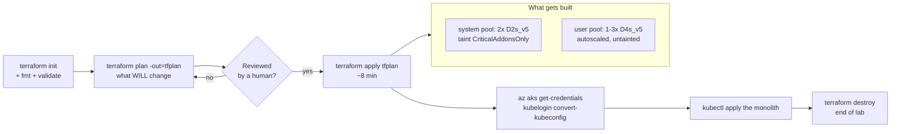

### Setup

```bash
mkdir -p ~/k8s-labs/09-foundations/terraform && cd $_
export ARM_SUBSCRIPTION_ID="$(az account show --query id -o tsv)"
export TENANT_ID="$(az account show --query tenantId -o tsv)"

az provider register --namespace Microsoft.ContainerService
az provider register --namespace Microsoft.OperationalInsights
az aks get-versions --location "$LOCATION" -o table     # pin a version that actually exists
```

### CLI walkthrough

```bash
cat <<'EOF' > providers.tf
terraform {
  required_version = ">= 1.6.0"
  required_providers {
    azurerm = {
      source  = "hashicorp/azurerm"
      version = "~> 4.0"
    }
    random = {
      source  = "hashicorp/random"
      version = "~> 3.6"
    }
  }
  # Lab uses local state. Production MUST use a remote backend:
  # backend "azurerm" {
  #   resource_group_name  = "rg-tfstate"
  #   storage_account_name = "sttfstateshared01"
  #   container_name       = "tfstate"
  #   key                  = "aks/student-01.tfstate"
  #   use_azuread_auth     = true
  # }
}

provider "azurerm" {
  subscription_id = var.subscription_id
  features {
    resource_group {
      prevent_deletion_if_contains_resources = false
    }
  }
}

provider "random" {}
EOF
```

```bash
cat <<'EOF' > variables.tf
variable "subscription_id" {
  type = string
}

variable "tenant_id" {
  type = string
}

variable "student_id" {
  type = string
  validation {
    condition     = can(regex("^[a-z0-9-]{3,20}$", var.student_id))
    error_message = "student_id must be 3-20 lowercase alphanumeric or hyphen characters."
  }
}

variable "location" {
  type    = string
  default = "centralindia"
}

variable "kubernetes_version" {
  type    = string
  default = "1.31"
}

variable "sku_tier" {
  type    = string
  default = "Free"
}

variable "vnet_address_space" {
  type    = list(string)
  default = ["10.10.0.0/16"]
}

variable "aks_subnet_prefix" {
  type    = list(string)
  default = ["10.10.1.0/24"]
}

variable "pod_cidr" {
  type    = string
  default = "192.168.0.0/16"
}

variable "service_cidr" {
  type    = string
  default = "172.16.0.0/16"
}

variable "dns_service_ip" {
  type    = string
  default = "172.16.0.10"
}

variable "system_node_vm_size" {
  type    = string
  default = "Standard_D2s_v5"
}

variable "system_node_count" {
  type    = number
  default = 2
}

variable "user_node_vm_size" {
  type    = string
  default = "Standard_D4s_v5"
}

variable "user_node_min_count" {
  type    = number
  default = 1
}

variable "user_node_max_count" {
  type    = number
  default = 3
}

variable "max_pods_per_node" {
  type    = number
  default = 110
}

variable "availability_zones" {
  type    = list(string)
  default = ["1", "2", "3"]
}

variable "admin_group_object_ids" {
  type    = list(string)
  default = []
}

variable "acr_id" {
  description = "Resource ID of an existing ACR to attach. Empty string skips the role assignment."
  type        = string
  default     = ""
}

variable "tags" {
  type = map(string)
  default = {
    environment = "training"
    managed-by  = "terraform"
  }
}
EOF
```

```bash
cat <<'EOF' > main.tf
locals {
  name_prefix = var.student_id
  common_tags = merge(var.tags, { owner = var.student_id })
}

resource "random_string" "suffix" {
  length  = 5
  special = false
  upper   = false
}

resource "azurerm_resource_group" "aks" {
  name     = "rg-aks-${local.name_prefix}"
  location = var.location
  tags     = local.common_tags
}

# With Azure CNI Overlay the subnet only holds node IPs plus surge nodes,
# so a /24 is generous even for a large cluster.
resource "azurerm_virtual_network" "aks" {
  name                = "vnet-aks-${local.name_prefix}"
  location            = azurerm_resource_group.aks.location
  resource_group_name = azurerm_resource_group.aks.name
  address_space       = var.vnet_address_space
  tags                = local.common_tags
}

resource "azurerm_subnet" "aks_nodes" {
  name                 = "snet-aks-nodes"
  resource_group_name  = azurerm_resource_group.aks.name
  virtual_network_name = azurerm_virtual_network.aks.name
  address_prefixes     = var.aks_subnet_prefix
}

resource "azurerm_log_analytics_workspace" "aks" {
  name                = "law-aks-${local.name_prefix}-${random_string.suffix.result}"
  location            = azurerm_resource_group.aks.location
  resource_group_name = azurerm_resource_group.aks.name
  sku                 = "PerGB2018"
  retention_in_days   = 30
  tags                = local.common_tags
}

resource "azurerm_kubernetes_cluster" "this" {
  name                = "aks-${local.name_prefix}"
  location            = azurerm_resource_group.aks.location
  resource_group_name = azurerm_resource_group.aks.name
  dns_prefix          = "aks-${local.name_prefix}"
  kubernetes_version  = var.kubernetes_version
  sku_tier            = var.sku_tier
  node_resource_group = "rg-aks-${local.name_prefix}-nodes"

  automatic_upgrade_channel = "patch"
  node_os_upgrade_channel   = "NodeImage"

  oidc_issuer_enabled       = true
  workload_identity_enabled = true

  role_based_access_control_enabled = true

  default_node_pool {
    name                        = "system"
    vm_size                     = var.system_node_vm_size
    node_count                  = var.system_node_count
    vnet_subnet_id              = azurerm_subnet.aks_nodes.id
    zones                       = var.availability_zones
    max_pods                    = var.max_pods_per_node
    os_disk_size_gb             = 128
    os_sku                      = "Ubuntu"
    temporary_name_for_rotation = "systemtmp"

    # Taints this pool CriticalAddonsOnly=true:NoSchedule so only
    # tolerating add-ons (CoreDNS, metrics-server, CSI) land here.
    only_critical_addons_enabled = true

    node_labels = {
      "nodepool-type" = "system"
    }

    upgrade_settings {
      max_surge = "33%"
    }
  }

  identity {
    type = "SystemAssigned"
  }

  network_profile {
    network_plugin      = "azure"
    network_plugin_mode = "overlay"
    network_policy      = "calico"
    load_balancer_sku   = "standard"
    pod_cidr            = var.pod_cidr
    service_cidr        = var.service_cidr
    dns_service_ip      = var.dns_service_ip
  }

  azure_active_directory_role_based_access_control {
    tenant_id              = var.tenant_id
    admin_group_object_ids = var.admin_group_object_ids
    azure_rbac_enabled     = true
  }

  oms_agent {
    log_analytics_workspace_id      = azurerm_log_analytics_workspace.aks.id
    msi_auth_for_monitoring_enabled = true
  }

  auto_scaler_profile {
    balance_similar_node_groups = true
    scale_down_delay_after_add  = "10m"
    scale_down_unneeded         = "10m"
  }

  tags = local.common_tags

  lifecycle {
    # The autoscaler owns the live node count; don't fight it on every plan.
    ignore_changes = [default_node_pool[0].node_count]
  }
}

resource "azurerm_kubernetes_cluster_node_pool" "user" {
  name                  = "user"
  kubernetes_cluster_id = azurerm_kubernetes_cluster.this.id
  vm_size               = var.user_node_vm_size
  mode                  = "User"
  zones                 = var.availability_zones
  vnet_subnet_id        = azurerm_subnet.aks_nodes.id
  max_pods              = var.max_pods_per_node
  os_disk_size_gb       = 128
  os_type               = "Linux"
  os_sku                = "Ubuntu"

  auto_scaling_enabled = true
  min_count            = var.user_node_min_count
  max_count            = var.user_node_max_count

  node_labels = {
    "nodepool-type" = "user"
    "workload"      = "applications"
  }

  upgrade_settings {
    max_surge = "33%"
  }

  tags = local.common_tags

  lifecycle {
    ignore_changes = [node_count]
  }
}

resource "azurerm_role_assignment" "acr_pull" {
  count                            = var.acr_id == "" ? 0 : 1
  scope                            = var.acr_id
  role_definition_name             = "AcrPull"
  principal_id                     = azurerm_kubernetes_cluster.this.kubelet_identity[0].object_id
  skip_service_principal_aad_check = true
}
EOF
```

```bash
cat <<'EOF' > outputs.tf
output "resource_group_name" {
  value = azurerm_resource_group.aks.name
}

output "cluster_name" {
  value = azurerm_kubernetes_cluster.this.name
}

output "cluster_fqdn" {
  value = azurerm_kubernetes_cluster.this.fqdn
}

output "node_resource_group" {
  description = "Azure-managed RG holding the VMSS, disks and load balancer. Never edit it by hand."
  value       = azurerm_kubernetes_cluster.this.node_resource_group
}

output "oidc_issuer_url" {
  value = azurerm_kubernetes_cluster.this.oidc_issuer_url
}

output "kubelet_identity_object_id" {
  value = azurerm_kubernetes_cluster.this.kubelet_identity[0].object_id
}

output "get_credentials_command" {
  value = format(
    "az aks get-credentials --resource-group %s --name %s --overwrite-existing && kubelogin convert-kubeconfig -l azurecli",
    azurerm_resource_group.aks.name,
    azurerm_kubernetes_cluster.this.name
  )
}

output "kube_config_raw" {
  value     = azurerm_kubernetes_cluster.this.kube_config_raw
  sensitive = true
}
EOF
```

```bash
cat <<EOF > terraform.tfvars
subscription_id    = "$ARM_SUBSCRIPTION_ID"
tenant_id          = "$TENANT_ID"
student_id         = "$STUDENT"
location           = "$LOCATION"
kubernetes_version = "1.31"
sku_tier           = "Free"
acr_id             = ""
EOF

cat <<'EOF' > .gitignore
.terraform/
*.tfstate
*.tfstate.*
*.tfplan
tfplan
terraform.tfvars
EOF
```

`terraform.tfvars` holds subscription and tenant IDs; `*.tfstate` holds the cluster's kubeconfig and certificates in cleartext. Both stay out of Git — in the real pipeline they become pipeline variables and a remote backend.

```bash
terraform init
terraform fmt -recursive
terraform validate
terraform plan -out=tfplan
terraform show -no-color tfplan | grep -E "^  # |Plan:"
```

Expect ~7 resources to create. **Read the plan out loud with the class** — in a regulated environment, this output attached to a change ticket is worth more than any screenshot.

> If `validate` rejects an argument, you are on a different provider major version. AzureRM 4.x renamed several (`enable_auto_scaling` → `auto_scaling_enabled`, `automatic_channel_upgrade` → `automatic_upgrade_channel`). `terraform validate` names the offending argument — read the error rather than searching for a copy-paste fix. This is the job.

```bash
time terraform apply tfplan          # 6-10 min. Teach the 9.1 sizing material while it runs.
terraform output
export TF_RG="$(terraform output -raw resource_group_name)"
export TF_AKS="$(terraform output -raw cluster_name)"
az aks get-credentials -g "$TF_RG" -n "$TF_AKS" --overwrite-existing
kubelogin convert-kubeconfig -l azurecli
kubectl get nodes -L nodepool-type,topology.kubernetes.io/zone
```

**Prove the node pool design works:**

```bash
kubectl get nodes -l nodepool-type=system \
  -o jsonpath='{range .items[*]}{.metadata.name}{"\t"}{.spec.taints[*].key}{"\n"}{end}'

kubectl create namespace app-demo
kubectl create deployment sched-test --image=nginx:1.27-alpine --replicas=4 -n app-demo
kubectl rollout status deployment/sched-test -n app-demo --timeout=180s
kubectl get pods -n app-demo -o custom-columns='POD:.metadata.name,NODE:.spec.nodeName'
kubectl get nodes -L nodepool-type
```

Every Pod is on `user`, zero on `system`. That output is the deliverable of this step.

**Deploy the monolith onto your own cluster — the Section 9 deliverable:**

```bash
kubectl create namespace production
kubectl apply -f ~/k8s-labs/09-foundations/04-config.yaml   -n production
kubectl apply -f ~/k8s-labs/09-foundations/05-monolith.yaml -n production
kubectl rollout status deployment/monolith -n production --timeout=300s
kubectl get all -n production
kubectl port-forward svc/monolith 8083:80 -n production & sleep 3
curl -s -o /dev/null -w "monolith on my own AKS cluster -> HTTP %{http_code}\n" http://localhost:8083; kill %1
```

**Change through Terraform, not the Portal:**

```bash
sed -i 's/^acr_id             = ""/user_node_max_count = 5/' terraform.tfvars 2>/dev/null
echo 'user_node_max_count = 5' >> terraform.tfvars
terraform plan -out=tfplan2 | grep -E "max_count|Plan:"
terraform apply tfplan2
az aks nodepool show -g "$TF_RG" --cluster-name "$TF_AKS" -n user --query "{min:minCount,max:maxCount}" -o table
```

An in-place update. Contrast with changing `default_node_pool.name` or `network_profile.network_plugin`, which print `# forces replacement` — the one line you must never skim past.

### WebUI equivalent

Walk the **Create → Containers → AKS** wizard *after* Terraform finishes, so students map fields to HCL:

| Terraform | Portal field |
|---|---|
| `default_node_pool.vm_size` / `node_count` | **Basics → Node size / Node count** |
| `azurerm_kubernetes_cluster_node_pool.user` | **Node pools → + Add node pool** (Mode = User) |
| `only_critical_addons_enabled` | **Node pools → pool → Taints** |
| `auto_scaling_enabled` / `min` / `max` | **Node pools → Scale method: Autoscale** |
| `network_plugin_mode = "overlay"` | **Networking → Azure CNI Overlay** |
| `network_policy = "calico"` | **Networking → Network policy: Calico** |
| `oidc_issuer_enabled` / `workload_identity_enabled` | **Security → OIDC issuer / Workload Identity** |
| `oms_agent` | **Integrations → Container Insights** |
| `acr_id` role assignment | **Integrations → Container registry** |

Then two things to show in the Portal:

1. **Resource groups → `rg-aks-student-01-nodes`** — the *node resource group*: VMSS, disks, load balancer, NSG. Azure owns it. **Never modify anything in it by hand**; AKS reconciles it and your change vanishes, or breaks the cluster.
2. **The drift demo.** Change the `user` pool's max count to 9 in the Portal → Apply. Then run `terraform plan`. Terraform reports drift and proposes to revert. The Portal edit was faster and is now invisible to every reviewer, every audit and every colleague. **That demo is the strongest argument for GitOps you will make all day.**

```bash
terraform apply -auto-approve      # restores declared state
```

### Verify & troubleshoot

```bash
az aks show -g "$TF_RG" -n "$TF_AKS" \
  --query "{name:name,version:currentKubernetesVersion,plugin:networkProfile.networkPlugin,mode:networkProfile.networkPluginMode,policy:networkProfile.networkPolicy,state:provisioningState}" -o table
az aks nodepool list -g "$TF_RG" --cluster-name "$TF_AKS" -o table
kubectl get pods -n kube-system -o wide | head
```

**Scenario — a Pod that targets the tainted system pool.**

```bash
kubectl run wrong-pool --image=nginx:1.27-alpine -n app-demo \
  --overrides='{"spec":{"nodeSelector":{"nodepool-type":"system"},"containers":[{"name":"app","image":"nginx:1.27-alpine"}]}}'
sleep 15
kubectl describe pod wrong-pool -n app-demo | sed -n '/Events:/,$p'
kubectl delete pod wrong-pool -n app-demo
```

Expected: `node(s) had untolerated taint {CriticalAddonsOnly: true}`. **The fix is not to remove the taint** — it is to schedule on the user pool, or, for a genuine add-on, add the toleration deliberately.

| Symptom | Cause | Fix |
|---|---|---|
| `subscription ID could not be determined` | AzureRM 4.x needs it explicitly | Set `subscription_id` or `ARM_SUBSCRIPTION_ID` |
| `Unsupported argument` | Provider major-version rename | Read the error; check docs for the pinned version |
| `QuotaExceeded` / insufficient vCPU | Subscription core quota | Reduce node counts or request an increase |
| `ServiceCidrOverlapExistingSubnetsCidr` | `service_cidr` overlaps the VNet | VNet, pod CIDR and service CIDR must be disjoint |
| Apply hangs then fails | No capacity for that SKU in a zone | Try another SKU or drop `availability_zones` |
| `creating Role Assignment ... AuthorizationFailed` | No `roleAssignments/write` | Attach ACR later with `az aks update --attach-acr` |
| `destroy` fails on the RG | Objects created outside Terraform | Delete LoadBalancer Services and PVCs first |

### Cleanup

**Order matters more here than anywhere else in the course.** Kubernetes objects that created Azure resources go first.

```bash
kubectl delete svc -A --field-selector spec.type=LoadBalancer --ignore-not-found   # each owns a public IP
kubectl delete namespace production app-demo --ignore-not-found                     # removes PVCs / disks
kubectl get pv                                                                      # must be empty

cd ~/k8s-labs/09-foundations/terraform
terraform plan -destroy -out=tfdestroy
terraform apply tfdestroy

az group list --query "[?starts_with(name, 'rg-aks-${STUDENT}')].name" -o tsv       # must be empty
kubectl config delete-context "aks-${STUDENT}" 2>/dev/null || true
kubectl config use-context aks-training
```

If destroy fails partway, re-run `terraform apply tfdestroy` — it is idempotent. If it fails repeatedly on one resource, delete it in the Portal, `terraform state rm <address>`, destroy again.

> **Instructor cost sweep, next morning:**
> `for g in $(az group list --query "[?starts_with(name,'rg-aks-student-')].name" -o tsv); do az group delete -n "$g" --yes --no-wait; done`
> Twenty student clusters left running for a week is a four-figure invoice.

---

## Lab 9.6 — Helm (40 min)

### Objectives
- Explain chart, release and values, and the precedence order between them.
- Install, upgrade, roll back and uninstall a release in your namespace.
- Render with `helm template` before installing, and use the checksum-annotation idiom so a config change rolls the Pods automatically.

### Concept

Helm is a template engine plus a release ledger. A **chart** is templated manifests + `values.yaml`. A **release** is one installation of a chart into one namespace under a name. **Values precedence**, lowest to highest: chart defaults → `-f values.yaml` (later files win) → `--set`. Each revision's rendered manifests are stored in a Secret named `sh.helm.release.v1.<release>.v<n>` — that ledger is what makes rollback possible.

What Helm is **not**: a deployment controller. `helm upgrade` applies and waits; if someone edits the objects afterwards, Helm has no idea until the next upgrade. That gap is the argument for ArgoCD or Flux.

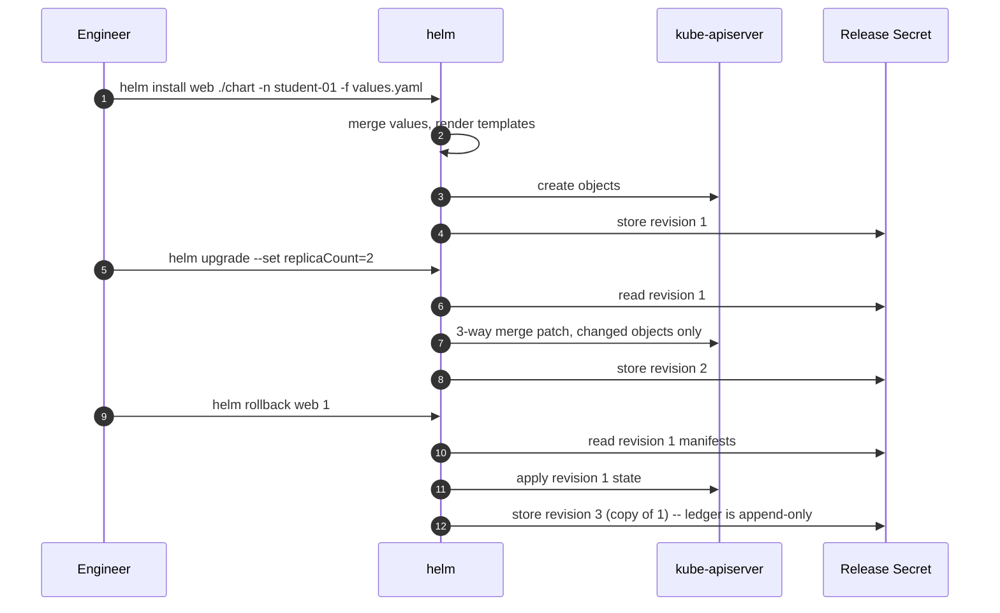

### Setup

```bash
cd ~/k8s-labs/09-foundations
kubectl config use-context aks-training
kubectl config set-context --current --namespace="$NAMESPACE"
helm version
```

### CLI walkthrough

```bash
helm repo add ingress-nginx https://kubernetes.github.io/ingress-nginx
helm repo update
helm search repo ingress-nginx --versions | head -5
helm show values ingress-nginx/ingress-nginx | head -30
```

> **Chart sourcing, for the enterprise audience.** Public chart repositories change ownership, licensing and image locations — Bitnami's public catalog was restructured during 2025 and broke a large number of pinned references overnight. Mirror the charts and images you depend on into your own ACR, and pin chart versions and image digests. Never let a production rollout depend on an anonymous pull from a repository you do not control.

**Render before you install — always:**

```bash
helm template demo ingress-nginx/ingress-nginx -n "$NAMESPACE" > preview.yaml
grep -E "^kind:" preview.yaml | sort | uniq -c
```

`ClusterRole`, `ValidatingWebhookConfiguration`, `IngressClass` — all cluster-scoped, all things you cannot create as a namespace-scoped student. **`helm template` told you the install would fail before you tried it.** (The instructor has already installed this chart cluster-wide for Section 10.)

**Scaffold your own chart — how every real chart in your organisation starts:**

```bash
helm create monolith-chart
rm -f monolith-chart/templates/hpa.yaml monolith-chart/templates/ingress.yaml

cat <<'EOF' > monolith-chart/values.yaml
replicaCount: 2

image:
  repository: mcr.microsoft.com/azuredocs/aks-helloworld
  pullPolicy: IfNotPresent
  tag: "v1"

imagePullSecrets: []
nameOverride: ""
fullnameOverride: "monolith-helm"

serviceAccount:
  create: true
  automount: false
  annotations: {}
  name: ""

config:
  appEnv: "dev"
  logLevel: "info"
  title: "Monolith deployed by Helm"

podAnnotations: {}
podLabels: {}

podSecurityContext:
  seccompProfile:
    type: RuntimeDefault

securityContext:
  allowPrivilegeEscalation: false
  capabilities:
    drop:
      - ALL

service:
  type: ClusterIP
  port: 80

resources:
  requests:
    cpu: 100m
    memory: 128Mi
  limits:
    cpu: 500m
    memory: 512Mi

livenessProbe:
  httpGet:
    path: /
    port: http
  initialDelaySeconds: 15
  periodSeconds: 20

readinessProbe:
  httpGet:
    path: /
    port: http
  initialDelaySeconds: 5
  periodSeconds: 10

autoscaling:
  enabled: false

volumes: []
volumeMounts: []
nodeSelector: {}
tolerations: []
affinity: {}
EOF

cat <<'EOF' > monolith-chart/templates/configmap.yaml
apiVersion: v1
kind: ConfigMap
metadata:
  name: {{ include "monolith-chart.fullname" . }}-config
  labels:
    {{- include "monolith-chart.labels" . | nindent 4 }}
data:
  APP_ENV: {{ .Values.config.appEnv | quote }}
  LOG_LEVEL: {{ .Values.config.logLevel | quote }}
  TITLE: {{ .Values.config.title | quote }}
EOF
```

Wire the ConfigMap into the Deployment, with the checksum annotation — this is *the* Helm idiom:

```bash
python3 - <<'PYEOF'
import pathlib
p = pathlib.Path("monolith-chart/templates/deployment.yaml")
s = p.read_text()

anno = ('      annotations:\n'
        '        checksum/config: {{ include (print $.Template.BasePath "/configmap.yaml") . | sha256sum }}\n')

if "checksum/config" not in s:
    if "      annotations:\n        {{- toYaml . | nindent 8 }}" in s:
        s = s.replace("      annotations:\n",
                      anno.replace("      annotations:\n", "      annotations:\n"), 1)
        s = s.replace('      annotations:\n        {{- toYaml . | nindent 8 }}',
                      anno + '        {{- toYaml . | nindent 8 }}', 1)
    else:
        s = s.replace("    spec:\n", anno + "    spec:\n", 1)

s = s.replace(
    "          resources:\n            {{- toYaml .Values.resources | nindent 12 }}",
    '          envFrom:\n            - configMapRef:\n                name: {{ include "monolith-chart.fullname" . }}-config\n'
    "          resources:\n            {{- toYaml .Values.resources | nindent 12 }}",
    1,
)
p.write_text(s)
PYEOF

grep -n -B1 -A2 "checksum/config" monolith-chart/templates/deployment.yaml
grep -n -A2 "envFrom" monolith-chart/templates/deployment.yaml
```

```bash
helm lint ./monolith-chart
helm template monolith-helm ./monolith-chart -n "$NAMESPACE" | grep -E "^kind:|checksum/config"

helm install monolith-helm ./monolith-chart -n "$NAMESPACE" --wait --timeout 5m
helm list -n "$NAMESPACE"
helm status monolith-helm -n "$NAMESPACE" | head -8
kubectl get secret -n "$NAMESPACE" -l "owner=helm"     # the release ledger, visible
```

**Upgrade with a values file, then with `--set`:**

```bash
cat <<'EOF' > values-dev.yaml
replicaCount: 3
config:
  appEnv: "dev"
  logLevel: "debug"
resources:
  requests:
    cpu: 50m
    memory: 64Mi
  limits:
    cpu: 200m
    memory: 192Mi
EOF

helm upgrade monolith-helm ./monolith-chart -n "$NAMESPACE" -f values-dev.yaml --wait --timeout 5m
helm upgrade monolith-helm ./monolith-chart -n "$NAMESPACE" -f values-dev.yaml --set replicaCount=1 --wait
kubectl get deploy -n "$NAMESPACE" -l "app.kubernetes.io/instance=monolith-helm" \
  -o custom-columns='NAME:.metadata.name,REPLICAS:.spec.replicas'
helm history monolith-helm -n "$NAMESPACE"
```

`--set replicaCount=1` beat the file's `3`. Command line always wins.

**The checksum idiom, proved:**

```bash
kubectl get pods -n "$NAMESPACE" -l "app.kubernetes.io/instance=monolith-helm" \
  -o custom-columns='NAME:.metadata.name,AGE:.metadata.creationTimestamp'
helm upgrade monolith-helm ./monolith-chart -n "$NAMESPACE" -f values-dev.yaml --set config.logLevel=warn --wait
kubectl get pods -n "$NAMESPACE" -l "app.kubernetes.io/instance=monolith-helm" \
  -o custom-columns='NAME:.metadata.name,AGE:.metadata.creationTimestamp'
```

New Pod names. A ConfigMap-only change produced a rolling restart automatically — no `rollout restart` needed. That is the whole reason charts beat a folder of static YAML.

**Rollback and test:**

```bash
helm history monolith-helm -n "$NAMESPACE"
helm rollback monolith-helm 2 -n "$NAMESPACE" --wait --timeout 5m
helm history monolith-helm -n "$NAMESPACE"      # rollback is a NEW revision -- append-only ledger
helm test monolith-helm -n "$NAMESPACE" --logs  # the generated test-connection Pod; most teams delete it, a mistake
```

**Diff plugin — install on day one of any real project:**

```bash
helm plugin install https://github.com/databus23/helm-diff 2>/dev/null || echo "already installed"
helm diff upgrade monolith-helm ./monolith-chart -n "$NAMESPACE" -f values-dev.yaml --set replicaCount=4
```

Red/green field-level output before anything happens. In a change-controlled enterprise that output *is* your change record.

**Package to ACR — the enterprise pattern (charts as OCI artifacts beside your images):**

```bash
helm package ./monolith-chart --destination ./dist
# az acr login --name "$ACR_NAME"
# helm push ./dist/monolith-chart-0.1.0.tgz "oci://${ACR_LOGIN_SERVER}/helm"
# helm install monolith-helm "oci://${ACR_LOGIN_SERVER}/helm/monolith-chart" --version 0.1.0 -n "$NAMESPACE"
```

### WebUI equivalent

Helm has no first-class Portal UI. **Workloads → Deployments →** open a release object → **YAML** → find `app.kubernetes.io/managed-by: Helm`. That label is the only clue in the UI. **Configuration → Secrets** shows `sh.helm.release.v1.monolith-helm.v1..v5` — one per revision.

**Drift demo:** scale `monolith-helm` to 5 in the Portal, then `helm upgrade monolith-helm ./monolith-chart -n "$NAMESPACE" -f values-dev.yaml --wait`. It snaps back. Editing a Helm-managed object through the Portal is a drift event that the next upgrade silently reverts.

### Verify & troubleshoot

```bash
helm list -n "$NAMESPACE"                                    # STATUS deployed
helm history monolith-helm -n "$NAMESPACE"                   # >= 4 revisions
kubectl get all -n "$NAMESPACE" -l "app.kubernetes.io/managed-by=Helm"
```

**Scenario — a failed upgrade, and `--atomic`.**

```bash
helm upgrade monolith-helm ./monolith-chart -n "$NAMESPACE" \
  -f values-dev.yaml --set image.tag=not-a-real-tag --wait --timeout 90s
helm list -n "$NAMESPACE"                                    # STATUS: failed
kubectl describe pod -n "$NAMESPACE" -l "app.kubernetes.io/instance=monolith-helm" | sed -n '/Events:/,$p' | tail -10
helm rollback monolith-helm -n "$NAMESPACE" --wait --timeout 5m

# Better: let Helm roll itself back.
helm upgrade monolith-helm ./monolith-chart -n "$NAMESPACE" \
  -f values-dev.yaml --set image.tag=still-not-real --atomic --timeout 90s || echo "auto-rolled-back"
helm list -n "$NAMESPACE"                                    # STATUS: deployed
```

`--wait --timeout` is what turns a silent half-broken rollout into a failed command your pipeline can detect. Always use it in CI; prefer `--atomic`.

| Symptom | Cause | Fix |
|---|---|---|
| `cannot re-use a name that is still in use` | Release exists | `helm upgrade`, or uninstall first |
| Stuck in `pending-upgrade` | Interrupted upgrade (Ctrl-C, CI timeout) | `helm rollback <rel> <last-good>` |
| `field is immutable` | Changed a Deployment `selector` | Uninstall and reinstall |
| Objects exist, `helm list` empty | Wrong namespace, or created with `kubectl` | `helm list -A`; check `managed-by` |
| `INSTALLATION FAILED: ... is forbidden` | Chart creates cluster-scoped objects | `helm template` first; instructor installs |
| Rollback reverts config but Pods don't restart | No checksum annotation | Add it as above |
| Values seem ignored | Precedence, or a typo in a nested key | `helm get values <rel> -n <ns> --all` |

### Cleanup

```bash
helm uninstall monolith-helm -n "$NAMESPACE"
helm list -n "$NAMESPACE" --all
kubectl get all -n "$NAMESPACE" -l "app.kubernetes.io/managed-by=Helm"
rm -rf ./dist preview.yaml
kubectl get all -n "$NAMESPACE"                  # the hand-written monolith from 9.4 remains -- keep it
```

`helm uninstall` deletes the history Secrets too, so rollback is no longer possible. Use `--keep-history` when you want the release marked `uninstalled` but still rollback-able.

### Section 9 checkpoint

A participant has finished Section 9 when they can: authenticate with Entra ID and manage contexts; explain control plane vs data plane; describe what a quota and a LimitRange each reject and *when*; walk Deployment → ReplicaSet → Pod → Events to find an error; roll out and roll back; run the monolith with externalised config, probes and a PDB; install/upgrade/rollback a Helm release; provision and destroy an AKS cluster with Terraform; and score three of their own applications against the modernization rubric.

---
---

# SECTION 10 — AKS Networking and Gateway API (2h)

**Deliverable:** the application reachable at a real HTTPS URL through AKS ingress/gateway.
**Prerequisite:** the `monolith` Deployment + Service from Lab 9.4 still running in `$NAMESPACE` on the shared cluster. NGINX Gateway Fabric, cert-manager and external-dns are pre-installed cluster-wide by the instructor.

---

## Lab 10.1 — Networking models & Service types (20 min)

### Objectives
- Choose between kubenet, Azure CNI and Azure CNI Overlay from IP-planning constraints.
- Name the four Service types and what each actually provisions on Azure.
- State when a service mesh is worth its operational cost — and when it is not.

### Concept

| Model | Pod IP source | Subnet sizing | Use when |
|---|---|---|---|
| **kubenet** | Node-local, UDR-routed | Node IPs only | Legacy. No Windows nodes, limited policy options. Avoid for new clusters. |
| **Azure CNI (classic)** | Real VNet IP per Pod | `(nodes + surge) × (max_pods + 1)` | Pods must be directly addressable from the VNet or on-prem |
| **Azure CNI Overlay** | Private overlay CIDR | Node IPs only | **Default for new clusters.** CNI performance, kubenet IP economy. |

100 nodes × 110 pods on classic CNI needs 11,211 addresses — a /18 out of enterprise space. On Overlay the same cluster needs a /24. **Node subnets cannot be resized after cluster creation**, so this is a rebuild-level mistake.

| Service type | Provisions | Notes |
|---|---|---|
| `ClusterIP` | Virtual IP, cluster-internal | Default; the backend for an Ingress/Gateway |
| `NodePort` | Port 30000–32767 on every node | Building block; rarely used directly on AKS |
| `LoadBalancer` | Azure LB rule + public or internal IP | Costs money per Service — that's why we route through one gateway |
| `ExternalName` | CNAME to an external name | Pointing at a PaaS database during migration |
| Headless (`clusterIP: None`) | No VIP; DNS returns Pod IPs | StatefulSets (Section 11), gRPC clients |

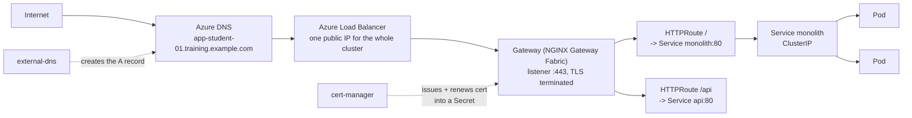

**Ingress vs Gateway API.** Ingress is one object mixing infrastructure and routing concerns, extended by controller-specific annotations that don't port between controllers. Gateway API splits the roles: the **platform team** owns `GatewayClass` and `Gateway` (listeners, TLS, IPs); the **application team** owns `HTTPRoute` in its own namespace, attaching to the shared Gateway. That role split is exactly the boundary this training draws between the platform track and the developer track — which is why we teach Gateway API.

**Service mesh — when it makes sense.** mTLS between every service, L7 traffic splitting for canaries, per-service retry/circuit-breaking policy, and request-level telemetry you cannot get otherwise. **When it does not:** fewer than ~10 services; no team to own the control plane; the actual requirement is "TLS at the edge" (a gateway does that); or you're adding it to fix a problem you haven't measured. A mesh adds a sidecar to every Pod, a control plane to upgrade, and a new class of failure between your app and the network. Earn it.

### Quick demo (5 min, instructor-driven)

```bash
kubectl get svc -A -o custom-columns='NS:.metadata.namespace,NAME:.metadata.name,TYPE:.spec.type,CLUSTERIP:.spec.clusterIP,EXTERNAL:.status.loadBalancer.ingress[0].ip'
az aks show -g "$RG" -n "$AKS_NAME" --query "networkProfile.{plugin:networkPlugin,mode:networkPluginMode,policy:networkPolicy,podCidr:podCidr,serviceCidr:serviceCidr}" -o table
kubectl get gatewayclass
```

---

## Lab 10.2 — Gateway API, DNS and TLS (60 min)

### Objectives
- Attach an `HTTPRoute` in your namespace to the shared `Gateway`.
- Get a real DNS name resolving to the gateway and a Let's Encrypt certificate issued by cert-manager.
- Apply host-based and path-based routing.

### Concept

Three objects, three owners. `GatewayClass` (cluster, platform team) names the controller. `Gateway` (platform team) defines listeners, ports, TLS and which namespaces may attach. `HTTPRoute` (you, in your namespace) declares hostnames, path rules and backend Services.

cert-manager watches for an annotated `Gateway`/`Ingress` or a `Certificate` object, solves an ACME challenge, and writes the issued cert into a Secret the gateway reads. **HTTP01** proves control by serving a token over port 80 — simple, needs public inbound. **DNS01** proves control by writing a TXT record — works for private clusters and wildcards, needs DNS API credentials.

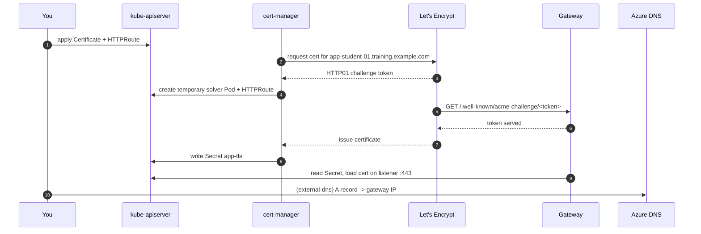

### Setup

```bash
cd ~/k8s-labs/10-networking
kubectl config use-context aks-training
kubectl config set-context --current --namespace="$NAMESPACE"

export BASE_DOMAIN="training.example.com"        # instructor supplies the real zone
export APP_HOST="app-${STUDENT}.${BASE_DOMAIN}"
echo "APP_HOST=$APP_HOST"

# The shared gateway (installed by the instructor)
kubectl get gatewayclass
kubectl get gateway -n nginx-gateway
export GW_IP="$(kubectl get gateway shared-gateway -n nginx-gateway -o jsonpath='{.status.addresses[0].value}')"
echo "GW_IP=$GW_IP"

# Your app must still be running from Lab 9.4
kubectl get deploy,svc,endpoints monolith -n "$NAMESPACE"
```

Reference — what the instructor installed (show it, don't run it):

```bash
# GatewayClass + shared Gateway, owned by the platform team.
cat <<'EOF'
apiVersion: gateway.networking.k8s.io/v1
kind: Gateway
metadata:
  name: shared-gateway
  namespace: nginx-gateway
  annotations:
    cert-manager.io/cluster-issuer: letsencrypt-prod
spec:
  gatewayClassName: nginx
  listeners:
    - name: http
      protocol: HTTP
      port: 80
      allowedRoutes:
        namespaces:
          from: All
    - name: https
      protocol: HTTPS
      port: 443
      tls:
        mode: Terminate
        certificateRefs:
          - kind: Secret
            name: shared-gateway-tls
      allowedRoutes:
        namespaces:
          from: All
EOF
```

### CLI walkthrough

**Step 1 — the ClusterIssuer (instructor-installed; read it, then verify it).**

```bash
kubectl get clusterissuer
kubectl describe clusterissuer letsencrypt-prod | tail -12
```

```bash
# For reference -- the ClusterIssuer definition:
cat <<'EOF'
apiVersion: cert-manager.io/v1
kind: ClusterIssuer
metadata:
  name: letsencrypt-prod
spec:
  acme:
    server: https://acme-v02.api.letsencrypt.org/directory
    email: platform@example.com
    privateKeySecretRef:
      name: letsencrypt-prod-account-key
    solvers:
      - http01:
          gatewayHTTPRoute:
            parentRefs:
              - name: shared-gateway
                namespace: nginx-gateway
                kind: Gateway
EOF
```

> **Rate limits are real.** Let's Encrypt production allows a limited number of certificates per registered domain per week. During training, point students at `letsencrypt-staging` first (`https://acme-staging-v02.api.letsencrypt.org/directory`) — the cert won't be browser-trusted, but the issuance flow is identical and you will not burn the production quota with twenty students retrying.

**Step 2 — request a certificate for your hostname.**

```bash
cat <<EOF > 01-certificate.yaml
apiVersion: cert-manager.io/v1
kind: Certificate
metadata:
  name: app-tls
  namespace: $NAMESPACE
spec:
  secretName: app-tls
  duration: 2160h
  renewBefore: 360h
  issuerRef:
    name: letsencrypt-prod
    kind: ClusterIssuer
  dnsNames:
    - $APP_HOST
EOF

kubectl apply -f 01-certificate.yaml
kubectl get certificate app-tls -n "$NAMESPACE" -w    # Ctrl-C once READY=True
```

**Step 3 — the DNS record.** If external-dns is installed it creates the record from your HTTPRoute's hostname. Otherwise create it explicitly:

```bash
# external-dns path -- just confirm after applying the HTTPRoute in step 4:
# az network dns record-set a list -g "$RG" -z "$BASE_DOMAIN" -o table

# Manual path (instructor, or students with DNS rights):
az network dns record-set a add-record \
  --resource-group "$RG" --zone-name "$BASE_DOMAIN" \
  --record-set-name "app-${STUDENT}" --ipv4-address "$GW_IP"

dig +short "$APP_HOST"
```

**Step 4 — attach your HTTPRoute to the shared gateway.**

```bash
cat <<EOF > 02-httproute.yaml
apiVersion: gateway.networking.k8s.io/v1
kind: HTTPRoute
metadata:
  name: monolith
  namespace: $NAMESPACE
  annotations:
    external-dns.alpha.kubernetes.io/hostname: $APP_HOST
spec:
  parentRefs:
    - name: shared-gateway
      namespace: nginx-gateway
      sectionName: https
  hostnames:
    - "$APP_HOST"
  rules:
    - matches:
        - path:
            type: PathPrefix
            value: /
      backendRefs:
        - name: monolith
          port: 80
EOF

kubectl apply -f 02-httproute.yaml
kubectl get httproute monolith -n "$NAMESPACE"
kubectl describe httproute monolith -n "$NAMESPACE" | sed -n '/Status:/,$p'
```

The `Accepted` and `ResolvedRefs` conditions must both be `True`. `ResolvedRefs: False` almost always means the backend Service name or port is wrong.

**Cross-namespace note:** a `Gateway` in `nginx-gateway` accepting an `HTTPRoute` from `student-01` requires `allowedRoutes.namespaces.from: All` (or a selector) on the listener — and a `ReferenceGrant` if the route points at a Service in a *third* namespace. That is Gateway API's deliberate answer to Ingress's "any namespace can claim any hostname" problem.

**Step 5 — reach it.**

```bash
curl -sSI "https://${APP_HOST}" | head -5
curl -s "https://${APP_HOST}" | head -10
echo | openssl s_client -connect "${APP_HOST}:443" -servername "$APP_HOST" 2>/dev/null \
  | openssl x509 -noout -subject -issuer -dates
```

**Step 6 — path-based and host-based routing.**

```bash
kubectl create deployment api --image=mcr.microsoft.com/azuredocs/aks-helloworld:v2 -n "$NAMESPACE"
kubectl set resources deployment/api -c api --requests=cpu=50m,memory=64Mi --limits=cpu=200m,memory=192Mi -n "$NAMESPACE"
kubectl expose deployment api --port=80 --target-port=80 -n "$NAMESPACE"
kubectl rollout status deployment/api -n "$NAMESPACE" --timeout=180s

cat <<EOF > 03-httproute-routing.yaml
apiVersion: gateway.networking.k8s.io/v1
kind: HTTPRoute
metadata:
  name: monolith
  namespace: $NAMESPACE
spec:
  parentRefs:
    - name: shared-gateway
      namespace: nginx-gateway
      sectionName: https
  hostnames:
    - "$APP_HOST"
  rules:
    - matches:
        - path:
            type: PathPrefix
            value: /api
      filters:
        - type: URLRewrite
          urlRewrite:
            path:
              type: ReplacePrefixMatch
              replacePrefixMatch: /
      backendRefs:
        - name: api
          port: 80
    - matches:
        - path:
            type: PathPrefix
            value: /
      backendRefs:
        - name: monolith
          port: 80
EOF

kubectl apply -f 03-httproute-routing.yaml
curl -s -o /dev/null -w "/     -> %{http_code}\n" "https://${APP_HOST}/"
curl -s -o /dev/null -w "/api  -> %{http_code}\n" "https://${APP_HOST}/api"
```

Rules are evaluated most-specific-first, so `/api` wins over `/` regardless of order in the file. The `URLRewrite` filter strips the prefix before the backend sees it — the equivalent of `nginx.ingress.kubernetes.io/rewrite-target`, but portable across controllers.

**Traffic splitting (a canary, in four lines):**

```bash
kubectl patch httproute monolith -n "$NAMESPACE" --type=json -p='[
  {"op":"replace","path":"/spec/rules/1/backendRefs","value":[
    {"name":"monolith","port":80,"weight":90},
    {"name":"api","port":80,"weight":10}
  ]}
]'
for i in $(seq 1 10); do curl -s "https://${APP_HOST}/" | grep -o "Welcome\|AKS" | head -1; done
kubectl apply -f 03-httproute-routing.yaml     # revert to 100%
```

### WebUI equivalent

| CLI | Portal |
|---|---|
| `kubectl get httproute` | **Kubernetes resources → Services and ingresses** (Ingresses tab; Gateway API objects appear under Custom resources) |
| `kubectl get svc -A --field-selector spec.type=LoadBalancer` | **Services and ingresses → Services**, EXTERNAL-IP column |
| `dig $APP_HOST` | **DNS zones → `training.example.com` → Recordsets** |
| Gateway public IP | **Resource groups → `MC_...` node RG → Public IP addresses** |
| Certificate status | No Portal view — `kubectl describe certificate` |
| Traffic on the gateway | **Monitoring → Insights → Controllers**, or the Log Analytics workspace |

1. **DNS zones → your zone → Recordsets** — find `app-student-01`. If external-dns created it, the record has a TXT companion recording ownership; deleting the HTTPRoute removes both.
2. **Node resource group → Load balancer → Frontend IP configuration** — one public IP serving every student's hostname. That is the cost argument for a shared gateway over per-app `LoadBalancer` Services.
3. **Monitoring → Insights → Controllers** for gateway Pod health during the troubleshooting lab.

### Verify

```bash
kubectl get certificate app-tls -n "$NAMESPACE"                      # READY True
kubectl get httproute monolith -n "$NAMESPACE" -o jsonpath='{.status.parents[0].conditions[*].type}{"\n"}'
dig +short "$APP_HOST"                                               # == $GW_IP
curl -sS -o /dev/null -w "%{http_code} %{ssl_verify_result}\n" "https://${APP_HOST}/"   # 200 0
```

---

## Lab 10.3 — Troubleshooting lab (30 min)

Run these as timed exercises. Break it, hand it to the person next to you, let them diagnose.

**Scenario 1 — 502 Bad Gateway (backend unhealthy).**

```bash
kubectl scale deployment/monolith --replicas=0 -n "$NAMESPACE"
sleep 10
curl -s -o /dev/null -w "%{http_code}\n" "https://${APP_HOST}/"     # 502
```

Diagnose in order — **the ladder is the lesson**:

```bash
kubectl get endpoints monolith -n "$NAMESPACE"                       # <none> -> found it
kubectl get pods -n "$NAMESPACE" -l app=monolith
kubectl describe httproute monolith -n "$NAMESPACE" | sed -n '/Status:/,$p'
kubectl logs -n nginx-gateway -l app.kubernetes.io/name=nginx-gateway-fabric --tail=20
kubectl scale deployment/monolith --replicas=2 -n "$NAMESPACE"
kubectl rollout status deployment/monolith -n "$NAMESPACE" --timeout=180s
```

**502 means the gateway had no healthy backend to talk to.** It is nearly always an endpoints problem — zero replicas, failing readiness probes, or a selector that matches nothing. Start at `kubectl get endpoints`, never at the gateway logs.

**Scenario 2 — 504 Gateway Timeout (slow backend / wrong port).**

```bash
kubectl patch svc monolith -n "$NAMESPACE" --type=merge -p '{"spec":{"ports":[{"name":"http","port":80,"targetPort":8080}]}}'
sleep 10
curl -s -o /dev/null -w "%{http_code}\n" --max-time 20 "https://${APP_HOST}/"
kubectl get endpoints monolith -n "$NAMESPACE"        # endpoints EXIST but on the wrong port
kubectl get svc monolith -n "$NAMESPACE" -o jsonpath='{.spec.ports[0].targetPort}{"\n"}'
kubectl get pods -n "$NAMESPACE" -l app=monolith -o jsonpath='{.items[0].spec.containers[0].ports[0].containerPort}{"\n"}'
kubectl patch svc monolith -n "$NAMESPACE" --type=merge -p '{"spec":{"ports":[{"name":"http","port":80,"targetPort":80}]}}'
curl -s -o /dev/null -w "%{http_code}\n" "https://${APP_HOST}/"
```

**502 vs 504:** 502 = no backend, or the backend refused/closed the connection. 504 = a backend was reached but did not answer in time. Endpoints present + 504 points at port mismatch, an app hang, or a timeout shorter than the app's response time. Other real causes: response headers larger than the proxy buffer, and slow upstream dependencies.

**Scenario 3 — DNS: propagation vs resolution.**

```bash
dig +short "$APP_HOST"                                # what the world sees
dig +short "$APP_HOST" @8.8.8.8                       # public resolver -- propagation check
az network dns record-set a list -g "$RG" -z "$BASE_DOMAIN" -o table | grep "$STUDENT"
```

If the record exists in Azure but `dig` returns nothing, it is TTL/propagation — wait, don't change anything. If Azure has no record, external-dns did not create it: check its logs and that the `hostname` annotation is on the HTTPRoute.

```bash
kubectl logs -n external-dns -l app.kubernetes.io/name=external-dns --tail=30 | grep -i "$STUDENT"
```

**Scenario 4 — in-cluster service discovery (CoreDNS).**

```bash
kubectl run netshoot --image=nicolaka/netshoot:latest --restart=Never -n "$NAMESPACE" --command -- sleep 3600
kubectl wait --for=condition=Ready pod/netshoot -n "$NAMESPACE" --timeout=120s

kubectl exec -it netshoot -n "$NAMESPACE" -- cat /etc/resolv.conf
kubectl exec -it netshoot -n "$NAMESPACE" -- nslookup monolith
kubectl exec -it netshoot -n "$NAMESPACE" -- nslookup "monolith.${NAMESPACE}.svc.cluster.local"
kubectl exec -it netshoot -n "$NAMESPACE" -- nslookup kubernetes.default
kubectl exec -it netshoot -n "$NAMESPACE" -- curl -sS -o /dev/null -w "%{http_code}\n" http://monolith

# CoreDNS health, when in-cluster resolution fails everywhere
kubectl get pods -n kube-system -l k8s-app=kube-dns
kubectl logs -n kube-system -l k8s-app=kube-dns --tail=20
kubectl get svc kube-dns -n kube-system
kubectl get configmap coredns -n kube-system -o yaml | head -30
```

Triage order: **one name fails → selector/Service problem. Every name fails from one Pod → that Pod's `resolv.conf` or `dnsPolicy`. Every name fails from every Pod → CoreDNS or the DNS Service.** Note that external names go through CoreDNS's forward plugin to the Azure resolver — a failure resolving `login.microsoftonline.com` is an egress problem, not a Kubernetes DNS problem.

**Scenario 5 — certificate not issuing.**

```bash
kubectl get certificate app-tls -n "$NAMESPACE"
kubectl describe certificate app-tls -n "$NAMESPACE" | sed -n '/Events:/,$p'
kubectl get certificaterequest,order,challenge -n "$NAMESPACE"
kubectl describe challenge -n "$NAMESPACE" 2>/dev/null | sed -n '/Status:/,$p'
kubectl logs -n cert-manager -l app.kubernetes.io/name=cert-manager --tail=40
```

Walk the chain: `Certificate` → `CertificateRequest` → `Order` → `Challenge`. The real error is almost always on the `Challenge`.

| Challenge failure | Cause | Fix |
|---|---|---|
| HTTP01 `404` on `/.well-known/acme-challenge/...` | The solver route isn't attached to the gateway, or port 80 isn't listening | Ensure an HTTP listener exists and `allowedRoutes` permits it |
| HTTP01 times out | DNS not resolving to the gateway yet, or an NSG blocks 80 | Fix DNS first; certificates need the name to resolve publicly |
| DNS01 `NXDOMAIN` on the TXT record | The solver identity lacks DNS Zone Contributor | Grant the role on the zone |
| `too many certificates already issued` | Let's Encrypt rate limit | Switch to `letsencrypt-staging` for training |
| Cert issued but browser still warns | Gateway still holds the old Secret | Check `certificateRefs`; restart the gateway Pod |

### Cleanup

```bash
kubectl delete pod netshoot -n "$NAMESPACE" --ignore-not-found
kubectl delete -f 03-httproute-routing.yaml --ignore-not-found
kubectl delete -f 02-httproute.yaml --ignore-not-found
kubectl delete svc api -n "$NAMESPACE" --ignore-not-found
kubectl delete deployment api -n "$NAMESPACE" --ignore-not-found
kubectl delete -f 01-certificate.yaml --ignore-not-found
kubectl delete secret app-tls -n "$NAMESPACE" --ignore-not-found

# If you created the DNS record manually:
az network dns record-set a delete -g "$RG" -z "$BASE_DOMAIN" -n "app-${STUDENT}" --yes 2>/dev/null || true

kubectl get httproute,certificate -n "$NAMESPACE"
kubectl get deploy,svc monolith -n "$NAMESPACE"      # keep the monolith for Sections 11 and 12
```

**Expected outcome:** the participant can expose an AKS workload securely with correct DNS and TLS, and can triage 502/504, DNS and certificate failures in a defined order rather than by guessing.

---
---

# SECTION 11 — AKS Storage and Stateful Workloads (2h)

**Deliverable:** a stateful workload in AKS with verified backup and restore.
**Prerequisite:** Velero is installed cluster-wide with the Azure plugin and a Blob container, by the instructor.

---

## Lab 11.1 — Storage primitives & Azure options (20 min)

### Objectives
- Map Volume / PV / PVC / StorageClass onto the provisioning flow and say who creates each.
- Choose between Azure Disks, Files and NetApp Files from access mode and performance needs.
- State when stateful workloads should live outside the cluster.

### Concept

**A `PersistentVolumeClaim` is a request; a `PersistentVolume` is the fulfilment; a `StorageClass` is the recipe for creating one on demand.** In dynamic provisioning — which is all you should use on AKS — you write only the PVC. The CSI driver creates the Azure resource and the PV object.

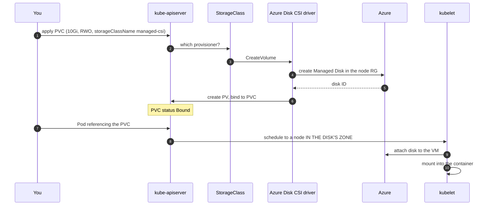

| Option | Access modes | Backed by | Use for |
|---|---|---|---|
| **Azure Disk CSI** (`managed-csi`, `managed-csi-premium`) | `ReadWriteOnce` | Managed Disk | Databases, single-writer state. Fast. **Zone-bound.** |
| **Azure Files CSI** (`azurefile-csi`, `azurefile-csi-premium`) | `ReadWriteMany` | SMB/NFS share | Shared config, uploads, legacy apps expecting a shared mount |
| **Azure NetApp Files** | `ReadWriteMany` | ANF volume | High-throughput, low-latency shared storage; SAP, HPC |
| `emptyDir` | Pod-local | Node disk / memory | Scratch, caches. **Dies with the Pod.** |

```bash
kubectl get storageclass
kubectl describe storageclass managed-csi | grep -E "Provisioner|ReclaimPolicy|VolumeBindingMode|AllowVolumeExpansion"
```

Two fields to read out loud:

- **`reclaimPolicy: Delete`** on the default classes — deleting the PVC deletes the Azure disk **and your data**. Set `Retain` for anything you care about; then cleanup becomes a deliberate act.
- **`volumeBindingMode: WaitForFirstConsumer`** — provisioning is deferred until a Pod is scheduled, so the disk is created in the *right zone*. With `Immediate`, a disk in zone 1 and a Pod scheduled to zone 2 gives you a Pod stuck in `ContainerCreating` forever. This is the single most common AKS storage incident.

**When state should live outside the cluster.** You *can* run PostgreSQL, Kafka or Elasticsearch on AKS with operators. You then own storage performance tuning, backup verification, restore rehearsals, failover testing and major-version upgrades for a system whose failure modes are subtle and whose bad days are very bad. Azure Database for PostgreSQL, Event Hubs and Azure AI Search exist. **Default to the managed service; run it in-cluster only with a specific, defensible reason** — licensing, an extension the PaaS lacks, or a genuine portability requirement. We run PostgreSQL in-cluster in the next lab *because it is a lab*, and you should say so.

---

## Lab 11.2 — StatefulSet on Azure Disks (45 min)

### Objectives
- Deploy PostgreSQL as a `StatefulSet` backed by an Azure Disk via `volumeClaimTemplates`.
- Demonstrate the three StatefulSet guarantees: stable identity, stable storage, ordered operations.
- Prove data survives Pod deletion.

### Concept

A Deployment's Pods are interchangeable: random names, shared or no storage, replaced in any order. A **StatefulSet** gives each Pod a stable ordinal name (`db-0`, `db-1`), a stable DNS name through a **headless Service** (`db-0.db.student-01.svc.cluster.local`), and **its own PVC** created from `volumeClaimTemplates` — which is retained when the Pod is deleted and re-attached when it comes back. Creation and scale-up are ordered `0,1,2`; scale-down and deletion are reverse-ordered.

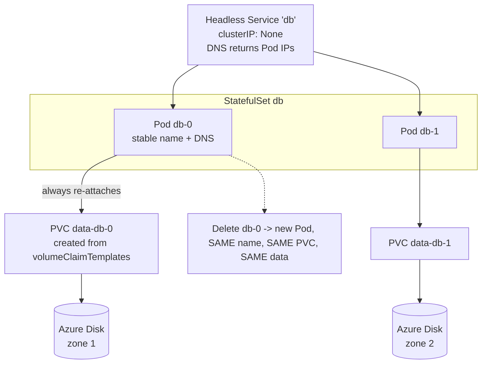

### Setup

```bash
cd ~/k8s-labs/11-storage
kubectl config use-context aks-training
kubectl config set-context --current --namespace="$NAMESPACE"
kubectl get storageclass
kubectl get resourcequota -n "$NAMESPACE" 2>/dev/null | grep -i persistentvolume || true
```

### CLI walkthrough

```bash
cat <<'EOF' > 01-postgres-sts.yaml
apiVersion: v1
kind: Secret
metadata:
  name: pg-secret
  labels:
    app: pg
type: Opaque
stringData:
  POSTGRES_PASSWORD: "LabOnly-Pg-2026!"
  POSTGRES_USER: "appuser"
  POSTGRES_DB: "appdb"
---
apiVersion: v1
kind: Service
metadata:
  name: pg
  labels:
    app: pg
spec:
  clusterIP: None
  selector:
    app: pg
  ports:
    - name: postgres
      port: 5432
      targetPort: postgres
---
apiVersion: apps/v1
kind: StatefulSet
metadata:
  name: pg
  labels:
    app: pg
spec:
  serviceName: pg
  replicas: 1
  selector:
    matchLabels:
      app: pg
  template:
    metadata:
      labels:
        app: pg
    spec:
      terminationGracePeriodSeconds: 60
      securityContext:
        fsGroup: 999
      containers:
        - name: postgres
          image: postgres:16-alpine
          ports:
            - name: postgres
              containerPort: 5432
          envFrom:
            - secretRef:
                name: pg-secret
          env:
            - name: PGDATA
              value: /var/lib/postgresql/data/pgdata
          volumeMounts:
            - name: data
              mountPath: /var/lib/postgresql/data
          readinessProbe:
            exec:
              command: ["sh", "-c", "pg_isready -U $POSTGRES_USER -d $POSTGRES_DB"]
            initialDelaySeconds: 10
            periodSeconds: 10
          livenessProbe:
            exec:
              command: ["sh", "-c", "pg_isready -U $POSTGRES_USER -d $POSTGRES_DB"]
            initialDelaySeconds: 30
            periodSeconds: 20
            failureThreshold: 3
          resources:
            requests:
              cpu: "100m"
              memory: "256Mi"
            limits:
              cpu: "500m"
              memory: "512Mi"
  volumeClaimTemplates:
    - metadata:
        name: data
      spec:
        accessModes:
          - ReadWriteOnce
        storageClassName: managed-csi
        resources:
          requests:
            storage: 5Gi
EOF

kubectl apply -f 01-postgres-sts.yaml -n "$NAMESPACE"
kubectl rollout status statefulset/pg -n "$NAMESPACE" --timeout=300s
kubectl get statefulset,pods,pvc,svc -n "$NAMESPACE" -l app=pg
kubectl get pv | grep "$NAMESPACE"
```

Note the names: Pod `pg-0`, PVC `data-pg-0`. Ordinal, predictable, not random.

```bash
# Write data
kubectl exec -it pg-0 -n "$NAMESPACE" -- psql -U appuser -d appdb -c \
  "CREATE TABLE IF NOT EXISTS orders (id serial PRIMARY KEY, item text, created timestamptz DEFAULT now());"
kubectl exec -it pg-0 -n "$NAMESPACE" -- psql -U appuser -d appdb -c \
  "INSERT INTO orders (item) VALUES ('widget-a'),('widget-b'),('widget-c');"
kubectl exec -it pg-0 -n "$NAMESPACE" -- psql -U appuser -d appdb -c "SELECT count(*) FROM orders;"
```

```bash
# Stable identity + stable storage: delete the Pod, get the SAME name and the SAME data.
kubectl get pvc data-pg-0 -n "$NAMESPACE" -o jsonpath='{.spec.volumeName}{"\n"}'
kubectl delete pod pg-0 -n "$NAMESPACE"
kubectl wait --for=condition=Ready pod/pg-0 -n "$NAMESPACE" --timeout=300s
kubectl get pvc data-pg-0 -n "$NAMESPACE" -o jsonpath='{.spec.volumeName}{"\n"}'   # identical PV
kubectl exec -it pg-0 -n "$NAMESPACE" -- psql -U appuser -d appdb -c "SELECT count(*) FROM orders;"
```

```bash
# Stable DNS through the headless Service
kubectl run netshoot --image=nicolaka/netshoot:latest --restart=Never -n "$NAMESPACE" --command -- sleep 3600
kubectl wait --for=condition=Ready pod/netshoot -n "$NAMESPACE" --timeout=120s
kubectl exec -it netshoot -n "$NAMESPACE" -- nslookup pg
kubectl exec -it netshoot -n "$NAMESPACE" -- nslookup "pg-0.pg.${NAMESPACE}.svc.cluster.local"
```

The headless Service returns Pod IPs, not a VIP. That is what lets a replica connect to `pg-0` *specifically* — which is exactly what clustered databases need and what a normal Service cannot express.

```bash
# Online volume expansion (allowVolumeExpansion: true on managed-csi). Shrinking is not possible.
kubectl patch pvc data-pg-0 -n "$NAMESPACE" --type=merge -p '{"spec":{"resources":{"requests":{"storage":"8Gi"}}}}'
kubectl get pvc data-pg-0 -n "$NAMESPACE" -w      # Ctrl-C when CAPACITY reads 8Gi
```

### WebUI equivalent

| CLI | Portal |
|---|---|
| `kubectl get statefulset` | **Kubernetes resources → Workloads → Stateful sets** |
| `kubectl get pvc` | **Kubernetes resources → Storage → Persistent volume claims** |
| `kubectl get pv` | **→ Storage → Persistent volumes** |
| `kubectl get storageclass` | **→ Storage → Storage classes** |
| The actual disk | **Resource groups → `MC_...` node RG → Disks** |

Open the node resource group's **Disks** list and find the one whose name contains your PVC's PV name. Its **Availability zone** is why `WaitForFirstConsumer` exists. Its **Size + SKU** is the line item on the invoice — students routinely provision Premium SSD when Standard would do.

### Verify & troubleshoot

```bash
kubectl get statefulset pg -n "$NAMESPACE" -o jsonpath='{.status.readyReplicas}/{.spec.replicas}{"\n"}'
kubectl get pvc -n "$NAMESPACE" -l app=pg
kubectl exec -it pg-0 -n "$NAMESPACE" -- psql -U appuser -d appdb -c "SELECT count(*) FROM orders;"
```

**Scenario — PVC stuck `Pending`.**

```bash
cat <<'EOF' > 02-bad-pvc.yaml
apiVersion: v1
kind: PersistentVolumeClaim
metadata:
  name: bad-pvc
spec:
  accessModes:
    - ReadWriteMany
  storageClassName: managed-csi
  resources:
    requests:
      storage: 5Gi
EOF

kubectl apply -f 02-bad-pvc.yaml -n "$NAMESPACE"
kubectl get pvc bad-pvc -n "$NAMESPACE"
kubectl describe pvc bad-pvc -n "$NAMESPACE" | sed -n '/Events:/,$p'
kubectl delete -f 02-bad-pvc.yaml -n "$NAMESPACE"
```

Azure Disk cannot do `ReadWriteMany` — it attaches to one VM at a time. `ReadWriteMany` means `azurefile-csi`. Note a `Pending` PVC on a `WaitForFirstConsumer` class with no Pod yet is **normal**, not a fault: `describe` says `waiting for first consumer`.

| Symptom | Cause | Fix |
|---|---|---|
| PVC `Pending`, `waiting for first consumer` | Normal for `WaitForFirstConsumer` | Create a Pod that uses it |
| PVC `Pending`, no matching class | Typo in `storageClassName` | `kubectl get sc` |
| PVC `Pending`, quota | `persistentvolumeclaims` or `requests.storage` quota | `kubectl describe resourcequota` |
| Pod `ContainerCreating`, attach fails | Disk in a different zone from the node; or still attached to an old node | `describe pod` → `FailedAttachVolume`; ensure `WaitForFirstConsumer`; wait out the detach (~5 min) |
| Pod `ContainerCreating`, mount permission denied | Container runs as non-root without `fsGroup` | Set `securityContext.fsGroup` |
| StatefulSet Pod won't start after node loss | Disk still attached to the dead node | Wait for detach, or force-delete the Pod only after confirming the node is truly gone |
| Slow I/O on Azure Files | SMB protocol overhead, IOPS limit on the share tier | Use Premium Files, tune `mountOptions` (`cache=strict`, `actimeo`), or move to Disk if RWO suffices |

---

## Lab 11.3 — Backup and restore with Velero (35 min)

### Objectives
- Back up a namespace including PVC data to Azure Blob Storage.
- Simulate data loss and restore, verifying the data actually came back.
- State what Velero does not protect you from.

### Concept

Velero backs up **Kubernetes objects** to Blob Storage and **volume data** either as Azure disk snapshots or via file-level copy (Kopia/Restic) for non-snapshottable volumes. A restore recreates objects and volumes into a target namespace. Azure Backup for AKS is the managed alternative — same concepts, Azure-native lifecycle and policy.

**The rule to say out loud: a backup you have never restored is not a backup.** The restore step below is the entire point of this lab.

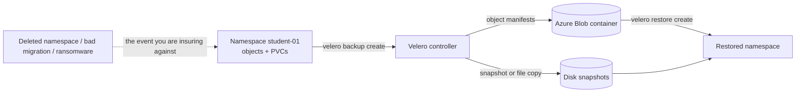

### Setup

```bash
cd ~/k8s-labs/11-storage
velero version
velero backup-location get
kubectl get pods -n velero
```

Reference — the instructor's install:

```bash
# velero install \
#   --provider azure \
#   --plugins velero/velero-plugin-for-microsoft-azure:v1.11.0 \
#   --bucket velero \
#   --secret-file ./credentials-velero \
#   --backup-location-config resourceGroup=$RG,storageAccount=$STORAGE_ACCOUNT,subscriptionId=$SUBSCRIPTION_ID \
#   --snapshot-location-config apiTimeout=5m,resourceGroup=$RG,subscriptionId=$SUBSCRIPTION_ID \
#   --use-node-agent
```

### CLI walkthrough

```bash
# 1. Baseline: confirm what we are protecting.
kubectl exec -it pg-0 -n "$NAMESPACE" -- psql -U appuser -d appdb -c "SELECT count(*), max(created) FROM orders;"

# 2. Back up the namespace, including volume data.
velero backup create "bk-${STUDENT}-$(date +%H%M)" \
  --include-namespaces "$NAMESPACE" \
  --default-volumes-to-fs-backup \
  --wait

export BACKUP_NAME="$(velero backup get -o json 2>/dev/null | python3 -c "
import json,sys
items=json.load(sys.stdin).get('items',[])
print(sorted(i['metadata']['name'] for i in items)[-1])
" 2>/dev/null || velero backup get | awk 'NR>1{print $1}' | tail -1)"
echo "BACKUP_NAME=$BACKUP_NAME"

velero backup describe "$BACKUP_NAME" --details | head -40
velero backup logs "$BACKUP_NAME" | tail -20
```

`--default-volumes-to-fs-backup` copies file contents rather than relying on disk snapshots. It is slower but portable across storage classes and works where CSI snapshots are unavailable.

```bash
# 3. Simulate data loss.
kubectl exec -it pg-0 -n "$NAMESPACE" -- psql -U appuser -d appdb -c "DROP TABLE orders;"
kubectl exec -it pg-0 -n "$NAMESPACE" -- psql -U appuser -d appdb -c "\dt"     # gone

kubectl delete -f 01-postgres-sts.yaml -n "$NAMESPACE"
kubectl delete pvc data-pg-0 -n "$NAMESPACE" --ignore-not-found
kubectl get pods,pvc -n "$NAMESPACE" -l app=pg
```

```bash
# 4. Restore.
velero restore create "rs-${STUDENT}-$(date +%H%M)" --from-backup "$BACKUP_NAME" --wait

velero restore get
export RESTORE_NAME="$(velero restore get | awk 'NR>1{print $1}' | tail -1)"
velero restore describe "$RESTORE_NAME" --details | head -30
velero restore logs "$RESTORE_NAME" | tail -20
```

```bash
# 5. VERIFY -- this step is the lab.
kubectl get statefulset,pods,pvc -n "$NAMESPACE" -l app=pg
kubectl wait --for=condition=Ready pod/pg-0 -n "$NAMESPACE" --timeout=300s
kubectl exec -it pg-0 -n "$NAMESPACE" -- psql -U appuser -d appdb -c "SELECT count(*), max(created) FROM orders;"
```

The row count must match the baseline from step 1. If it does not, the backup was taken before the writes, or the volume data was not included — both are real production failure modes and both are why you rehearse.

```bash
# 6. Scheduled backups -- what you actually run in production.
velero schedule create "sched-${STUDENT}" \
  --schedule="0 2 * * *" \
  --include-namespaces "$NAMESPACE" \
  --default-volumes-to-fs-backup \
  --ttl 168h
velero schedule get
velero schedule delete "sched-${STUDENT}" --confirm
```

`--ttl 168h` expires backups after 7 days. Without a TTL, Blob costs grow forever.

**What Velero does not protect you from:** a bad backup you never tested; logical corruption backed up faithfully (garbage in, garbage out — you need point-in-time recovery for that, which is a database feature, not a Velero feature); anything outside the cluster (Azure SQL, Key Vault, DNS); and cluster-scoped state you excluded from the backup scope.

### WebUI equivalent

Velero has no Portal UI. Inspect its artefacts instead:

| CLI | Portal |
|---|---|
| `velero backup get` | **Storage accounts → your account → Containers → `velero` → `backups/`** |
| `velero backup describe` | The `.tar.gz` and JSON metadata in that blob prefix |
| Disk snapshots | **Resource groups → node RG → Snapshots** |
| `kubectl get pods -n velero` | **Workloads → Deployments**, namespace `velero` |

**Azure Backup for AKS** is the managed alternative and *does* have a Portal experience: **Backup center → Backup instances → Kubernetes Services**. Show it and note the trade-off — Azure-native policy, retention and RBAC, but Azure-only, whereas Velero restores into any Kubernetes cluster anywhere.

### Verify

```bash
velero backup get
velero restore get                        # STATUS Completed
kubectl exec -it pg-0 -n "$NAMESPACE" -- psql -U appuser -d appdb -c "SELECT count(*) FROM orders;"
```

---

## Lab 11.4 — Troubleshooting lab (20 min)

**Scenario 1 — Pod stuck `ContainerCreating` on volume attach.**

```bash
kubectl get pods -n "$NAMESPACE" -l app=pg
kubectl describe pod pg-0 -n "$NAMESPACE" | sed -n '/Events:/,$p'
kubectl get events -n "$NAMESPACE" --field-selector reason=FailedAttachVolume --sort-by=.lastTimestamp | tail -5
kubectl get pvc data-pg-0 -n "$NAMESPACE" -o jsonpath='{.spec.volumeName}{"\n"}'
kubectl get pv "$(kubectl get pvc data-pg-0 -n "$NAMESPACE" -o jsonpath='{.spec.volumeName}')" \
  -o jsonpath='{.spec.nodeAffinity}{"\n"}'
kubectl get nodes -L topology.kubernetes.io/zone
```

`Multi-Attach error` means the disk is still attached to another node — usually a node that failed and hasn't released it. Azure detach takes several minutes; **wait**. Force-deleting the Pod before the detach completes makes it worse. Compare the PV's `nodeAffinity` zone with the node's zone: a mismatch means the class used `Immediate` binding instead of `WaitForFirstConsumer`.

**Scenario 2 — a StatefulSet Pod whose identity drifted from its PVC.**

```bash
kubectl get pvc -n "$NAMESPACE" -l app=pg
kubectl get pods -n "$NAMESPACE" -l app=pg -o custom-columns='POD:.metadata.name,PVC:.spec.volumes[0].persistentVolumeClaim.claimName'
```

A StatefulSet always binds `pg-N` to `data-pg-N`. If someone deleted `data-pg-0` while `pg-0` was down, the StatefulSet provisions a **fresh empty disk** on restart — the Pod is healthy and the data is gone. Recovery: restore that PVC from a Velero backup (Lab 11.3), or bind a retained PV manually.

**Never delete a StatefulSet's PVCs as part of "cleaning up".** `kubectl delete statefulset` deliberately leaves them behind; that is a safety feature, not a bug.

**Scenario 3 — slow I/O on Azure Files.**

```bash
kubectl get storageclass azurefile-csi -o yaml | grep -A 10 "mountOptions" || true
```

Triage order: is it SMB protocol overhead (many small files — Files is bad at this, Disk is good), the share's IOPS tier (Standard vs Premium), or client-side caching (`cache=strict` vs `cache=none` in `mountOptions`)? If the workload is single-writer, the real answer is usually to move it to a Disk.

**Scenario 4 — the reclaim policy trap.**

```bash
kubectl get pv -o custom-columns='NAME:.metadata.name,CLAIM:.spec.claimRef.name,RECLAIM:.spec.persistentVolumeReclaimPolicy,STATUS:.status.phase' | head
```

Every PV showing `Delete` will destroy its Azure disk the moment the PVC is deleted. For anything that matters, `kubectl patch pv <name> -p '{"spec":{"persistentVolumeReclaimPolicy":"Retain"}}'` — then cleanup becomes a deliberate act instead of a side effect.

### Cleanup

```bash
kubectl delete pod netshoot -n "$NAMESPACE" --ignore-not-found
kubectl delete -f 01-postgres-sts.yaml -n "$NAMESPACE" --ignore-not-found

# StatefulSet PVCs are NOT deleted with the StatefulSet -- that is deliberate.
kubectl get pvc -n "$NAMESPACE" -l app=pg
kubectl delete pvc -n "$NAMESPACE" -l app=pg --ignore-not-found
kubectl get pv | grep "$NAMESPACE" || echo "no PVs left"

velero backup delete "$BACKUP_NAME" --confirm 2>/dev/null || true
velero backup get

kubectl get all,pvc -n "$NAMESPACE"     # the monolith stays -- Section 12 needs it
```

Confirm in the Portal that the disks are gone from the node resource group. An orphaned Premium SSD nobody deleted is a line item that runs for months.

**Expected outcome:** the participant can run, back up and recover a stateful workload in AKS — and can argue for putting the database in PaaS instead.

---
---

# SECTION 12 — Secure AKS Operations (2h)

**Deliverable:** a hardened namespace with no static secrets, no privileged Pods, and an explicit network allow list.
**Prerequisite:** the `monolith` Deployment + Service from Lab 9.4 in `$NAMESPACE`; the Secrets Store CSI driver, a Key Vault, per-student managed identity and federated credential are pre-provisioned by the instructor (see §0.2).

---

## Lab 12.1 — AKS RBAC & least privilege (25 min)

### Objectives
- Distinguish Kubernetes RBAC from Azure RBAC on AKS and say when each applies.
- Build a namespace-scoped `Role` and `RoleBinding` and verify it with `kubectl auth can-i --as`.
- Explain why `cluster-admin` for humans is an anti-pattern and what to grant instead.

### Concept

Four nouns. **Role** = permissions inside one namespace. **ClusterRole** = permissions cluster-wide *or* a reusable permission set. **RoleBinding** = grant a Role (or a ClusterRole) to a subject **in one namespace**. **ClusterRoleBinding** = grant cluster-wide. The pairing that trips people up: a `RoleBinding` referencing a `ClusterRole` grants those permissions *only within that namespace* — that's how the built-in `view`, `edit` and `admin` ClusterRoles are used, and it is the right default.

**Two authorization systems on AKS.** *Azure RBAC for Kubernetes* evaluates Azure role assignments (`Azure Kubernetes Service RBAC Reader/Writer/Admin`) against the AKS resource — managed in the Portal alongside everything else, auditable in Azure Activity Log. *Kubernetes RBAC* evaluates Role/RoleBindings in the cluster, managed as YAML in Git. Both can be on at once. Pick one as your primary and be consistent; mixing them without a rule is how "who can do what" becomes unanswerable.

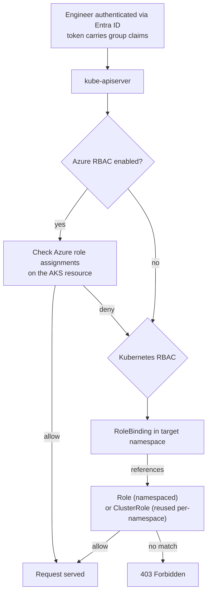

### Setup

```bash
cd ~/k8s-labs/12-security
kubectl config use-context aks-training
kubectl config set-context --current --namespace="$NAMESPACE"
kubectl auth can-i --list -n "$NAMESPACE" | head -15
```

### CLI walkthrough

```bash
# The built-in ClusterRoles you should be granting instead of inventing your own.
kubectl get clusterrole view edit admin cluster-admin
kubectl describe clusterrole view | head -20
```

```bash
cat <<EOF > 01-rbac.yaml
apiVersion: v1
kind: ServiceAccount
metadata:
  name: sa-deployer
  namespace: $NAMESPACE
---
apiVersion: rbac.authorization.k8s.io/v1
kind: Role
metadata:
  name: app-operator
  namespace: $NAMESPACE
rules:
  - apiGroups: ["apps"]
    resources: ["deployments", "replicasets"]
    verbs: ["get", "list", "watch", "update", "patch"]
  - apiGroups: [""]
    resources: ["pods", "pods/log", "services", "configmaps", "events"]
    verbs: ["get", "list", "watch"]
  - apiGroups: ["apps"]
    resources: ["deployments/scale"]
    verbs: ["update", "patch"]
---
apiVersion: rbac.authorization.k8s.io/v1
kind: RoleBinding
metadata:
  name: app-operator
  namespace: $NAMESPACE
subjects:
  - kind: ServiceAccount
    name: sa-deployer
    namespace: $NAMESPACE
roleRef:
  apiGroup: rbac.authorization.k8s.io
  kind: Role
  name: app-operator
EOF

kubectl apply -f 01-rbac.yaml
```

Note what is **absent**: no `create`/`delete` on Deployments, no `secrets` at all, no `exec`. A CI identity that can roll out a new image does not need to read your database password or shell into a Pod.

```bash
# Verify by impersonation -- the fastest way to test RBAC without switching identities.
SA="system:serviceaccount:${NAMESPACE}:sa-deployer"
kubectl auth can-i patch deployments   --as="$SA" -n "$NAMESPACE"     # yes
kubectl auth can-i update deployments/scale --as="$SA" -n "$NAMESPACE" # yes
kubectl auth can-i get secrets         --as="$SA" -n "$NAMESPACE"     # no
kubectl auth can-i create pods/exec    --as="$SA" -n "$NAMESPACE"     # no
kubectl auth can-i delete deployments  --as="$SA" -n "$NAMESPACE"     # no
kubectl auth can-i get pods            --as="$SA" -n kube-system      # no
kubectl auth can-i --list              --as="$SA" -n "$NAMESPACE"
```

`--as` requires impersonation rights, which the instructor account has. It is the correct way to answer "can this pipeline identity actually do what it needs?" **before** the pipeline fails at 2 a.m.

```bash
# Who currently has cluster-admin? Ask this on every cluster you inherit.
kubectl get clusterrolebindings -o json | python3 -c "
import json,sys
for b in json.load(sys.stdin)['items']:
    if b['roleRef']['name'] == 'cluster-admin':
        subs = ', '.join(f\"{s['kind']}:{s.get('name','')}\" for s in b.get('subjects') or [])
        print(f\"{b['metadata']['name']:45} -> {subs}\")
"
```

**Least-privilege patterns worth writing down:**

| Audience | Grant | Not |
|---|---|---|
| Developers, their namespace | `edit` via RoleBinding | `admin` (can edit RBAC) or `cluster-admin` |
| Read-only auditors | `view` via RoleBinding, per namespace | `ClusterRoleBinding` to `view` (exposes every namespace's Secrets metadata) |
| CI/CD | Purpose-built Role like `app-operator`, one namespace | `cluster-admin` "because the pipeline needs it" |
| Platform team | `cluster-admin` via a break-glass Entra group with PIM | Standing membership |
| Applications | A ServiceAccount with the narrowest Role; `automountServiceAccountToken: false` when unused | The `default` ServiceAccount with a mounted token |

### WebUI equivalent

| CLI | Portal |
|---|---|
| Azure RBAC assignments | **AKS cluster → Access control (IAM) → Role assignments** |
| Test a user's access | **→ Access control (IAM) → Check access** |
| `kubectl get role,rolebinding` | **Kubernetes resources → Custom resources / YAML view** |
| Entra group membership | **Microsoft Entra ID → Groups → `aks-training-student-01` → Members** |

Show **Access control (IAM) → Role assignments** and the four AKS built-ins (`RBAC Reader`, `Writer`, `Admin`, `Cluster Admin`) plus `Azure Kubernetes Service Cluster User Role` — which grants only the ability to *fetch a kubeconfig*, not to do anything with it. That separation is genuinely useful: everyone gets Cluster User, then Kubernetes RBAC decides what they can actually do.

### Verify & troubleshoot

```bash
kubectl get sa,role,rolebinding -n "$NAMESPACE"
kubectl auth can-i --list --as="system:serviceaccount:${NAMESPACE}:sa-deployer" -n "$NAMESPACE"
```

| Symptom | Cause | Fix |
|---|---|---|
| `Forbidden` despite a RoleBinding | Wrong namespace, or the subject name/kind doesn't match the token | `kubectl auth can-i --as=<subject>`; check `kind: Group` vs `User` vs `ServiceAccount` |
| Works with `kubectl`, fails in a Pod | The Pod uses the `default` ServiceAccount | Set `serviceAccountName` in the Pod spec |
| Azure role assigned, still denied | Azure RBAC not enabled, or propagation delay (up to ~5 min) | `az aks show --query aadProfile.enableAzureRbac`; wait and retry |
| `ClusterRole` referenced from a `RoleBinding` grants too much | Expected — it grants those rules *in that namespace only* | Confirm with `--as` rather than reasoning about it |

### Cleanup (deferred)

Keep `sa-deployer` — Lab 12.2 uses a ServiceAccount. Clean up at the end of the section.

---

## Lab 12.2 — Workload Identity + Key Vault CSI (45 min)

### Objectives
- Replace the Kubernetes `Secret` from Lab 9.4 with values mounted from Azure Key Vault.
- Configure Workload Identity so the app gets an Entra token with **no stored credential anywhere**.
- Explain the federated-credential trust chain and why it beats a client secret.

### Concept

A Kubernetes `Secret` is base64, readable by anyone with `get secret` in the namespace, and typically committed somewhere it shouldn't be. Two replacements, used together:

**Secrets Store CSI driver + Azure Key Vault provider** — a `SecretProviderClass` names the vault and the objects; the driver mounts them as files into the Pod at start. The value lives in Key Vault, versioned, access-logged, rotatable.

**Workload Identity** — the Pod's ServiceAccount token (an OIDC JWT signed by the cluster's issuer) is exchanged with Entra ID for an Azure access token, because a **federated credential** on a managed identity trusts `issuer + subject`, where subject is `system:serviceaccount:<namespace>:<serviceaccount>`. **Nothing is stored. Nothing to rotate. Nothing to leak.** The trust is a statement about *which workload in which namespace of which cluster*, not a shared string.

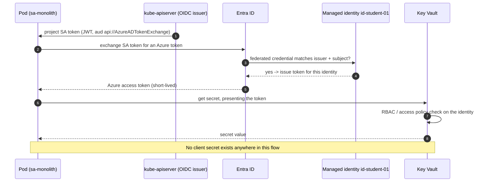

### Setup

```bash
cd ~/k8s-labs/12-security
export KEYVAULT_NAME="kv-training-shared"          # instructor supplies
export USER_ASSIGNED_CLIENT_ID="<from your lab card>"
export TENANT_ID="$(az account show --query tenantId -o tsv)"

az aks show -g "$RG" -n "$AKS_NAME" --query "{oidc:oidcIssuerProfile.enabled,wi:securityProfile.workloadIdentity.enabled}" -o table
kubectl get pods -n kube-system -l app=secrets-store-csi-driver
kubectl get pods -n kube-system -l app=csi-secrets-store-provider-azure
```

Reference — what the instructor ran per student (see §0.2 for the loop):

```bash
# az identity create -g "$RG" -n "id-${STUDENT}" -l "$LOCATION"
# az identity federated-credential create \
#     --name "fc-${STUDENT}" --identity-name "id-${STUDENT}" -g "$RG" \
#     --issuer "$(az aks show -g $RG -n $AKS_NAME --query oidcIssuerProfile.issuerUrl -o tsv)" \
#     --subject "system:serviceaccount:${STUDENT}:sa-monolith" \
#     --audience api://AzureADTokenExchange
# az role assignment create --role "Key Vault Secrets User" \
#     --assignee "$(az identity show -g $RG -n id-${STUDENT} --query principalId -o tsv)" \
#     --scope "$(az keyvault show -n $KEYVAULT_NAME --query id -o tsv)"
# az keyvault secret set --vault-name "$KEYVAULT_NAME" --name "db-password-${STUDENT}" --value "FromKeyVault-2026!"
# az keyvault secret set --vault-name "$KEYVAULT_NAME" --name "api-key-${STUDENT}"     --value "kv-8f3c1d0a4b7e"
```

**The subject string must match exactly** — `system:serviceaccount:<namespace>:<serviceaccount-name>`. A typo here produces `AADSTS70021: No matching federated identity record found`, which is the single most common Workload Identity error.

### CLI walkthrough

```bash
# 1. ServiceAccount annotated with the client ID.
cat <<EOF > 02-serviceaccount.yaml
apiVersion: v1
kind: ServiceAccount
metadata:
  name: sa-monolith
  namespace: $NAMESPACE
  annotations:
    azure.workload.identity/client-id: "$USER_ASSIGNED_CLIENT_ID"
  labels:
    azure.workload.identity/use: "true"
EOF

kubectl apply -f 02-serviceaccount.yaml
kubectl describe sa sa-monolith -n "$NAMESPACE"
```

```bash
# 2. SecretProviderClass: which vault, which objects, and the Kubernetes Secret to sync (optional).
cat <<EOF > 03-secretproviderclass.yaml
apiVersion: secrets-store.csi.x-k8s.io/v1
kind: SecretProviderClass
metadata:
  name: monolith-kv
  namespace: $NAMESPACE
spec:
  provider: azure
  parameters:
    clientID: "$USER_ASSIGNED_CLIENT_ID"
    keyvaultName: "$KEYVAULT_NAME"
    tenantId: "$TENANT_ID"
    usePodIdentity: "false"
    useVMManagedIdentity: "false"
    objects: |
      array:
        - |
          objectName: db-password-$STUDENT
          objectType: secret
          objectAlias: DB_PASSWORD
        - |
          objectName: api-key-$STUDENT
          objectType: secret
          objectAlias: API_KEY
  secretObjects:
    - secretName: monolith-kv-synced
      type: Opaque
      data:
        - objectName: DB_PASSWORD
          key: DB_PASSWORD
        - objectName: API_KEY
          key: API_KEY
EOF

kubectl apply -f 03-secretproviderclass.yaml
kubectl get secretproviderclass -n "$NAMESPACE"
```

`secretObjects` mirrors the mounted values into a Kubernetes Secret so `envFrom` still works for apps that only read environment variables. **The mirror is a compatibility bridge, not the goal** — it recreates the base64 exposure inside the cluster. Prefer reading the mounted files, or having the app call Key Vault directly with its Workload Identity token.

```bash
# 3. Patch the Deployment: ServiceAccount, the workload-identity label, and the CSI volume.
cat <<EOF > 04-monolith-kv-patch.yaml
spec:
  template:
    metadata:
      labels:
        azure.workload.identity/use: "true"
    spec:
      serviceAccountName: sa-monolith
      containers:
        - name: monolith
          volumeMounts:
            - name: kv-secrets
              mountPath: /mnt/secrets-store
              readOnly: true
      volumes:
        - name: kv-secrets
          csi:
            driver: secrets-store.csi.k8s.io
            readOnly: true
            volumeAttributes:
              secretProviderClass: monolith-kv
EOF

kubectl patch deployment monolith -n "$NAMESPACE" --patch-file 04-monolith-kv-patch.yaml
kubectl rollout status deployment/monolith -n "$NAMESPACE" --timeout=300s
```

```bash
# 4. Verify the secret arrived from Key Vault.
POD="$(kubectl get pods -n "$NAMESPACE" -l app=monolith -o jsonpath='{.items[0].metadata.name}')"
kubectl exec -it "$POD" -n "$NAMESPACE" -- ls -l /mnt/secrets-store/
kubectl exec -it "$POD" -n "$NAMESPACE" -- cat /mnt/secrets-store/DB_PASSWORD; echo

# The synced Kubernetes Secret was created automatically by the driver.
kubectl get secret monolith-kv-synced -n "$NAMESPACE"

# The Workload Identity webhook injected these -- nobody wrote them into the manifest.
kubectl exec -it "$POD" -n "$NAMESPACE" -- sh -c 'env | grep -E "^AZURE_(CLIENT_ID|TENANT_ID|FEDERATED_TOKEN_FILE|AUTHORITY_HOST)="'
kubectl exec -it "$POD" -n "$NAMESPACE" -- ls -l /var/run/secrets/azure/tokens/
```

The projected token file is the entire credential. It is short-lived, audience-scoped, rotated by the kubelet, and worthless outside this ServiceAccount in this namespace in this cluster.

```bash
# 5. Retire the static Secret from Lab 9.4.
kubectl patch deployment monolith -n "$NAMESPACE" --type=json -p='[
  {"op":"remove","path":"/spec/template/spec/containers/0/envFrom/1"}
]'
kubectl rollout status deployment/monolith -n "$NAMESPACE" --timeout=300s
kubectl delete secret monolith-secrets -n "$NAMESPACE" --ignore-not-found
kubectl get secret -n "$NAMESPACE"
```

**Rotation, in one command with zero manifest changes:**

```bash
az keyvault secret set --vault-name "$KEYVAULT_NAME" --name "db-password-${STUDENT}" --value "Rotated-2026!" 2>/dev/null \
  || echo "(instructor demonstrates -- students may not have vault write access)"
# The CSI driver refreshes mounted files on its poll interval (default 2m).
# For envFrom consumers you still need: kubectl rollout restart deployment/monolith -n "$NAMESPACE"
```

That last line is the honest caveat: the *storage* is solved, but an app reading env vars still needs a restart. Apps that read the mounted file, or call Key Vault directly, rotate without one.

### WebUI equivalent

| CLI | Portal |
|---|---|
| `az identity show` | **Managed Identities → `id-student-01` → Overview** (client ID, principal ID) |
| `az identity federated-credential list` | **→ Federated credentials** tab (issuer, subject, audience) |
| `az keyvault secret list` | **Key vaults → `kv-training-shared` → Objects → Secrets** |
| Vault access | **→ Access control (IAM)** (RBAC) or **→ Access policies** |
| Who read the secret | **→ Monitoring → Diagnostic settings / Logs** — `AzureDiagnostics \| where OperationName == "SecretGet"` |
| `kubectl get secretproviderclass` | **Kubernetes resources → Custom resources** |

Open **Managed Identities → id-student-01 → Federated credentials** and read the subject next to your namespace and ServiceAccount name. That row *is* the trust relationship. Then show the Key Vault audit log — you can now answer "which workload read this secret and when", which is impossible with a value pasted into a Kubernetes Secret.

### Verify & troubleshoot

```bash
kubectl exec -it "$POD" -n "$NAMESPACE" -- cat /mnt/secrets-store/API_KEY >/dev/null && echo "KV mount OK"
kubectl get secret monolith-secrets -n "$NAMESPACE" 2>&1 | grep -q NotFound && echo "static secret retired"
kubectl get sa sa-monolith -n "$NAMESPACE" -o jsonpath='{.metadata.annotations.azure\.workload\.identity/client-id}{"\n"}'
```

**Scenario — break the federated subject and read the error.**

```bash
kubectl patch deployment monolith -n "$NAMESPACE" --type=merge -p '{"spec":{"template":{"spec":{"serviceAccountName":"default"}}}}'
sleep 30
kubectl describe pod -n "$NAMESPACE" -l app=monolith | sed -n '/Events:/,$p' | tail -10
kubectl patch deployment monolith -n "$NAMESPACE" --type=merge -p '{"spec":{"template":{"spec":{"serviceAccountName":"sa-monolith"}}}}'
kubectl rollout status deployment/monolith -n "$NAMESPACE" --timeout=300s
```

| Symptom | Cause | Fix |
|---|---|---|
| `AADSTS70021: No matching federated identity record` | Subject string mismatch | It must be `system:serviceaccount:<ns>:<sa>` exactly |
| `Forbidden ... does not have secrets get permission` | Identity lacks a vault role | Assign `Key Vault Secrets User` to the identity's principal ID |
| Pod `ContainerCreating`, `failed to mount secrets store` | `SecretProviderClass` wrong vault/object name, or driver not installed | `kubectl describe pod`; `az keyvault secret list` |
| No `AZURE_CLIENT_ID` env var in the Pod | Missing `azure.workload.identity/use: "true"` **Pod label** | The label goes on the Pod template, not only the ServiceAccount |
| Works in one namespace, not another | Federated credential is per namespace+SA | Create one per workload identity you intend to grant |
| Rotated value not visible | Poll interval, or the app reads env vars | Wait, or `kubectl rollout restart` |

---

## Lab 12.3 — Pod Security Standards (20 min)

### Objectives
- Apply the `restricted` Pod Security Standard to a namespace in `warn`, then `enforce`.
- Read a rejection message and fix the offending `securityContext`.

### Concept

Pod Security Admission is built into the API server and configured entirely with **namespace labels** — no controller to install. Three levels: **privileged** (no restrictions), **baseline** (blocks known escalations — host namespaces, privileged containers, hostPath), **restricted** (baseline plus: run as non-root, drop ALL capabilities, `seccompProfile: RuntimeDefault`, no privilege escalation).

Three modes per level: `enforce` (reject), `audit` (log), `warn` (return a warning to the client but allow). **Roll out with `warn` and `audit` first, read what would break, then flip to `enforce`.** Enforcing first on a live namespace is how you take down an application at 09:00 on a Monday.

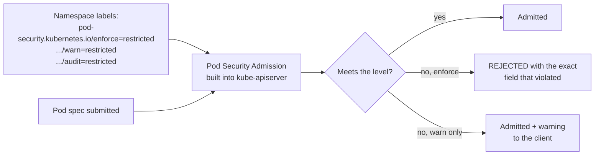

### CLI walkthrough

```bash
# 1. Warn and audit first -- observe before enforcing.
kubectl label namespace "$NAMESPACE" \
  pod-security.kubernetes.io/warn=restricted \
  pod-security.kubernetes.io/warn-version=latest \
  pod-security.kubernetes.io/audit=restricted --overwrite

kubectl get ns "$NAMESPACE" --show-labels

# Re-apply the existing workload and read the warnings -- this is your impact assessment.
kubectl rollout restart deployment/monolith -n "$NAMESPACE"
kubectl rollout status deployment/monolith -n "$NAMESPACE" --timeout=300s
kubectl get events -n "$NAMESPACE" --field-selector reason=FailedCreate --sort-by=.lastTimestamp | tail -5
```

```bash
# 2. Now enforce.
kubectl label namespace "$NAMESPACE" \
  pod-security.kubernetes.io/enforce=restricted \
  pod-security.kubernetes.io/enforce-version=latest --overwrite

# 3. A privileged Pod is now rejected outright.
kubectl run bad-pod --image=nginx:1.27-alpine -n "$NAMESPACE" \
  --overrides='{"spec":{"containers":[{"name":"bad","image":"nginx:1.27-alpine","securityContext":{"privileged":true}}]}}' \
  2>&1 | head -8
```

The rejection names every violated field — `privileged`, `allowPrivilegeEscalation != false`, `unrestricted capabilities`, `runAsNonRoot != true`, `seccompProfile`. Read it as a checklist, not an error.

```bash
# 4. A compliant Pod.
cat <<'EOF' > 05-compliant-pod.yaml
apiVersion: v1
kind: Pod
metadata:
  name: good-pod
  labels:
    app: good-pod
spec:
  securityContext:
    runAsNonRoot: true
    runAsUser: 101
    runAsGroup: 101
    fsGroup: 101
    seccompProfile:
      type: RuntimeDefault
  containers:
    - name: app
      image: nginxinc/nginx-unprivileged:1.27-alpine
      ports:
        - name: http
          containerPort: 8080
      securityContext:
        allowPrivilegeEscalation: false
        readOnlyRootFilesystem: true
        capabilities:
          drop:
            - ALL
      volumeMounts:
        - name: tmp
          mountPath: /tmp
        - name: cache
          mountPath: /var/cache/nginx
        - name: run
          mountPath: /var/run
      resources:
        requests:
          cpu: "50m"
          memory: "64Mi"
        limits:
          cpu: "200m"
          memory: "128Mi"
  volumes:
    - name: tmp
      emptyDir: {}
    - name: cache
      emptyDir: {}
    - name: run
      emptyDir: {}
EOF

kubectl apply -f 05-compliant-pod.yaml -n "$NAMESPACE"
kubectl wait --for=condition=Ready pod/good-pod -n "$NAMESPACE" --timeout=120s
kubectl get pod good-pod -n "$NAMESPACE"
```

Three points from that manifest: the **unprivileged image** listens on 8080 because non-root cannot bind below 1024; `readOnlyRootFilesystem: true` forces you to declare every writable path as an `emptyDir`, which is exactly the audit you want; and `runAsNonRoot` fails at *runtime* if the image's `USER` is root, so image and policy have to agree.

```bash
kubectl delete pod good-pod -n "$NAMESPACE"
```

### WebUI equivalent

Namespace → **YAML** tab → the `pod-security.kubernetes.io/*` labels under `metadata.labels`. Editing them there works and takes effect immediately.

For fleet-wide enforcement, show **AKS cluster → Policies** (Azure Policy for Kubernetes, built on Gatekeeper): initiatives like *Kubernetes cluster pod security baseline standards* apply across every cluster in a subscription with **Audit** or **Deny** effect, and report compliance in **Policy → Compliance**. PSA is per-namespace and free; Azure Policy is fleet-wide, centrally reported, and covers rules PSA cannot express (allowed registries, required labels).

### Verify

```bash
kubectl get ns "$NAMESPACE" -o jsonpath='{.metadata.labels}{"\n"}' | tr ',' '\n' | grep pod-security
kubectl get pods -n "$NAMESPACE"        # existing workloads still Running
```

| Symptom | Cause | Fix |
|---|---|---|
| Existing Pods keep running after `enforce` | PSA is admission-time only | They'll be rejected on next restart — that's why you `warn` first |
| `container has runAsNonRoot and image will run as root` | Image's `USER` is root | Use an unprivileged image variant, or set `runAsUser` to a UID the image supports |
| App crashes with `readOnlyRootFilesystem` | Writes to a path with no volume | Add an `emptyDir` for each writable path |
| Helm chart won't install under `restricted` | Chart defaults aren't hardened | Set `podSecurityContext`/`securityContext` in values |

---

## Lab 12.4 — Default-deny network policy (25 min)

### Objectives
- Prove that namespaces are not a network boundary, then make one.
- Build a default-deny-ingress baseline and add explicit allows for required flows.
- Confirm a policy engine is actually enforcing, not silently ignoring.

### Concept

This closes the loop opened in Lab 9.3, where a Pod in `dev` reached a Service in `test` with nothing stopping it. `NetworkPolicy` is namespaced, additive (policies union — there is no "deny" rule, only absence of allow), and **only does anything if a policy engine is installed** (Azure NPM, Calico or Cilium). The API server accepts the object on any cluster; without an engine it is stored and ignored. **That silent no-op has caused real production incidents — check it on every cluster you inherit.**

The pattern: one `default-deny` policy selecting all Pods, then narrow allow policies per required flow. Remember DNS — a default-deny **egress** policy blocks CoreDNS and every name resolution in the namespace fails, which looks like an application bug and is not.

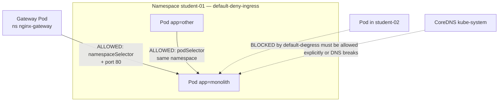

### CLI walkthrough

```bash
# 0. Confirm an engine exists. Empty output = policies do nothing.
az aks show -g "$RG" -n "$AKS_NAME" --query networkProfile.networkPolicy -o tsv
kubectl get pods -n kube-system -l k8s-app=calico-node 2>/dev/null | head -3
```

```bash
# 1. Baseline: cross-namespace access works today.
kubectl run netshoot --image=nicolaka/netshoot:latest --restart=Never -n "$NS_DEV" --command -- sleep 3600
kubectl wait --for=condition=Ready pod/netshoot -n "$NS_DEV" --timeout=120s
kubectl exec -it netshoot -n "$NS_DEV" -- curl -s --max-time 6 -o /dev/null \
  -w "cross-ns before policy -> %{http_code}\n" "http://monolith.${NAMESPACE}.svc.cluster.local"
```

```bash
# 2. Default-deny ingress + explicit allows.
cat <<EOF > 06-netpol.yaml
apiVersion: networking.k8s.io/v1
kind: NetworkPolicy
metadata:
  name: default-deny-ingress
  namespace: $NAMESPACE
spec:
  podSelector: {}
  policyTypes:
    - Ingress
---
apiVersion: networking.k8s.io/v1
kind: NetworkPolicy
metadata:
  name: allow-same-namespace
  namespace: $NAMESPACE
spec:
  podSelector:
    matchLabels:
      app: monolith
  policyTypes:
    - Ingress
  ingress:
    - from:
        - podSelector: {}
      ports:
        - protocol: TCP
          port: 80
---
apiVersion: networking.k8s.io/v1
kind: NetworkPolicy
metadata:
  name: allow-gateway-ingress
  namespace: $NAMESPACE
spec:
  podSelector:
    matchLabels:
      app: monolith
  policyTypes:
    - Ingress
  ingress:
    - from:
        - namespaceSelector:
            matchLabels:
              kubernetes.io/metadata.name: nginx-gateway
      ports:
        - protocol: TCP
          port: 80
EOF

kubectl apply -f 06-netpol.yaml
kubectl get networkpolicy -n "$NAMESPACE"
kubectl describe networkpolicy default-deny-ingress -n "$NAMESPACE"
```

`kubernetes.io/metadata.name` is set automatically on every namespace by the API server, so you can select a namespace by name without labelling it yourself.

```bash
# 3. Retest.
kubectl exec -it netshoot -n "$NS_DEV" -- curl -s --max-time 6 -o /dev/null \
  -w "cross-ns after policy -> %{http_code}\n" "http://monolith.${NAMESPACE}.svc.cluster.local" \
  || echo "cross-ns -> BLOCKED (expected)"

kubectl run netshoot-same --image=nicolaka/netshoot:latest --restart=Never -n "$NAMESPACE" --command -- sleep 3600
kubectl wait --for=condition=Ready pod/netshoot-same -n "$NAMESPACE" --timeout=120s
kubectl exec -it netshoot-same -n "$NAMESPACE" -- curl -s --max-time 6 -o /dev/null \
  -w "same-ns -> %{http_code}\n" http://monolith

curl -s -o /dev/null -w "through the gateway -> %{http_code}\n" "https://app-${STUDENT}.${BASE_DOMAIN}/" 2>/dev/null || true
```

Blocked from outside, allowed from inside, still reachable through the gateway. That is a working allow list.

```bash
# 4. Egress -- the DNS trap. Demonstrate it deliberately.
cat <<EOF > 07-netpol-egress.yaml
apiVersion: networking.k8s.io/v1
kind: NetworkPolicy
metadata:
  name: default-deny-egress
  namespace: $NAMESPACE
spec:
  podSelector: {}
  policyTypes:
    - Egress
EOF

kubectl apply -f 07-netpol-egress.yaml
kubectl exec -it netshoot-same -n "$NAMESPACE" -- nslookup monolith 2>&1 | tail -3   # DNS is dead
```

```bash
# The fix: always pair a default-deny-egress with a DNS allow.
cat <<EOF > 08-netpol-egress-dns.yaml
apiVersion: networking.k8s.io/v1
kind: NetworkPolicy
metadata:
  name: allow-dns-egress
  namespace: $NAMESPACE
spec:
  podSelector: {}
  policyTypes:
    - Egress
  egress:
    - to:
        - namespaceSelector:
            matchLabels:
              kubernetes.io/metadata.name: kube-system
          podSelector:
            matchLabels:
              k8s-app: kube-dns
      ports:
        - protocol: UDP
          port: 53
        - protocol: TCP
          port: 53
EOF

kubectl apply -f 08-netpol-egress-dns.yaml
kubectl exec -it netshoot-same -n "$NAMESPACE" -- nslookup monolith 2>&1 | tail -3   # working again
```

**Every default-deny-egress policy needs a DNS companion.** Write them as a pair, in the same file, always. Teams discover this in production, at night.

### WebUI equivalent

| CLI | Portal |
|---|---|
| `kubectl get networkpolicy` | **Kubernetes resources → Services and ingresses / Custom resources → YAML** |
| Policy engine enabled? | **AKS cluster → Networking → Network policy** |
| Denied flows | **Monitoring → Logs**, or Container Insights network tables |

The Portal has no policy simulator. **Verification is a `curl` from a Pod, every time.** Show the **Networking** blade so students can check the engine at a glance on any cluster they inherit — a `NetworkPolicy` list on a cluster with no engine is security theatre.

### Verify & troubleshoot

```bash
kubectl get networkpolicy -n "$NAMESPACE"
kubectl exec -it netshoot-same -n "$NAMESPACE" -- curl -s --max-time 6 -o /dev/null -w "%{http_code}\n" http://monolith
kubectl exec -it netshoot -n "$NS_DEV" -- curl -s --max-time 6 "http://monolith.${NAMESPACE}.svc.cluster.local" >/dev/null 2>&1 \
  && echo "STILL REACHABLE -- check the policy engine" || echo "blocked (correct)"
```

| Symptom | Cause | Fix |
|---|---|---|
| Policy applied, nothing blocked | No policy engine on the cluster | `az aks show --query networkProfile.networkPolicy`; engine must be set at creation |
| Everything broke after default-deny | No DNS egress allow | Add the `allow-dns-egress` policy |
| Gateway gets 502 after the policy | Gateway namespace not in an allow rule | Add a `namespaceSelector` for the gateway namespace |
| Policy works one way only | `Ingress` and `Egress` are independent | Both sides need a matching allow |
| Selector matches nothing | Policy selects Pod labels, not Service names | `kubectl get pods --show-labels` |

### Section 12 cleanup

```bash
kubectl delete pod netshoot-same -n "$NAMESPACE" --ignore-not-found
kubectl delete pod netshoot -n "$NS_DEV" --ignore-not-found
kubectl delete -f 08-netpol-egress-dns.yaml --ignore-not-found
kubectl delete -f 07-netpol-egress.yaml --ignore-not-found
kubectl delete -f 06-netpol.yaml --ignore-not-found
kubectl delete -f 05-compliant-pod.yaml -n "$NAMESPACE" --ignore-not-found
kubectl delete -f 03-secretproviderclass.yaml --ignore-not-found
kubectl delete -f 02-serviceaccount.yaml --ignore-not-found
kubectl delete -f 01-rbac.yaml --ignore-not-found
kubectl delete secret monolith-kv-synced -n "$NAMESPACE" --ignore-not-found

kubectl label namespace "$NAMESPACE" \
  pod-security.kubernetes.io/enforce- \
  pod-security.kubernetes.io/enforce-version- \
  pod-security.kubernetes.io/warn- \
  pod-security.kubernetes.io/warn-version- \
  pod-security.kubernetes.io/audit- 2>/dev/null || true

# Final teardown of the whole course workload
kubectl delete -f ~/k8s-labs/09-foundations/05-monolith.yaml -n "$NAMESPACE" --ignore-not-found
kubectl delete -f ~/k8s-labs/09-foundations/04-config.yaml   -n "$NAMESPACE" --ignore-not-found
kubectl get all,cm,secret,networkpolicy,pvc -n "$NAMESPACE"
```

**Expected outcome:** a namespace with no static secrets, no privileged Pods, an explicit ingress allow list, and a documented least-privilege RBAC model.

---
---

# Appendix — Command reference card

```bash
# ---- context ----
kubectl config get-contexts; kubectl config use-context <ctx>
kubectl config set-context --current --namespace=<ns>
az aks get-credentials -g <rg> -n <cluster> --overwrite-existing && kubelogin convert-kubeconfig -l azurecli

# ---- discovery ----
kubectl api-resources; kubectl explain <kind>.<field> --recursive
kubectl auth can-i <verb> <resource> -n <ns> [--as <subject>]
kubectl auth can-i --list -n <ns>

# ---- inspect ----
kubectl get <kind> -n <ns> -o wide --show-labels
kubectl get <kind> -n <ns> -o custom-columns='NAME:.metadata.name,NODE:.spec.nodeName'
kubectl describe <kind>/<name> -n <ns>
kubectl get events -n <ns> --sort-by=.lastTimestamp

# ---- debug ----
kubectl logs <pod> -n <ns> [--previous] [-f]
kubectl exec -it <pod> -n <ns> -- /bin/sh
kubectl port-forward svc/<name> 8080:80 -n <ns>
kubectl debug <pod> -n <ns> -it --image=nicolaka/netshoot --target=<container>
kubectl get endpoints <svc> -n <ns>          # THE Service debugging command

# ---- change ----
kubectl apply -f <file> -n <ns>; kubectl diff -f <file> -n <ns>
kubectl scale deploy/<n> --replicas=<x> -n <ns>
kubectl set image deploy/<n> <c>=<image> -n <ns>
kubectl rollout status|history|undo|restart deploy/<n> -n <ns>
kubectl patch <kind>/<n> -n <ns> --type=merge -p '{"spec":{"replicas":3}}'

# ---- generate ----
kubectl create <kind> <name> ... --dry-run=client -o yaml

# ---- helm ----
helm template <rel> <chart> -n <ns> -f values.yaml     # render, never install blind
helm lint <chart>
helm install|upgrade <rel> <chart> -n <ns> -f values.yaml --atomic --timeout 5m
helm history <rel> -n <ns>; helm rollback <rel> <rev> -n <ns>
helm get values <rel> -n <ns> --all; helm uninstall <rel> -n <ns>

# ---- storage / backup ----
kubectl get sc,pv,pvc -n <ns>
velero backup create <n> --include-namespaces <ns> --default-volumes-to-fs-backup --wait
velero restore create <n> --from-backup <b> --wait
velero backup|restore describe <n> --details

# ---- terraform ----
terraform init && terraform fmt -recursive && terraform validate
terraform plan -out=tfplan && terraform apply tfplan
terraform plan -destroy -out=tfdestroy && terraform apply tfdestroy
```

### The five-step triage for any broken workload

```bash
kubectl get pods -n $NAMESPACE                                        # 1. what phase?
kubectl describe pod <pod> -n $NAMESPACE                              # 2. read the Events
kubectl logs <pod> -n $NAMESPACE --previous                           # 3. why did the last attempt die?
kubectl get endpoints <svc> -n $NAMESPACE                             # 4. is it behind the Service?
kubectl get events -n $NAMESPACE --sort-by=.lastTimestamp | tail -20  # 5. what else happened?
```

Steps 2 and 3 resolve most incidents. **`kubectl describe` and its Events section is where Kubernetes tells you what is wrong** — the terminal output of your last command usually is not.

### Misconceptions to correct explicitly

| Misconception | Reality |
|---|---|
| "Kubernetes Secrets are encrypted" | Base64. RBAC + encryption-at-rest are the controls. Key Vault + Workload Identity is the answer (12.2). |
| "Namespaces isolate workloads" | Name scope and policy attachment point. Traffic flows freely until a NetworkPolicy *with an engine* stops it (12.4). |
| "The Deployment restarts my crashed app" | The *kubelet* restarts the container per `restartPolicy`. The ReplicaSet replaces the Pod only if the Pod object is gone. |
| "Limits are what the scheduler uses" | The scheduler reads **requests** only. Limits are enforced at runtime by the kernel. |
| "`kubectl get all` shows everything" | No ConfigMaps, Secrets, PVCs, Ingresses or CRDs. |
| "AKS backs up my cluster" | Microsoft manages control-plane availability, not your application state (11.3). |
| "Rolling updates guarantee zero downtime" | Only with correct readiness probes, `maxUnavailable: 0`, a `preStop` hook and graceful SIGTERM. |
| "More replicas means more resilience" | Only across nodes and zones, and only if the shared dependency behind them can take the load. |
