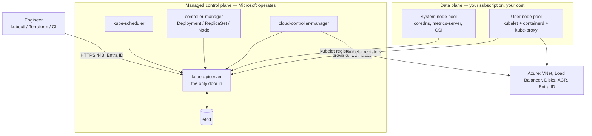
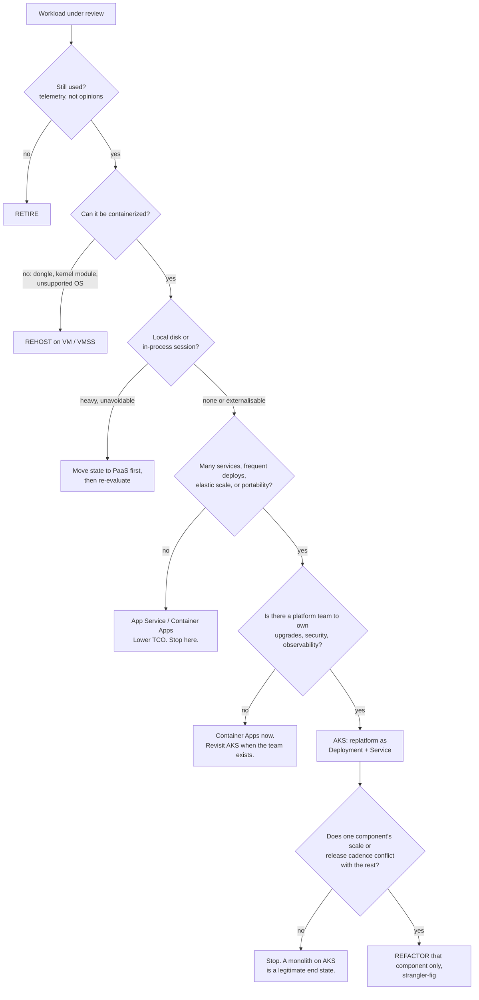
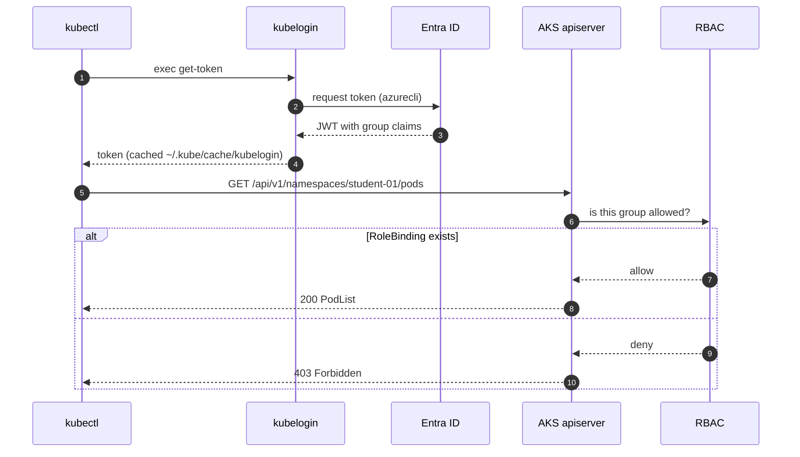
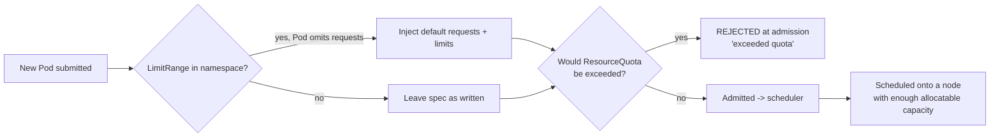
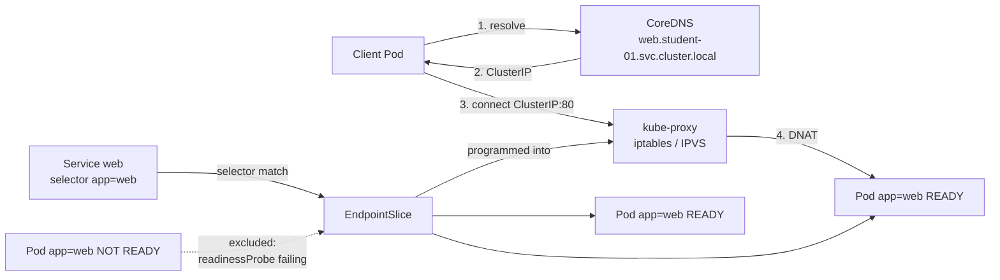
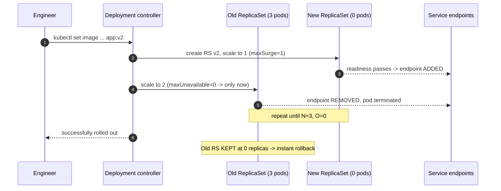

# SECTION 9 — Kubernetes and AKS Foundations
---

## Lab 9.1 — Architecture, modernization strategy & sizing

### Objectives
- Describe the control plane / data plane split and say which half Microsoft operates on AKS.
- Map five VM-era concepts onto Kubernetes objects and explain declarative reconciliation.
- Apply a scoring rubric to decide whether a workload belongs on AKS — and name five that do not.
- Size a cluster and design its node pools from workload requests.

### Concept

Kubernetes is a control system, not a place to run containers. You submit *desired state*; controllers close the gap between it and observed state, continuously. In VM operations a change was an imperative event that could silently drift afterwards. Here a change is a persistent intent that keeps being true.

| Traditional                 | Kubernetes                          | What changed                                          |
| --------------------------- | ----------------------------------- | ----------------------------------------------------- |
| Virtual machine             | **Pod**                             | Disposable, seconds to create, no persistent identity |
| Golden image                | **Container image**                 | Immutable, versioned, built in CI                     |
| LB VIP + pool members       | **Service**                         | Membership computed from labels, not edited by hand   |
| `systemctl enable app`      | **Deployment** `replicas: 3`        | The controller restarts it, not you                   |
| `/etc/myapp/app.conf`       | **ConfigMap**                       | Versioned, namespaced, injected at runtime            |
| `.env` with the DB password | **Secret** (→ Key Vault)            | Controlled by RBAC, not file permissions              |
| dev/test/prod VLANs         | **Namespaces** + policy             | Logical isolation inside one cluster                  |
| Change window + runbook     | `kubectl apply` of Git-tracked YAML | Reviewable, auditable, revertable                     |



**AKS specifics to state now, so later labs make sense**

- **Managed control plane** — no SSH to the API server, no `etcd` backup on you. You choose the tier: 
  - Free (no SLA)
  - Standard (99.95% with zones)
  - Premium (long-term version support)
- **Node pools** — one *system* pool for add-ons, one or more *user* pools for workloads. The split stops a runaway app from starving CoreDNS. Enforced with the `CriticalAddonsOnly` taint (Lab 9.5).
- **Upgrades are two-phase** — control plane first, then node pools (cordon → drain → surge-replace).
- **If the control plane is down for ten minutes**, running Pods keep serving. You lose the ability to *change*, *reschedule* and *scale*. 
### Modernization decision framework



| Strategy   | Changes                         | Effort   | Right when                                  |
| ---------- | ------------------------------- | -------- | ------------------------------------------- |
| Retire     | It goes away                    | Very low | Nobody can name a user                      |
| Rehost     | Hosting only                    | Low      | Datacentre exit deadline, no capacity       |
| Replatform | Packaging + externalised config | Medium   | Deployment pain is the bottleneck           |
| Refactor   | Architecture                    | High     | One component's cadence genuinely conflicts |
| Replace    | Buy instead of build            | Medium   | A commodity you happened to build           |

**Sequencing rule that saves projects: containerize before you decompose.** Teams that attempt platform adoption and microservice decomposition at once usually deliver neither.

**When NOT to use Kubernetes** — say all six out loud:

1. A single app deployed monthly by one team. The platform costs more than it returns.
2. Anything that can't be containerized like dongles, kernel modules, MAC-bound licence servers.
3. Stateful engines you can buy as a service. You *can* run PostgreSQL or Kafka with operators; you then own storage performance, backup verification and failover testing.
4. Latency-critical or specialised-hardware workloads (real-time kernels, SR-IOV).
5. Windows apps with heavy GUI/COM+/MSMQ dependencies.
6. **When there is no platform team.**

### Sizing & node pool design

AKS reserves resources on every node before your Pods see any. 

- Memory: 
  - 25% of the first 4 GB, 
  - 20% of 4–8, 
  - 10% of 8–16, 
  - 6% of 16–128, 
  - 2% above. 
- CPU: 
  - 6% of core 1, 
  - 1% of core 2, 
  - 0.5% each for cores 3–4, 
  - 0.25% thereafter. 
 
A `Standard_D2s_v5` (2 vCPU / 8 GB) yields roughly 1.9 vCPU and ~5.4 GB allocatable. This is nearly a third of the memory gone before you deploy anything. Every cost estimate built on raw capacity is wrong.


| Pool role          | Size                         | Notes                                                         |
| ------------------ | ---------------------------- | ------------------------------------------------------------- |
| System             | `D2s_v5`/`D4s_v5`, 2–3 nodes | Never 1 node. Spread across zones. Tainted.                   |
| General apps       | `D4s_v5`/`D8s_v5`            | 4–8 vCPU is the value sweet spot                              |
| Memory-heavy (JVM) | `E4s_v5`/`E8s_v5`            | 8 GB per vCPU                                                 |
| Batch / CI         | `D8s_v5` Spot                | Taint `kubernetes.azure.com/scalesetpriority=spot:NoSchedule` |

IP planning, which you cannot change later: 
- **kubenet** 110 pods/node, non-routable Pod IPs. 
- **Classic Azure CNI** : every Pod takes a VNet IP, so the subnet needs `(nodes + surge) × (max_pods + 1)`; 
  - 100 nodes × 110 pods = 11,211 addresses, a /18. 
- **Azure CNI Overlay** : nodes get VNet IPs, Pods get overlay IPs from a private CIDR, so a /24 supports a large cluster. Node subnets cannot be resized after cluster creation. Default to Overlay.

Rules for every pool: 
- taint special-purpose pools and require an explicit toleration; 
- label by *intent* (`workload=batch`) not implementation (`vm=D8sv5`); - keep the system pool boring and multi-zone; 

---

## Lab 9.2 — Cluster access, `kubectl` workflow & contexts

### Objectives
- Authenticate to the shared AKS cluster with Entra ID + `kubelogin` and explain why `az aks get-credentials` alone is not enough.
- Manage contexts and pin a default namespace.
- Read the cluster's physical topology and your own permissions.

### Concept

`kubectl` reads `~/.kube/config`, which holds three independent lists:
- **clusters** (URL + CA), 
- **users** (how to authenticate), 
- **contexts** (cluster + user + default namespace). 

On an Entra-integrated cluster the user entry holds no token. it holds an *exec plugin* stanza that runs `kubelogin` to fetch a fresh OIDC token. 
- `az aks get-credentials` writes the removed legacy provider; 
- `kubelogin convert-kubeconfig` rewrites it to the supported exec format.



### Setup

```bash
cd ~/k8s-labs/09-foundations
```
```bash
export STUDENT="student-01"          # CHANGE to your assigned ID
export NAMESPACE="$STUDENT"
export NS_DEV="${STUDENT}-dev"
export NS_TEST="${STUDENT}-test"
export RG="rg-k8s-training"
export AKS_NAME="aks-training-shared"
export ACR_NAME="acrtrainingshared"
export LOCATION="centralindia"
```
```bash
cat <<EOF >> ~/.bashrc
export STUDENT="$STUDENT" NAMESPACE="$NAMESPACE" NS_DEV="$NS_DEV" NS_TEST="$NS_TEST"
export RG="$RG" AKS_NAME="$AKS_NAME" ACR_NAME="$ACR_NAME" LOCATION="$LOCATION"
EOF
```

### CLI walkthrough

```bash
az login --use-device-code
az account show -o table
```
```bash
# If multiple subscriptions: 
az account set --subscription "<ID-or-NAME>"
```

```bash
az aks get-credentials -g "$RG" -n "$AKS_NAME" --overwrite-existing
```
```bash
kubelogin convert-kubeconfig -l azurecli
```
```bash
kubectl cluster-info
```

`--overwrite-existing` prevents `aks-training-shared-1`, `-2` accumulating.

Login modes: 
- `-l azurecli` (workstation, our default), 
- `-l devicecode` (headless), 
- `-l workloadidentity` (Pods and federated CI), 
- `-l spn` (legacy CI).

```bash
# Contexts: pin the namespace and give the context a name you can type.
kubectl config get-contexts
```
```bash
kubectl config rename-context "$AKS_NAME" "aks-training"
```
```bash
kubectl config use-context "aks-training"
```
```bash
kubectl config set-context --current --namespace="$NAMESPACE"
```
```bash
kubectl config view --minify -o jsonpath='{..namespace}{"\n"}'
```

```bash
# Physical topology
kubectl get nodes -o wide
```
```bash
kubectl get nodes -L agentpool -L kubernetes.azure.com/mode \
  -L topology.kubernetes.io/zone -L node.kubernetes.io/instance-type
```
```bash
kubectl describe node "$(kubectl get nodes -o jsonpath='{.items[0].metadata.name}')" \
  | grep -A 12 -E "Taints:|Allocatable:|Allocated resources"
```
```bash
kubectl top nodes
```

```bash
# Your three self-service reference tools
kubectl api-resources | head -20
```
```bash
kubectl api-resources --namespaced=false | head -10     # why a ClusterRole can't live in your namespace
```
```bash
kubectl explain deployment.spec.strategy
```
```bash
kubectl auth can-i create deployments -n "$NAMESPACE"   # yes
```
```bash
kubectl auth can-i create deployments -n kube-system    # no
```
```bash
kubectl auth can-i --list -n "$NAMESPACE" | head -15
```

### WebUI equivalent

| CLI                              | Azure Portal                                              |
| -------------------------------- | --------------------------------------------------------- |
| `az aks show`                    | **Kubernetes services → cluster → Overview**              |
| `kubectl get nodes -o wide`      | **→ Node pools → pool → Nodes**                           |
| `kubectl get nodes -L agentpool` | **→ Node pools** (Mode column: System / User)             |
| `kubectl top nodes`              | **→ Monitoring → Insights → Nodes**                       |
| `kubectl get pods -A`            | **→ Kubernetes resources → Workloads** (namespace filter) |
| `kubectl auth can-i --list`      | **→ Access control (IAM) → Check access**                 |

1. Portal → **Kubernetes services → `aks-training-shared` → Node pools**. Exactly one pool is Mode `System`.
2. **Kubernetes resources → Workloads**, set **Namespace** to yours. Empty for now.
3. **Monitoring → Insights → Cluster** for node CPU/memory over the last 6 hours.

The Portal's Kubernetes resources blade is a real API client authenticating as *you*. "You do not have access" there is the same `403` the CLI returns, not a Portal bug.

### Verify & troubleshoot

```bash
kubectl config current-context  # aks-training
```
```bash
kubectl config view --minify -o jsonpath='{..namespace}{"\n"}'  # student-01
```
```bash
kubectl get nodes  # all Ready
```
```bash
kubectl auth can-i create deployments -n "$NAMESPACE"  # yes
```
```bash
kubectl get pods -n "$NAMESPACE" # "No resources found" = PASS
```

**Scenario : deliberate 403.** 

Run 
```bash
kubectl get pods -n kube-system
```
then 
```bash
kubectl auth can-i list pods -n kube-system
```

- **`Forbidden` means authentication succeeded and authorization failed;** 
- **`Unauthorized` means the token itself was rejected.** 

---

## Lab 9.3 — Namespaces & dev/test isolation

### Objectives
- Explain precisely what a namespace does and does not isolate.
- Enforce capacity with `ResourceQuota` and set container defaults with `LimitRange`.
- Show that DNS is namespace-aware and that namespaces are *not* a network boundary.

### Concept

A namespace is a **name scope plus a policy attachment point**.

It gives you: 
- name uniqueness, 
- an RBAC attachment point, 
- a quota attachment point, 
- a DNS domain (`<svc>.<ns>.svc.cluster.local`), 
- a cheap blast radius (`delete namespace` removes everything inside).

It does **not** give you:
- network isolation (every Pod can reach every Pod cluster-wide until a NetworkPolicy says otherwise),
- node isolation, 
- kernel isolation.

#### The enterprise answer to "namespaces or clusters for dev/test/prod": 
- dev and test as namespaces in one cluster is normal and cost-effective; 
- **production in its own cluster is the default posture**, 
- because upgrades, CRDs and admission controllers are cluster-wide and hit every namespace at once.



### Setup

```bash
cd ~/k8s-labs/09-foundations
```
```bash
kubectl config use-context aks-training
```
```bash
kubectl config set-context --current --namespace="$NAMESPACE"
```
```bash
kubectl get ns "$NAMESPACE" "$NS_DEV" "$NS_TEST"
```

### CLI walkthrough

```bash
kubectl label namespace "$NS_DEV"  environment=dev  owner="$STUDENT" cost-center=training --overwrite
```
```bash
kubectl label namespace "$NS_TEST" environment=test owner="$STUDENT" cost-center=training --overwrite
```
```bash
kubectl get namespaces -L environment,owner,cost-center
```
```bash
kubectl get namespaces -l "owner=$STUDENT"
```

```bash
cat <<EOF > 01-governance.yaml
apiVersion: v1
kind: ResourceQuota
metadata:
  name: dev-quota
  namespace: $NS_DEV
spec:
  hard:
    requests.cpu: "2"
    requests.memory: "4Gi"
    limits.cpu: "4"
    limits.memory: "8Gi"
    pods: "10"
    services: "5"
    services.loadbalancers: "0"
    persistentvolumeclaims: "4"
    count/deployments.apps: "5"
---
apiVersion: v1
kind: LimitRange
metadata:
  name: dev-limits
  namespace: $NS_DEV
spec:
  limits:
    - type: Container
      default:
        cpu: "300m"
        memory: "256Mi"
      defaultRequest:
        cpu: "100m"
        memory: "128Mi"
      min:
        cpu: "10m"
        memory: "32Mi"
      max:
        cpu: "1"
        memory: "1Gi"
    - type: Pod
      max:
        cpu: "2"
        memory: "2Gi"
    - type: PersistentVolumeClaim
      min:
        storage: "1Gi"
      max:
        storage: "10Gi"
EOF

kubectl apply -f 01-governance.yaml
kubectl describe resourcequota dev-quota -n "$NS_DEV"
kubectl describe limitrange dev-limits -n "$NS_DEV"
```

`services.loadbalancers: "0"` is a real cost control. every `type: LoadBalancer` Service provisions a public IP.

**Critical rule:** 
- once a quota sets `requests.cpu` or `requests.memory`, 
- **every** container in that namespace must specify requests and limits or be rejected at admission. 
- The `LimitRange` is what keeps existing manifests working.

```bash
cat <<'EOF' > 02-web.yaml
apiVersion: apps/v1
kind: Deployment
metadata:
  name: web
  labels:
    app: web
spec:
  replicas: 2
  selector:
    matchLabels:
      app: web
  template:
    metadata:
      labels:
        app: web
    spec:
      containers:
        - name: web
          image: mcr.microsoft.com/azuredocs/aks-helloworld:v1
          ports:
            - name: http
              containerPort: 80
          resources:
            requests:
              cpu: "50m"
              memory: "64Mi"
            limits:
              cpu: "200m"
              memory: "192Mi"
---
apiVersion: v1
kind: Service
metadata:
  name: web
  labels:
    app: web
spec:
  type: ClusterIP
  selector:
    app: web
  ports:
    - name: http
      port: 80
      targetPort: http
EOF
```
```bash
kubectl apply -f 02-web.yaml -n "$NS_DEV"
```
```bash
kubectl apply -f 02-web.yaml -n "$NS_TEST"
```
```bash
kubectl rollout status deployment/web -n "$NS_DEV"  --timeout=180s
```
```bash
kubectl rollout status deployment/web -n "$NS_TEST" --timeout=180s
```
```bash
kubectl describe resourcequota dev-quota -n "$NS_DEV" | grep -E "pods|requests"
```

Two Deployments named `web`, two Services named `web`, zero conflicts. That is the name-scope property.

```bash
# DNS is namespace-aware
kubectl run netshoot --image=nicolaka/netshoot:latest --restart=Never -n "$NS_DEV" --command -- sleep 3600
```
```bash
kubectl wait --for=condition=Ready pod/netshoot -n "$NS_DEV" --timeout=120s
```
```bash
kubectl exec -it netshoot -n "$NS_DEV" -- cat /etc/resolv.conf
```
```bash
kubectl exec -it netshoot -n "$NS_DEV" -- nslookup web
```
```bash
kubectl exec -it netshoot -n "$NS_DEV" -- nslookup "web.${NS_TEST}.svc.cluster.local"
```
```bash
kubectl exec -it netshoot -n "$NS_DEV" -- curl -s -o /dev/null -w "dev  -> %{http_code}\n" http://web
```
```bash
kubectl exec -it netshoot -n "$NS_DEV" -- curl -s -o /dev/null -w "test -> %{http_code}\n" "http://web.${NS_TEST}.svc.cluster.local"
```

The `search` line in `/etc/resolv.conf` is the whole magic behind short names. **Both curls return 200**

### WebUI equivalent

| CLI                                   | Portal                                                        |
| ------------------------------------- | ------------------------------------------------------------- |
| `kubectl get ns`                      | **Kubernetes resources → Namespaces**                         |
| `kubectl label namespace`             | Namespace → **YAML** → edit `metadata.labels` → Review + save |
| `kubectl apply -f 01-governance.yaml` | **Kubernetes resources → + Create → Add with YAML**           |
| `kubectl get deploy -n $NS_DEV`       | **Workloads → Deployments**, Namespace filter                 |


### Verify & troubleshoot

```bash
kubectl get ns -l "owner=$STUDENT"
kubectl get resourcequota,limitrange -n "$NS_DEV"
kubectl get deploy web -n "$NS_DEV"  -o jsonpath='{.status.readyReplicas}{"\n"}'   # 2
kubectl get deploy web -n "$NS_TEST" -o jsonpath='{.status.readyReplicas}{"\n"}'   # 2
```

**Scenario 1 — exceed the quota (asynchronous failure).**

```bash
kubectl scale deployment/web --replicas=12 -n "$NS_DEV"
```
```bash
kubectl get deploy web -n "$NS_DEV"                 # 2/12
```
```bash
kubectl get pods -n "$NS_DEV" -l app=web            # only 2 -- the rest never existed
```
```bash
RS="$(kubectl get rs -n "$NS_DEV" -l app=web -o jsonpath='{.items[0].metadata.name}')"
kubectl describe rs "$RS" -n "$NS_DEV" | sed -n '/Events:/,$p'
```
```bash
kubectl scale deployment/web --replicas=2 -n "$NS_DEV"
```

Expected: `pods "web-xxxxx" is forbidden: exceeded quota: dev-quota, requested: pods=1, used: pods=10, limited: pods=10`.


**Scenario 2 — violate the LimitRange (synchronous failure).**

```bash
kubectl run too-big --image=nginx:1.27-alpine -n "$NS_DEV" --restart=Never \
  --overrides='{"spec":{"containers":[{"name":"hog","image":"nginx:1.27-alpine","resources":{"requests":{"cpu":"100m","memory":"128Mi"},"limits":{"cpu":"3","memory":"4Gi"}}}]}}'
```

Expected: `Error from server (Forbidden): ... maximum cpu usage per Container is 1, but limit is 3`. 

This failed at **admission**, before anything was stored, it appears in your terminal. 

Scenario 1's object *was* stored and failed asynchronously, visible only in `describe` and events. 

Engineers who read only stdout miss half of Kubernetes.

| Symptom                                                       | Cause                                   | Fix                                       |
| ------------------------------------------------------------- | --------------------------------------- | ----------------------------------------- |
| `must specify limits.cpu` on a manifest that worked yesterday | Quota added without a LimitRange        | Add a LimitRange or set requests/limits   |
| Deployment says `0/3`, no Pods exist                          | Quota/admission blocked creation        | `kubectl describe rs` → `FailedCreate`    |
| Namespace stuck `Terminating`                                 | Finalizer, or an unreachable APIService | `kubectl get apiservices \| grep -v True` |
| Short-name DNS fails cross-namespace                          | Expected behaviour                      | Use the FQDN                              |

### Cleanup

```bash
kubectl delete pod netshoot -n "$NS_DEV" --ignore-not-found
```
```bash
kubectl delete -f 02-web.yaml -n "$NS_TEST" --ignore-not-found
```
```bash
kubectl delete -f 02-web.yaml -n "$NS_DEV"  --ignore-not-found
```
```bash
kubectl delete -f 01-governance.yaml --ignore-not-found      # governance goes LAST
```bash
kubectl get all -n "$NS_DEV"; kubectl get all -n "$NS_TEST"
```

Leave the namespaces — later labs use them, and you cannot recreate them on the shared cluster.

---

## Lab 9.4 — Core objects and the monolith on AKS

### Objectives
- Show that a bare Pod is not self-healing, that a ReplicaSet adds *count*, and that a Deployment adds *change management*.
- Perform a rolling update and a rollback; explain the label-selector → endpoints → `kube-proxy` chain.
- Deploy the containerized monolith with externalised config, probes and a `PodDisruptionBudget`.
- Diagnose `ImagePullBackOff`, `CrashLoopBackOff` and an empty-endpoint Service.

### Concept

Three layers, each adding exactly one capability. 
**Pod** is the atom; 
  - one or more containers sharing a network namespace and volumes;
  - mortal, 
  - nothing brings it back. 
**ReplicaSet** adds count; 
  - it creates or deletes Pods until observed equals `spec.replicas`; 
  - it knows nothing about versions. 
**Deployment** adds change management; 
  - it manages one ReplicaSet per Pod-template revision and shifts replicas between them.

**Service** solves a different problem: 
  - Pod IPs change constantly, 
  - so a stable VIP and DNS name have their backends computed continuously from a **label selector**. 
  - A selector that matches nothing fails *silently*
  - the Service exists, DNS resolves, every connection is refused.

**Configuration**: one image, many environments, injected at runtime.
  - `envFrom` values are frozen at container start and need a Pod restart; 
  - mounted files refresh within ~60 s but only matter if the app watches them. 
  - Neither restarts your Pods





### Setup

```bash
cd ~/k8s-labs/09-foundations
```
```bash
kubectl config set-context --current --namespace="$NAMESPACE"
```
```bash
export ACR_LOGIN_SERVER="$(az acr show --name "$ACR_NAME" --query loginServer -o tsv 2>/dev/null || echo "${ACR_NAME}.azurecr.io")"
```
```bash
export APP_IMAGE="${ACR_LOGIN_SERVER}/${STUDENT}/monolith:1.0.0"
```
```bash
az acr repository show-tags --name "$ACR_NAME" --repository "${STUDENT}/monolith" -o table 2>/dev/null \
  || { export APP_IMAGE="mcr.microsoft.com/azuredocs/aks-helloworld:v1"; echo "fallback image: $APP_IMAGE"; }
```
```bash
echo "APP_IMAGE=$APP_IMAGE"
```

### Part A — Pod, ReplicaSet, Deployment

```bash
# A bare Pod, killed, is gone. That is the whole lesson.
kubectl run standalone --image=mcr.microsoft.com/azuredocs/aks-helloworld:v1 \
  -n "$NAMESPACE" --restart=Never \
  --overrides='{"spec":{"containers":[{"name":"web","image":"mcr.microsoft.com/azuredocs/aks-helloworld:v1","resources":{"requests":{"cpu":"50m","memory":"64Mi"},"limits":{"cpu":"200m","memory":"192Mi"}}}]}}'
```
```bash
kubectl wait --for=condition=Ready pod/standalone -n "$NAMESPACE" --timeout=180s
```
```bash
kubectl delete pod standalone -n "$NAMESPACE"
sleep 5
```
```bash
kubectl get pods -n "$NAMESPACE"        # nothing. A bare Pod is like a VM you forgot to put in a scale set.
```

```bash
cat <<'EOF' > 03-replicaset.yaml
apiVersion: apps/v1
kind: ReplicaSet
metadata:
  name: web-rs
  labels:
    app: web
    managed-by: replicaset
spec:
  replicas: 3
  selector:
    matchLabels:
      app: web
      managed-by: replicaset
  template:
    metadata:
      labels:
        app: web
        managed-by: replicaset
    spec:
      containers:
        - name: web
          image: mcr.microsoft.com/azuredocs/aks-helloworld:v1
          ports:
            - name: http
              containerPort: 80
          resources:
            requests:
              cpu: "50m"
              memory: "64Mi"
            limits:
              cpu: "200m"
              memory: "192Mi"
EOF
```
```bash
kubectl apply -f 03-replicaset.yaml -n "$NAMESPACE"
```
```bash
kubectl rollout status deployment/web-rs -n "$NAMESPACE" 2>/dev/null || kubectl get rs,pods -n "$NAMESPACE"
```

# Self-healing: delete one, get three back.
```bash
VICTIM="$(kubectl get pods -n "$NAMESPACE" -l managed-by=replicaset -o jsonpath='{.items[0].metadata.name}')"
```
```bash
kubectl delete pod "$VICTIM" -n "$NAMESPACE"
sleep 15
```
```bash
kubectl get pods -n "$NAMESPACE" -l managed-by=replicaset
```
```bash
# The selector -- not the owner reference -- is what it watches.
ADOPTEE="$(kubectl get pods -n "$NAMESPACE" -l managed-by=replicaset -o jsonpath='{.items[0].metadata.name}')"
```
```bash
kubectl label pod "$ADOPTEE" -n "$NAMESPACE" managed-by=orphan --overwrite
```
```bash
kubectl get pods -n "$NAMESPACE" --show-labels  # FOUR pods now
```
```bash
kubectl delete pod "$ADOPTEE" -n "$NAMESPACE"
```

Relabelling to orphan a Pod is exactly how you quarantine a misbehaving Pod for a live post-mortem: the controller replaces it immediately while your broken copy keeps running for inspection.

```bash
# The limitation that motivates Deployments:
kubectl set image rs/web-rs web=mcr.microsoft.com/azuredocs/aks-helloworld:v2 -n "$NAMESPACE"
```
```bash
kubectl get pods -n "$NAMESPACE" -o custom-columns='NAME:.metadata.name,IMAGE:.spec.containers[0].image'
# Every running Pod is still v1. A ReplicaSet applies its template only when CREATING a Pod.
```
```bash
kubectl delete -f 03-replicaset.yaml -n "$NAMESPACE"
```

### Part B — The monolith as a Deployment + Service + ConfigMap + Secret

```bash
cat <<'EOF' > 04-config.yaml
apiVersion: v1
kind: ConfigMap
metadata:
  name: monolith-config
  labels:
    app: monolith
data:
  APP_ENV: "dev"
  LOG_LEVEL: "debug"
  TITLE: "Containerized Monolith on AKS"
  DB_HOST: "monolith-db.database.svc.cluster.local"
  DB_PORT: "5432"
  app.properties: |
    server.port=80
    server.shutdown=graceful
    management.endpoints.web.exposure.include=health,info,metrics
    logging.level.root=INFO
---
apiVersion: v1
kind: Secret
metadata:
  name: monolith-secrets
  labels:
    app: monolith
type: Opaque
stringData:
  DB_USER: "monolith_app"
  DB_PASSWORD: "Tr41n1ng-L4b-N0t-Real!"
  API_KEY: "lab-only-8f3c1d0a4b7e9265"
EOF
```
```bash
kubectl apply -f 04-config.yaml -n "$NAMESPACE"
```
```bash
echo "04-config.yaml" >> .gitignore
```
```bash
# base64 is ENCODING, not encryption:
kubectl get secret monolith-secrets -n "$NAMESPACE" -o jsonpath='{.data.DB_PASSWORD}' | base64 -d; echo
```

```bash
cat <<EOF > 05-monolith.yaml
apiVersion: apps/v1
kind: Deployment
metadata:
  name: monolith
  labels:
    app: monolith
    tier: application
  annotations:
    kubernetes.io/change-cause: "Initial deployment of monolith 1.0.0"
spec:
  replicas: 2
  revisionHistoryLimit: 5
  minReadySeconds: 10
  strategy:
    type: RollingUpdate
    rollingUpdate:
      maxSurge: 1
      maxUnavailable: 0
  selector:
    matchLabels:
      app: monolith
      tier: application
  template:
    metadata:
      labels:
        app: monolith
        tier: application
    spec:
      securityContext:
        seccompProfile:
          type: RuntimeDefault
      containers:
        - name: monolith
          image: $APP_IMAGE
          imagePullPolicy: IfNotPresent
          ports:
            - name: http
              containerPort: 80
          envFrom:
            - configMapRef:
                name: monolith-config
            - secretRef:
                name: monolith-secrets
          env:
            - name: POD_NAME
              valueFrom:
                fieldRef:
                  fieldPath: metadata.name
            - name: NODE_NAME
              valueFrom:
                fieldRef:
                  fieldPath: spec.nodeName
          volumeMounts:
            - name: app-config
              mountPath: /etc/monolith
              readOnly: true
          startupProbe:
            httpGet:
              path: /
              port: http
            periodSeconds: 5
            failureThreshold: 30
          readinessProbe:
            httpGet:
              path: /
              port: http
            periodSeconds: 10
            timeoutSeconds: 3
            failureThreshold: 3
          livenessProbe:
            httpGet:
              path: /
              port: http
            periodSeconds: 20
            timeoutSeconds: 3
            failureThreshold: 3
          resources:
            requests:
              cpu: "100m"
              memory: "128Mi"
            limits:
              cpu: "500m"
              memory: "512Mi"
          securityContext:
            allowPrivilegeEscalation: false
            capabilities:
              drop:
                - ALL
          lifecycle:
            preStop:
              exec:
                command: ["/bin/sh", "-c", "sleep 5"]
      volumes:
        - name: app-config
          configMap:
            name: monolith-config
            items:
              - key: app.properties
                path: app.properties
            defaultMode: 0444
      terminationGracePeriodSeconds: 45
      topologySpreadConstraints:
        - maxSkew: 1
          topologyKey: kubernetes.io/hostname
          whenUnsatisfiable: ScheduleAnyway
          labelSelector:
            matchLabels:
              app: monolith
---
apiVersion: v1
kind: Service
metadata:
  name: monolith
  labels:
    app: monolith
spec:
  type: ClusterIP
  selector:
    app: monolith
    tier: application
  ports:
    - name: http
      port: 80
      targetPort: http
---
apiVersion: policy/v1
kind: PodDisruptionBudget
metadata:
  name: monolith-pdb
spec:
  minAvailable: 1
  selector:
    matchLabels:
      app: monolith
      tier: application
EOF
```
```bash
kubectl apply -f 05-monolith.yaml -n "$NAMESPACE"
```
```bash
kubectl rollout status deployment/monolith -n "$NAMESPACE" --timeout=300s
```
```bash
kubectl get deploy,rs,pods,svc,endpoints,pdb -n "$NAMESPACE" -o wide
```

Narrate four design decisions while it rolls:

- **`startupProbe` 30×5s** gives a slow JVM/.NET monolith 150 seconds to boot while liveness stays aggressive afterwards. Without it you'd need `livenessProbe.initialDelaySeconds: 150`, which also delays detection of a real hang by 150 s.
- **`preStop: sleep 5` + `terminationGracePeriodSeconds: 45`** — endpoint removal and `SIGTERM` happen concurrently, so a short pause closes the race where a Pod receives requests after it starts shutting down.
- **`maxSurge: 1` / `maxUnavailable: 0`** — capacity never dips below 100%.
- **`minAvailable: 1` PDB on 2 replicas** gives `ALLOWED DISRUPTIONS: 1`. 
- **The trap:** `minAvailable: 1` on a *single*-replica Deployment gives `0` and blocks node drains — and therefore AKS upgrades — forever, with no obvious error.

```bash
# Verify config actually reached the container
POD="$(kubectl get pods -n "$NAMESPACE" -l app=monolith -o jsonpath='{.items[0].metadata.name}')"
```
```bash
kubectl exec -it "$POD" -n "$NAMESPACE" -- sh -c 'env | grep -E "^(APP_ENV|LOG_LEVEL|DB_HOST|DB_USER|POD_NAME|NODE_NAME)=" | sort'
```
```bash
kubectl exec -it "$POD" -n "$NAMESPACE" -- ls -la /etc/monolith/
```
```bash
kubectl exec -it "$POD" -n "$NAMESPACE" -- cat /etc/monolith/app.properties
```

The `..data` symlink pointing at a timestamped directory is how the kubelet updates config atomically — an app never reads a half-written file.

```bash
# Env vars are frozen at container start.
kubectl patch configmap monolith-config -n "$NAMESPACE" --type=merge -p '{"data":{"LOG_LEVEL":"warn"}}'
sleep 10
```
```bash
kubectl exec -it "$POD" -n "$NAMESPACE" -- sh -c 'echo "still: LOG_LEVEL=$LOG_LEVEL"'
```
```bash
kubectl rollout restart deployment/monolith -n "$NAMESPACE"
```
```bash
kubectl rollout status deployment/monolith -n "$NAMESPACE" --timeout=300s
```
```bash
NEW_POD="$(kubectl get pods -n "$NAMESPACE" -l app=monolith -o jsonpath='{.items[0].metadata.name}')"
```
```bash
kubectl exec -it "$NEW_POD" -n "$NAMESPACE" -- sh -c 'echo "now: LOG_LEVEL=$LOG_LEVEL"'
```

`rollout restart` adds a `restartedAt` annotation, changing the template hash and triggering a normal rolling update. **Never `kubectl delete pod` to "restart" production** — that skips the surge and drops capacity.

```bash
# Same image, second environment, different config -- the point of the whole exercise.
kubectl apply -f 04-config.yaml   -n "$NS_DEV"
```
```bash
kubectl apply -f 05-monolith.yaml -n "$NS_DEV"
```
```bash
kubectl patch configmap monolith-config -n "$NS_DEV" --type=merge -p '{"data":{"APP_ENV":"dev","LOG_LEVEL":"trace"}}'
```
```bash
kubectl rollout restart deployment/monolith -n "$NS_DEV"
```
```bash
kubectl rollout status deployment/monolith -n "$NS_DEV" --timeout=300s
```
```bash
kubectl get deploy monolith -n "$NAMESPACE" -o jsonpath='{.spec.template.spec.containers[0].image}{"\n"}'
```
```bash
kubectl get deploy monolith -n "$NS_DEV"    -o jsonpath='{.spec.template.spec.containers[0].image}{"\n"}'
```
```bash
kubectl get cm monolith-config -n "$NAMESPACE" -o jsonpath='{.data.APP_ENV}{"\n"}'
```
```bash
kubectl get cm monolith-config -n "$NS_DEV"    -o jsonpath='{.data.APP_ENV}{"\n"}'
```

### Part C — Rolling update, rollback, and the three failure modes (20 min)

```bash
kubectl set image deployment/monolith monolith=mcr.microsoft.com/azuredocs/aks-helloworld:v2 -n "$NAMESPACE"
```
```bash
kubectl annotate deployment/monolith -n "$NAMESPACE" kubernetes.io/change-cause="Upgrade to v2" --overwrite
```
```bash
kubectl rollout status deployment/monolith -n "$NAMESPACE" --timeout=300s
```
```bash
kubectl get rs -n "$NAMESPACE" -l app=monolith   # old RS kept at 0 -> instant rollback
```
```bash
kubectl rollout history deployment/monolith -n "$NAMESPACE"
```
```bash
kubectl rollout undo deployment/monolith -n "$NAMESPACE"
```
```bash
kubectl rollout status deployment/monolith -n "$NAMESPACE" --timeout=300s
```

**Scenario 1 — `ImagePullBackOff`.**

```bash
kubectl set image deployment/monolith monolith=mcr.microsoft.com/azuredocs/aks-helloworld:v99-nope -n "$NAMESPACE"
sleep 25
```
```bash
kubectl get pods -n "$NAMESPACE" -l app=monolith
```
```bash
BAD="$(kubectl get pods -n "$NAMESPACE" -l app=monolith --field-selector=status.phase=Pending -o jsonpath='{.items[0].metadata.name}')"
```
```bash
kubectl describe pod "$BAD" -n "$NAMESPACE" | sed -n '/Events:/,$p'
```
```bash
kubectl rollout undo deployment/monolith -n "$NAMESPACE"
```
```bash
kubectl rollout status deployment/monolith -n "$NAMESPACE" --timeout=300s
```

**Availability never dropped.** 
`maxUnavailable: 0` meant a healthy old Pod was never removed until a new one was Ready — and none ever was. A bad image became a *stalled deployment* instead of an *outage*. Real-world causes in order: wrong tag; ACR not attached (`az aks update -g $RG -n $AKS_NAME --attach-acr $ACR_NAME`); missing `imagePullSecrets`; wrong CPU architecture; registry firewall.

**Scenario 2 — `CrashLoopBackOff` and `--previous`.**

```bash
kubectl create deployment crasher --image=busybox:1.36 -n "$NAMESPACE" -- \
  /bin/sh -c "echo starting; sleep 5; echo 'FATAL: cannot reach db:5432' >&2; exit 1"
sleep 45
```
```bash
CP="$(kubectl get pods -n "$NAMESPACE" -l app=crasher -o jsonpath='{.items[0].metadata.name}')"
kubectl logs "$CP" -n "$NAMESPACE"  # the current attempt -- usually not the failure
```
```bash
kubectl logs "$CP" -n "$NAMESPACE" --previous  # the attempt that actually died
```
```bash
kubectl get pod "$CP" -n "$NAMESPACE" -o jsonpath='restarts={.status.containerStatuses[0].restartCount} exit={.status.containerStatuses[0].lastState.terminated.exitCode} reason={.status.containerStatuses[0].lastState.terminated.reason}{"\n"}'
```
```bash
kubectl delete deployment crasher -n "$NAMESPACE"
```

`--previous` separates people who can debug Kubernetes from people who cannot. Exit **1** = the app quit; **137** = SIGKILL, almost always OOM (confirm `reason=OOMKilled`); **143** = SIGTERM, normal shutdown.

**Scenario 3 — the silent killer: a Service selecting nothing.**

```bash
kubectl create service clusterip web-broken --tcp=80:8080 -n "$NAMESPACE"
```
```bash
kubectl patch svc web-broken -n "$NAMESPACE" --type=merge -p '{"spec":{"selector":{"app":"monolith","tier":"backend"}}}'
```
```bash
kubectl get endpoints web-broken -n "$NAMESPACE"      # <none>
```
```bash
kubectl get svc web-broken -n "$NAMESPACE" -o jsonpath='{.spec.selector}{"\n"}'
```
```bash
kubectl get pods -n "$NAMESPACE" -l app=monolith --show-labels
```
```bash
kubectl delete svc web-broken -n "$NAMESPACE"
```

**The Service debugging ladder — muscle memory:**

```bash
kubectl get svc <svc> -n $NAMESPACE -o jsonpath='{.spec.selector}{"\n"}'   # 1. what does it select?
```
```bash
kubectl get pods -n $NAMESPACE --show-labels  # 2. what do Pods have?
```
```bash
kubectl get endpoints <svc> -n $NAMESPACE  # 3. did they match?
```
```bash
kubectl get pods -n $NAMESPACE -o wide   # 4. are they Ready?
```
```bash
kubectl exec -it <client> -n $NAMESPACE -- nslookup <svc>  # 5. does DNS resolve?
```
```bash
kubectl exec -it <client> -n $NAMESPACE -- curl -v http://<svc>:<port>     # 6. does the port match?
```

Ninety percent of "the Service doesn't work" tickets die at step 3.

### WebUI equivalent

| CLI                                 | Portal                                                       |
| ----------------------------------- | ------------------------------------------------------------ |
| `kubectl apply -f 05-monolith.yaml` | **Kubernetes resources → + Create → Add with YAML**          |
| `kubectl get deploy/rs/pods`        | **Workloads → Deployments / Replica sets / Pods**            |
| `kubectl describe pod`              | Pod → **Overview** + **Events**                              |
| `kubectl logs -f`                   | Pod → **Live logs**                                          |
| `kubectl scale` / `set image`       | Deployment → **YAML** tab → edit → Review + save             |
| `kubectl get svc / endpoints`       | **Services and ingresses → Services** → selector + endpoints |
| `kubectl rollout undo`              | **No UI equivalent — CLI/GitOps only**                       |
| `kubectl exec`                      | Not in the Portal; use `kubectl` or Lens                     |

Point at the gap in that table. The Portal is excellent for *observing* and acceptable for a one-off edit. Lifecycle operations — rollout, rollback, pause, restart — belong to `kubectl` and, in the target state, to Git.

### Verify

```bash
kubectl get deploy monolith -n "$NAMESPACE" -o jsonpath='{.status.readyReplicas}/{.spec.replicas}{"\n"}'   # 2/2
```
```bash
kubectl get endpoints monolith -n "$NAMESPACE"  # 2 IPs
```
```bash
kubectl get pdb monolith-pdb -n "$NAMESPACE" # ALLOWED DISRUPTIONS 1
```
```bash
kubectl rollout history deployment/monolith -n "$NAMESPACE" # >= 3 revisions
```
```bash
kubectl port-forward svc/monolith 8082:80 -n "$NAMESPACE" & sleep 3
```
```bash
curl -s -o /dev/null -w "HTTP %{http_code}\n" http://localhost:8082; kill %1
```

| Symptom                           | Cause                             | Command that proves it                          |
| --------------------------------- | --------------------------------- | ----------------------------------------------- |
| `Pending` forever                 | No allocatable capacity, or quota | `describe pod` → `FailedScheduling`             |
| `Running` but `0/1 READY`         | Readiness failing                 | `describe pod` → `Readiness probe failed`       |
| `CreateContainerConfigError`      | Missing ConfigMap/Secret **key**  | `describe pod`; `kubectl logs` returns nothing  |
| Restarts every ~60 s, app healthy | Liveness probe wrong port/path    | `get events --field-selector reason=Unhealthy`  |
| Exit 137 / `OOMKilled`            | Memory limit too low              | `-o jsonpath='{..lastState.terminated.reason}'` |
| Drain / upgrade hangs             | PDB `disruptionsAllowed: 0`       | `kubectl get pdb -A`                            |

### Cleanup

Keep the monolith running in `$NAMESPACE` — Sections 10, 11 and 12 all build on it. Remove only the dev copy and the debris:

```bash
kubectl delete -f 05-monolith.yaml -n "$NS_DEV" --ignore-not-found
kubectl delete -f 04-config.yaml   -n "$NS_DEV" --ignore-not-found
kubectl delete pod --field-selector=status.phase=Succeeded -n "$NAMESPACE" --ignore-not-found
kubectl get all -n "$NAMESPACE"
```

