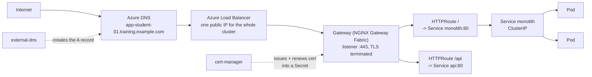
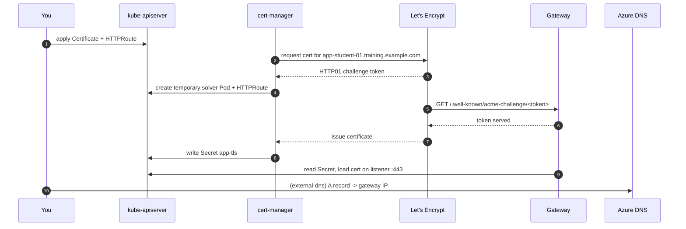

# SECTION 10 — AKS Networking and Gateway API (2h)

**Deliverable:** the application reachable at a real HTTPS URL through AKS ingress/gateway.
**Prerequisite:** the `monolith` Deployment + Service from Lab 9.4 still running in `$NAMESPACE` on the shared cluster. NGINX Gateway Fabric, cert-manager and external-dns are pre-installed cluster-wide by the instructor.

---

## Lab 10.1 — Networking models & Service types (20 min)

### Objectives
- Choose between kubenet, Azure CNI and Azure CNI Overlay from IP-planning constraints.
- Name the four Service types and what each actually provisions on Azure.
- State when a service mesh is worth its operational cost — and when it is not.

### Concept

| Model                   | Pod IP source          | Subnet sizing                      | Use when                                                                  |
| ----------------------- | ---------------------- | ---------------------------------- | ------------------------------------------------------------------------- |
| **kubenet**             | Node-local, UDR-routed | Node IPs only                      | Legacy. No Windows nodes, limited policy options. Avoid for new clusters. |
| **Azure CNI (classic)** | Real VNet IP per Pod   | `(nodes + surge) × (max_pods + 1)` | Pods must be directly addressable from the VNet or on-prem                |
| **Azure CNI Overlay**   | Private overlay CIDR   | Node IPs only                      | **Default for new clusters.** CNI performance, kubenet IP economy.        |

100 nodes × 110 pods on classic CNI needs 11,211 addresses — a /18 out of enterprise space. On Overlay the same cluster needs a /24. **Node subnets cannot be resized after cluster creation**, so this is a rebuild-level mistake.

| Service type                 | Provisions                            | Notes                                                             |
| ---------------------------- | ------------------------------------- | ----------------------------------------------------------------- |
| `ClusterIP`                  | Virtual IP, cluster-internal          | Default; the backend for an Ingress/Gateway                       |
| `NodePort`                   | Port 30000–32767 on every node        | Building block; rarely used directly on AKS                       |
| `LoadBalancer`               | Azure LB rule + public or internal IP | Costs money per Service — that's why we route through one gateway |
| `ExternalName`               | CNAME to an external name             | Pointing at a PaaS database during migration                      |
| Headless (`clusterIP: None`) | No VIP; DNS returns Pod IPs           | StatefulSets (Section 11), gRPC clients                           |



**Ingress vs Gateway API.** Ingress is one object mixing infrastructure and routing concerns, extended by controller-specific annotations that don't port between controllers. Gateway API splits the roles: the **platform team** owns `GatewayClass` and `Gateway` (listeners, TLS, IPs); the **application team** owns `HTTPRoute` in its own namespace, attaching to the shared Gateway. That role split is exactly the boundary this training draws between the platform track and the developer track — which is why we teach Gateway API.

**Service mesh — when it makes sense.** mTLS between every service, L7 traffic splitting for canaries, per-service retry/circuit-breaking policy, and request-level telemetry you cannot get otherwise. **When it does not:** fewer than ~10 services; no team to own the control plane; the actual requirement is "TLS at the edge" (a gateway does that); or you're adding it to fix a problem you haven't measured. A mesh adds a sidecar to every Pod, a control plane to upgrade, and a new class of failure between your app and the network. Earn it.

### Quick demo (5 min, instructor-driven)

```bash
# Get Services with tyes
kubectl get svc -A -o custom-columns='NS:.metadata.namespace,NAME:.metadata.name,TYPE:.spec.type,CLUSTERIP:.spec.clusterIP,EXTERNAL:.status.loadBalancer.ingress[0].ip'
```
```bash
#
az aks show -g "$RG" -n "$AKS_NAME" --query "networkProfile.{plugin:networkPlugin,mode:networkPluginMode,policy:networkPolicy,podCidr:podCidr,serviceCidr:serviceCidr}" -o table
kubectl get gatewayclass
```

---

## Lab 10.2 — Gateway API, DNS and TLS (60 min)

### Objectives
- Attach an `HTTPRoute` in your namespace to the shared `Gateway`.
- Get a real DNS name resolving to the gateway and a Let's Encrypt certificate issued by cert-manager.
- Apply host-based and path-based routing.

### Concept

Three objects, three owners. `GatewayClass` (cluster, platform team) names the controller. `Gateway` (platform team) defines listeners, ports, TLS and which namespaces may attach. `HTTPRoute` (you, in your namespace) declares hostnames, path rules and backend Services.

cert-manager watches for an annotated `Gateway`/`Ingress` or a `Certificate` object, solves an ACME challenge, and writes the issued cert into a Secret the gateway reads. 

#### Types of challenges:
- **HTTP01** proves control by serving a token over port 80. It is simple, needs public inbound. 
- **DNS01** proves control by writing a TXT record — works for private clusters and wildcards, needs DNS API credentials.



### Setup

```bash
# Create folder for networking labs
mkdir -p ~/k8s-labs/10-networking
cd ~/k8s-labs/10-networking
```
```bash
# Fill your namespace
export STUDENT="student-01"          # CHANGE to your assigned ID
export NAMESPACE="$STUDENT"
export NS_DEV="${STUDENT}-dev"
export NS_TEST="${STUDENT}-test"
export RG="rg-lab-shared"
export AKS_NAME="aks-training-shared"
export ACR_NAME="acrtrainingshared"
export LOCATION="eastus"
```

```bash
# Use proper kube context
kubectl config set-context --current --namespace="$NAMESPACE"
```
```bash
export BASE_DOMAIN="traininghard.com"
export APP_HOST="app-${STUDENT}.${BASE_DOMAIN}"
echo "APP_HOST=$APP_HOST"
```

# The shared gateway (installed by the instructor)

```bash
# Check gateway classes
kubectl get gatewayclass
```
```bash
# Check the available gateway
kubectl get gateway -n nginx-gateway
```
```bash
export GW_IP="$(kubectl get gateway shared-gateway -n nginx-gateway -o jsonpath='{.status.addresses[0].value}')"
echo "GW_IP=$GW_IP"
```

# Your app must still be running from Lab 9.4

```bash
kubectl get deploy,svc,endpoints monolith -n "$NAMESPACE"
```
# Recreate it

```bash
cat <<'EOF' > 04-config.yaml
apiVersion: v1
kind: ConfigMap
metadata:
  name: monolith-config
  labels:
    app: monolith
data:
  APP_ENV: "dev"
  LOG_LEVEL: "debug"
  TITLE: "Containerized Monolith on AKS"
  DB_HOST: "monolith-db.database.svc.cluster.local"
  DB_PORT: "5432"
  app.properties: |
    server.port=80
    server.shutdown=graceful
    management.endpoints.web.exposure.include=health,info,metrics
    logging.level.root=INFO
---
apiVersion: v1
kind: Secret
metadata:
  name: monolith-secrets
  labels:
    app: monolith
type: Opaque
stringData:
  DB_USER: "monolith_app"
  DB_PASSWORD: "Tr41n1ng-L4b-N0t-Real!"
  API_KEY: "lab-only-8f3c1d0a4b7e9265"
EOF
```
```bash
kubectl apply -f 04-config.yaml -n "$NAMESPACE"
```

```bash
# base64 is ENCODING, not encryption:
kubectl get secret monolith-secrets -n "$NAMESPACE" -o jsonpath='{.data.DB_PASSWORD}' | base64 -d; echo
```

```bash
cat <<EOF > 05-monolith.yaml
apiVersion: apps/v1
kind: Deployment
metadata:
  name: monolith
  labels:
    app: monolith
    tier: application
  annotations:
    kubernetes.io/change-cause: "Initial deployment of monolith 1.0.0"
spec:
  replicas: 2
  revisionHistoryLimit: 5
  minReadySeconds: 10
  strategy:
    type: RollingUpdate
    rollingUpdate:
      maxSurge: 1
      maxUnavailable: 0
  selector:
    matchLabels:
      app: monolith
      tier: application
  template:
    metadata:
      labels:
        app: monolith
        tier: application
    spec:
      containers:
        - name: monolith
          image: $APP_IMAGE
          imagePullPolicy: IfNotPresent
          ports:
            - name: http
              containerPort: 80
          envFrom:
            - configMapRef:
                name: monolith-config
            - secretRef:
                name: monolith-secrets
          env:
            - name: POD_NAME
              valueFrom:
                fieldRef:
                  fieldPath: metadata.name
            - name: NODE_NAME
              valueFrom:
                fieldRef:
                  fieldPath: spec.nodeName
          volumeMounts:
            - name: app-config
              mountPath: /etc/monolith
              readOnly: true
          startupProbe:
            httpGet:
              path: /
              port: http
            periodSeconds: 5
            failureThreshold: 30
          readinessProbe:
            httpGet:
              path: /
              port: http
            periodSeconds: 10
            timeoutSeconds: 3
            failureThreshold: 3
          livenessProbe:
            httpGet:
              path: /
              port: http
            periodSeconds: 20
            timeoutSeconds: 3
            failureThreshold: 3
          resources:
            requests:
              cpu: "100m"
              memory: "128Mi"
            limits:
              cpu: "500m"
              memory: "512Mi"
          lifecycle:
            preStop:
              exec:
                command: ["/bin/sh", "-c", "sleep 5"]
      volumes:
        - name: app-config
          configMap:
            name: monolith-config
            items:
              - key: app.properties
                path: app.properties
            defaultMode: 0444
      terminationGracePeriodSeconds: 45
      topologySpreadConstraints:
        - maxSkew: 1
          topologyKey: kubernetes.io/hostname
          whenUnsatisfiable: ScheduleAnyway
          labelSelector:
            matchLabels:
              app: monolith
---
apiVersion: v1
kind: Service
metadata:
  name: monolith
  labels:
    app: monolith
spec:
  type: ClusterIP
  selector:
    app: monolith
    tier: application
  ports:
    - name: http
      port: 80
      targetPort: http
EOF
```
```bash
kubectl apply -f 05-monolith.yaml -n "$NAMESPACE"
```
---

**Reference** what Aayush has installed **(don't run it)**:

```bash
# Installing standard Gateway CRDs
kubectl kustomize \
  "https://github.com/nginx/nginx-gateway-fabric/config/crd/gateway-api/standard?ref=v2.7.0" \
  | kubectl apply -f -
```

```bash
# Installing the NGINX Fabric Gateway
helm install ngf \
  oci://ghcr.io/nginx/charts/nginx-gateway-fabric \
  --create-namespace \
  -n nginx-gateway \
  --wait
```

### CLI walkthrough

**Step 1 — the ClusterIssuer (instructor-installed; read it, then verify it).**

```bash
# List the available cluster issuer
kubectl get clusterissuer
```

```bash
# For reference only -- the ClusterIssuer definition:
cat <<'EOF'
apiVersion: cert-manager.io/v1
kind: ClusterIssuer
metadata:
  name: letsencrypt-production
spec:
  acme:
    server: https://acme-v02.api.letsencrypt.org/directory
    email: aayush.pokharel@startsml.com
    privateKeySecretRef:
      name: letsencrypt-prod-account-key
    solvers:
      - http01:
          gatewayHTTPRoute:
            parentRefs:
              - name: shared-gateway
                namespace: nginx-gateway
                kind: Gateway
EOF
```

> **Rate limits are real.** Let's Encrypt production allows a limited number of certificates per registered domain per week. During training, students will use selfsigned certs. the cert won't be browser-trusted, but the issuance flow is identical.

**Step 2 — request a certificate for your hostname.**

```bash
cat <<EOF > 01-certificate.yaml
apiVersion: cert-manager.io/v1
kind: Certificate
metadata:
  name: app-tls
  namespace: $NAMESPACE
spec:
  secretName: app-tls
  duration: 2160h
  renewBefore: 360h
  issuerRef:
    name: root-ca-issuer
    kind: ClusterIssuer
  dnsNames:
    - $APP_HOST
EOF

kubectl apply -f 01-certificate.yaml
kubectl get certificate app-tls -n "$NAMESPACE" -w    # Ctrl-C once READY=True
```

**Step 3 — the DNS record.** If external-dns is installed it creates the record from your HTTPRoute's hostname. Otherwise we have to create it explicitly.


**Step 4 — attach your HTTPRoute to the shared gateway.**

```bash
cat <<EOF > 02-httproute.yaml
apiVersion: gateway.networking.k8s.io/v1
kind: HTTPRoute
metadata:
  name: monolith
  namespace: $NAMESPACE
spec:
  parentRefs:
    - name: shared-gateway
      namespace: nginx-gateway
      sectionName: https
  hostnames:
    - "$APP_HOST"
  rules:
    - matches:
        - path:
            type: PathPrefix
            value: /
      backendRefs:
        - name: monolith
          port: 80
EOF
```
```bash
kubectl apply -f 02-httproute.yaml
```
```bash
kubectl get httproute monolith -n "$NAMESPACE"
```
```bash
kubectl describe httproute monolith -n "$NAMESPACE" | sed -n '/Status:/,$p'
```

The `Accepted` and `ResolvedRefs` conditions must both be `True`. `ResolvedRefs: False` almost always means the backend Service name or port is wrong.

**Cross-namespace note:** a `Gateway` in `nginx-gateway` accepting an `HTTPRoute` from `student-01` requires `allowedRoutes.namespaces.from: All` (or a selector) on the listener — and a `ReferenceGrant` if the route points at a Service in a *third* namespace. That is Gateway API's deliberate answer to Ingress's "any namespace can claim any hostname" problem.

**Step 5 — reach it.**

```bash
curl -sSI "https://${APP_HOST}" | head -5
```
```bash
curl -s "https://${APP_HOST}" | head -10
echo | openssl s_client -connect "${APP_HOST}:443" -servername "$APP_HOST" 2>/dev/null \
  | openssl x509 -noout -subject -issuer -dates
```

**Step 6 — path-based and host-based routing.**

```bash
kubectl create deployment api --image=nginx:1.27-alpine -n "$NAMESPACE"
```
```bash
kubectl set resources deployment/api -c api --requests=cpu=50m,memory=64Mi --limits=cpu=200m,memory=192Mi -n "$NAMESPACE"
```
```bash
kubectl expose deployment api --port=80 --target-port=80 -n "$NAMESPACE"
```
```bash
kubectl rollout status deployment/api -n "$NAMESPACE" --timeout=180s
```
```bash
cat <<EOF > 03-httproute-routing.yaml
apiVersion: gateway.networking.k8s.io/v1
kind: HTTPRoute
metadata:
  name: monolith
  namespace: $NAMESPACE
spec:
  parentRefs:
    - name: shared-gateway
      namespace: nginx-gateway
      sectionName: https
  hostnames:
    - "$APP_HOST"
  rules:
    - matches:
        - path:
            type: PathPrefix
            value: /api
      filters:
        - type: URLRewrite
          urlRewrite:
            path:
              type: ReplacePrefixMatch
              replacePrefixMatch: /
      backendRefs:
        - name: api
          port: 80
    - matches:
        - path:
            type: PathPrefix
            value: /
      backendRefs:
        - name: monolith
          port: 80
EOF
```
```bash
kubectl apply -f 03-httproute-routing.yaml
```
```bash
curl -s -o /dev/null -w "/     -> %{http_code}\n" "https://${APP_HOST}/"
```
```bash
curl -s -o /dev/null -w "/api  -> %{http_code}\n" "https://${APP_HOST}/api"
```

Rules are evaluated most-specific-first, so `/api` wins over `/` regardless of order in the file. The `URLRewrite` filter strips the prefix before the backend sees it — the equivalent of `nginx.ingress.kubernetes.io/rewrite-target`, but portable across controllers.

**Traffic splitting (a canary, in four lines):**

```bash
kubectl patch httproute monolith -n "$NAMESPACE" --type=json -p='[
  {"op":"replace","path":"/spec/rules/1/backendRefs","value":[
    {"name":"monolith","port":80,"weight":90},
    {"name":"api","port":80,"weight":10}
  ]}
]'
```
```bash
for i in $(seq 1 10); do curl -s "https://${APP_HOST}/" | grep -o "Welcome\|AKS" | head -1; done
```
```bash
kubectl apply -f 03-httproute-routing.yaml     # revert to 100%
```

### WebUI equivalent

| CLI                                                          | Portal                                                                                                               |
| ------------------------------------------------------------ | -------------------------------------------------------------------------------------------------------------------- |
| `kubectl get httproute`                                      | **Kubernetes resources → Services and ingresses** (Ingresses tab; Gateway API objects appear under Custom resources) |
| `kubectl get svc -A --field-selector spec.type=LoadBalancer` | **Services and ingresses → Services**, EXTERNAL-IP column                                                            |
| `dig $APP_HOST`                                              | **DNS zones → `training.example.com` → Recordsets**                                                                  |
| Gateway public IP                                            | **Resource groups → `MC_...` node RG → Public IP addresses**                                                         |
| Certificate status                                           | No Portal view — `kubectl describe certificate`                                                                      |
| Traffic on the gateway                                       | **Monitoring → Insights → Controllers**, or the Log Analytics workspace                                              |

1. **DNS zones → your zone → Recordsets** — find `app-student-01`. If external-dns created it, the record has a TXT companion recording ownership; deleting the HTTPRoute removes both.
2. **Node resource group → Load balancer → Frontend IP configuration** — one public IP serving every student's hostname. That is the cost argument for a shared gateway over per-app `LoadBalancer` Services.
3. **Monitoring → Insights → Controllers** for gateway Pod health during the troubleshooting lab.

### Verify

```bash
kubectl get certificate app-tls -n "$NAMESPACE"                      # READY True
kubectl get httproute monolith -n "$NAMESPACE" -o jsonpath='{.status.parents[0].conditions[*].type}{"\n"}'
dig +short "$APP_HOST"                                               # == $GW_IP
curl -sS -o /dev/null -w "%{http_code} %{ssl_verify_result}\n" "https://${APP_HOST}/"   # 200 0
```
